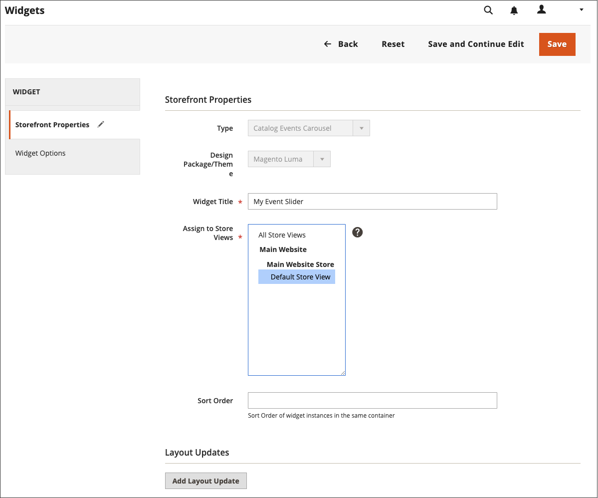
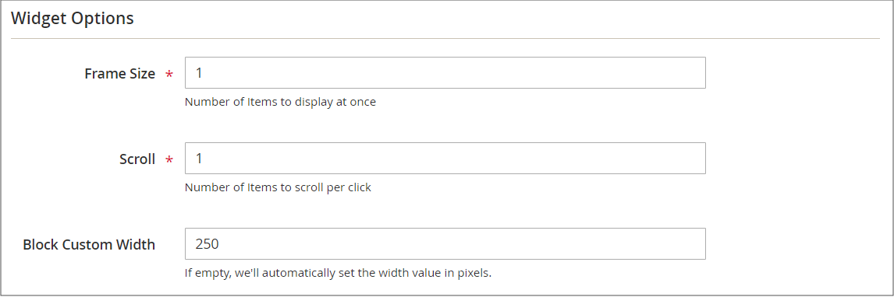

# Karusellwidget för kataloghändelser

{{ee-feature}}

En karusellwidget för kataloghändelser visar ett reglage för kommande händelser med en nedräkningsfunktion för varje händelse. Du kan välja de sidor och det område i sidlayouten där du vill att karusellen ska visas och styra bredden och antalet händelser som visas samtidigt. Vilket resultat du får beror på temat, var det är placerat på sidan och vilka alternativ du väljer.

{width="700" zoomable="yes"}

## Steg 1: Aktivera katalogCarousel-widgeten

Innan du börjar följer du [instruktioner](../merchandising-promotions/event-configure.md) för att konfigurera _Kataloghändelse_ widgeten så att den är aktiverad för butiken.

{width="500" zoomable="yes"}

## Steg 2: Skapa widgeten

1. På _Administratör_ sidebar, gå till **[!UICONTROL Content]** > _[!UICONTROL Elements]_>**[!UICONTROL Widgets]**.

1. Klicka på i det övre högra hörnet **[!UICONTROL Add Widget]**.

1. I _[!UICONTROL Settings]_gör du följande:

   - Ange **[!UICONTROL Type]** till `Catalog Events Carousel`.

   - Välj **[!UICONTROL Design Theme]** som används av butiken.

1. Klicka på **[!UICONTROL Continue]**.

   {width="500" zoomable="yes"}

1. I _[!UICONTROL Storefront Properties]_gör du följande:

   - För **[!UICONTROL Widget Title]** anger du en beskrivande titel för widgeten.

     Den här titeln visas bara från _Administratör_.

   - För **[!UICONTROL Assign to Store Views]** markerar du de butiksvyer där du vill att widgeten ska vara synlig.

     Du kan välja en viss butiksvy eller `All Store Views`. Om du vill markera flera vyer håller du ned Ctrl (PC) eller Kommando (Mac) och klickar på varje alternativ.

   - (valfritt) för **[!UICONTROL Sort Order]** anger du en siffra som bestämmer i vilken ordning det här objektet visas med andra på samma del av sidan. (`0` = first, `1` = sekund, `3` = tredje och så vidare.)

     {width="600" zoomable="yes"}

## Steg 3: Välj plats

1. I _Layoutuppdateringar_ avsnitt, klicka **[!UICONTROL Add Layout Update]**.

1. Ange **[!UICONTROL Display On]** till `Specified Page`.

1. Ange **[!UICONTROL Page]** till `CMS Home Page`.

1. Ange **[!UICONTROL Container]** något av följande:

   - `Main Content Area`
   - `Sidebar Additional`
   - `Sidebar Main`

   >[!NOTE]
   >
   >Resultatet varierar beroende på tema och sidlayout. Du måste också ange _[!UICONTROL Catalog Events Carousel Default Template]_i kategorikonfigurationen.

1. Om du vill att händelsekarusellen ska visas på en annan plats i butiken klickar du på **[!UICONTROL Add Layout Update]** och upprepa de här stegen för den platsen.

   {width="600" zoomable="yes"}

1. Klicka på **[!UICONTROL Save and Continue Edit]**.

   För tillfället kan du ignorera meddelandet för att uppdatera cachen.

## Steg 4: Konfigurera alternativen

1. Välj **[!UICONTROL Widget Options]**.

1. För **[!UICONTROL Frame Size]** anger du antalet händelser som du vill visa i skjutreglaget samtidigt.

   Om du bara vill visa en händelse i taget anger du `1`.

1. För **[!UICONTROL Scroll]** anger du antalet händelselistor som du vill rulla i varje klick.

   Om du vill bläddra till nästa händelse anger du `1`.

1. Ange antalet pixlar för en anpassad bredd **[!UICONTROL Block Custom Width]**.

   På följande exempelsida är den anpassade bredden inställd på 250 pixlar.

   {width="400" zoomable="yes"}

1. När du är klar klickar du på **[!UICONTROL Save]**.

1. När du uppmanas att uppdatera cacheminnet klickar du på länken i meddelandet längst upp på sidan och följer instruktionerna.
