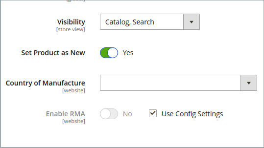

# Ny widget för produktlista

Listan med nya produkter är ett exempel på dynamiskt innehåll och består av livedata som hämtas från produktkatalogen. Som standard är _Nya produkter_ innehåller de första åtta av de senast tillagda produkterna. Den kan dock även konfigureras så att den endast innehåller produkter inom ett angivet datumintervall.

{width="700" zoomable="yes"}

## Steg 1: Ange varje produkt som ny

 Detta steg gäller endast Magento Open Source.

 För Adobe Commerce butiker, se [Schemalägga en uppdatering](content-staging-scheduled-update.md) och fortsätt sedan till steg 2 på den här sidan.

_[!UICONTROL Set Product as New]_datumintervallsinställningen kan bara konfigureras i schemalagda uppdateringar.

Om du anger en produkt som ny läggs produkten till i _Nya produkter_ lista. Du kan när som helst ändra inställningen igen när du inte längre vill ta med den i listan.

1. På _Administratör_ sidebar, gå till **[!UICONTROL Catalog]** > **[!UICONTROL Products]**.

1. Hitta de produkter du vill ha och öppna i redigeringsläge.

1. För **[!UICONTROL Set Product as New]** kan du välja att ange produkten som en ny produkt eller inte.

   {width="400" zoomable="yes"}

1. När du är klar klickar du på **[!UICONTROL Save]**.

1. När du uppmanas att indexera om och uppdatera sidcachen klickar du på länkarna högst upp på sidan och följer instruktionerna.

## Steg 2: Skapa widgeten

Koden som avgör innehållet i listan Nya produkter och dess placering i din butik genereras av widgetverktyget.

1. På _Administratör_ sidebar, gå till **[!UICONTROL Content]** > _[!UICONTROL Elements]_>**[!UICONTROL Widgets]**.

1. Klicka på i det övre högra hörnet **[!UICONTROL Add Widget]**.

1. I _[!UICONTROL Settings]_gör du följande:

   - Ange **[!UICONTROL Type]** till `Catalog New Products List`.

   - Välj **[!UICONTROL Design Theme]** som används av butiken.

1. Klicka på **[!UICONTROL Continue]**.

   {width="600" zoomable="yes"}

1. I _[!UICONTROL Storefront Properties]_gör du följande:

   - För **[!UICONTROL Widget Title]** anger du en beskrivande titel för widgeten. (Den här titeln visas bara från _Administratör_.)

   - För **[!UICONTROL Assign to Store Views]** markerar du de butiksvyer där widgeten visas.

     Du kan välja en viss butiksvy eller `All Store Views`. Om du vill markera flera vyer håller du ned Ctrl (PC) eller Kommando (Mac) och klickar på varje alternativ.

   - (valfritt) för **[!UICONTROL Sort Order]** anger du en siffra som bestämmer i vilken ordning det här objektet visas med andra på samma del av sidan. (`0` = first, `1` = sekund, `3` = tredje och så vidare.)

   {width="600" zoomable="yes"}

## Steg 3: Välj plats

1. I _[!UICONTROL Layout Updates]_avsnitt, klicka **[!UICONTROL Add Layout Update]**.

1. Ange **[!UICONTROL Display On]** till `Specified Page.`

1. Ange **[!UICONTROL Page]** till `CMS Home Page`.

1. Ange **[!UICONTROL Block Reference]** till `Main Content Area`.

1. Ange **[!UICONTROL Template]** till något av följande:

   - `New Product List Template`
   - `New Products Grid Template`

     {width="600" zoomable="yes"}

1. Klicka på **[!UICONTROL Save and Continue Edit]**.

   För tillfället kan du ignorera meddelandet för att uppdatera cachen.

## Steg 4: Konfigurera listan

1. Välj **[!UICONTROL Widget Options]**.

1. Ange **[!UICONTROL Display Products]** till något av följande:

   - `All Products` - Visar produkter i sekvens, med början från den senast tillagda produkten.
   - `New Products` - Visar endast de produkter som identifieras som _new_. En produkt anses vara ny under det datumintervall som anges i _[!UICONTROL Set Product As New From/To]_. Listan är tom om datumintervallet förfaller utan att några nya produkter har definierats.

1. Ange navigeringskontroll för listor med flera sidor **[!UICONTROL Display Page Control]** till `Yes`.

   För **[!UICONTROL Number of Products per Page]** anger du antalet produkter som du vill ska visas på varje sida.

1. Ange **[!UICONTROL Number of Products to Display]** alternativ för antalet nya produkter som du vill ta med i listan.

   Standardinställningen är `10`.

1. För **[!UICONTROL Cache Lifetime (Seconds)]** väljer du hur ofta du vill uppdatera listan med nya produkter.

   Som standard är cachen inställd på 86 400 sekunder (24 timmar).

   {width="600" zoomable="yes"}

1. När du är klar klickar du på **[!UICONTROL Save]**.

1. När du uppmanas att uppdatera cacheminnet klickar du på länken i meddelandet längst upp på sidan och följer instruktionerna.

## Steg 5: Förhandsgranska ditt arbete

1. På _Administratör_ sidebar, gå till **[!UICONTROL Content]** > _[!UICONTROL Elements]_>**[!UICONTROL Pages]**.

1. Hitta sidan i rutnätet där _Nya produkter_ ska visas och klicka på **[!UICONTROL Preview]** i _[!UICONTROL Action]_kolumn.
