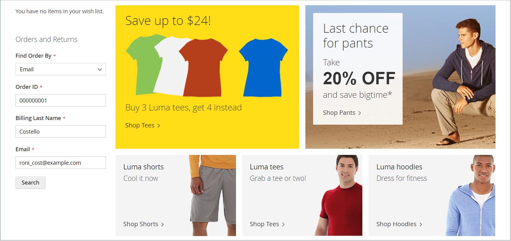

# Widgeten Beställningar och returer

The _Beställningar och returer_ widgeten ger gästerna möjlighet att kontrollera status för sina order, utskriftsfakturor och spåra leveranser. När widgeten läggs till i butiken visas den bara för gäster och för kunder som inte är inloggade på sina konton. Gäster kan hitta beställningar genom att ange beställnings-ID, efternamn för fakturering och antingen e-postadress eller postnummer.

{width="600" zoomable="yes"}

## Widgeten för order och returer i butiken

1. Kunden kan använda **[!UICONTROL Find Order By]** om du vill välja någon av följande parametrar som ska användas för att hitta ordningen:

   - E-postadress
   - Postnummer

1. Kunden anger **[!UICONTROL Order ID]** och **[!UICONTROL Billing Last Name]**.

1. Anger antingen faktureringen **[!UICONTROL Email Address]** eller **[!UICONTROL ZIP Code]** som är associerad med ordern.

1. Klickningar **[!UICONTROL Search]** för att hämta ordern.

   {width="700" zoomable="yes"}

## Ställa in widgeten för beställningar och returer

1. På _Administratör_ sidebar, gå till **[!UICONTROL Content]** > _[!UICONTROL Elements]_>**[!UICONTROL Widgets]**.

1. Klicka på i det övre högra hörnet **[!UICONTROL Add Widget]**.

1. I _[!UICONTROL Settings]_gör du följande:

   - Ange **[!UICONTROL Type]** till `Orders and Returns`.

   - Välj **[!UICONTROL Design Theme]** som används av butiken.

1. Klicka på **[!UICONTROL Continue]**.

1. I _[!UICONTROL Storefront Properties]_gör du följande:

   - För **[!UICONTROL Widget Title]** anger du en beskrivande titel för widgeten.

     Den här titeln visas bara från administratören.

   - För **[!UICONTROL Assign to Store Views]** markerar du de butiksvyer där widgeten visas.

     Du kan välja en viss butiksvy eller `All Store Views`. Om du vill markera flera vyer håller du ned Ctrl (PC) eller Kommando (Mac) och klickar på varje alternativ.

   - (valfritt) för **[!UICONTROL Sort Order]** anger du en siffra som bestämmer i vilken ordning det här objektet visas med andra på samma del av sidan. (`0` = first, `1` = sekund, `3` = tredje och så vidare.)

1. I _[!UICONTROL Layout Updates]_avsnitt, klicka **[!UICONTROL Add Layout Update]**och gör följande:

   - Ange **[!UICONTROL Display On]** till den typ av sida där du vill att widgeten ska visas.

   - Om du vill bestämma var widgeten ska visas på sidan, fyller du i resten av layoutuppdateringsinformationen.

1. När du är klar klickar du på **[!UICONTROL Save]**.

1. När du uppmanas att uppdatera cacheminnet klickar du på länken i meddelandet längst upp på sidan och följer instruktionerna.
