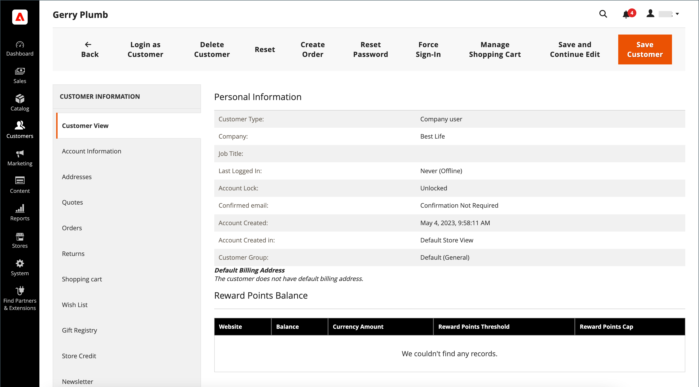

# Skapa ett enskilt kundkonto

Besökare i din butik kan öppna ett konto för att hantera sina inköp och aktiviteter. Kunderna skapar vanligtvis egna konton från din butik. Du kan även skapa kundkonton direkt från administratören, vilket är användbart om du vill hjälpa kunder via telefon.

Följande instruktioner representerar standardkonfigurationen för kundkontot. Information om hur du ändrar val och beteende för vissa av fälten i formuläret finns i [Konfigurera kundkonton](../customers/customer-account-scope.md).

Som butiksadministratör kan du även ange att [nya kontoalternativ](../customers/account-options-new.md) ska skicka ett bekräftelsemeddelande via e-post till nya registrerade kunder, vilket gör att registrerade konton är giltiga.

>[!NOTE]
>
>Från och med version 2.4.7 måste kunderna ange sin e-postadress och sitt lösenord på nytt för att logga in på sina konton efter e-postbekräftelse, oavsett webbläsare.

## Skapa konto från butiken

En butikskund skapar ett konto i butiken.

1. Klicka på **[!UICONTROL Create an Account]** i det övre högra hörnet av sidhuvudet i butiken.

   {width="700" zoomable="yes"}

1. Under **[!UICONTROL Personal Information]** anger deras **[!UICONTROL First Name]** och **[!UICONTROL Last Name]**.

   {width="600" zoomable="yes"}

1. Om kunden vill lägga till sitt namn och sin e-postadress i listan över nyhetsbrevets prenumeranter markerar kunden kryssrutan **[!UICONTROL Sign Up for Newsletter]**.

   >[!INFO]
   >
   > Det här alternativet visas även om butiken inte publicerar något nyhetsbrev.

1. Om de vill att supportpersonalen på butiken ska [se vad de ser](../customers/login-as-customer.md) och ge fjärrhjälp, markerar kunden kryssrutan **[!UICONTROL Allow remote shopping assistance]**.

1. Under **[!UICONTROL Sign-in Information]** anger deras **[!UICONTROL Email]**-adress.

   >[!INFO]
   >
   > Den här e-postadressen blir en del av inloggningsuppgifterna och kan inte kopplas till något annat kundkonto.

   {width="600" zoomable="yes"}

1. Anger en **[!UICONTROL Password]** som innehåller tre av följande typer av information:

   - Gemener
   - Versaler
   - Nummer
   - Specialtecken

   När de trycker på **[!UICONTROL Enter]** utvärderas lösenordets styrka och visas under fältet. Om lösenordet anses vara _Weak_ kan du prova med ett annat tills det utvärderas som _Strong_.

   {width="600" zoomable="yes"}

1. Sedan anger kunden det igen till **[!UICONTROL Confirm Password]**.

1. Om det behövs klickar du på **[!UICONTROL Show Password]** för att visa lösenordet du angav.

1. När det är klart klickar du på **Skapa ett konto**.

Kunden kan sedan använda sin e-postadress och sitt lösenord för att [logga in](../customers/customer-sign-in.md) på sitt konto och fylla i adressinformationen.

## Skapa ett konto från administratören

Som handlare kan du skapa ett kundkonto från administratören.

1. Gå till **[!UICONTROL Customers]** > **[!UICONTROL All Customers]** på sidofältet _Admin_.

1. Klicka på **[!UICONTROL Add New Customer]**.

### Steg 1: Fyll i kontoinformationen

{width="700" zoomable="yes"}

1. Gör följande i avsnittet **[!UICONTROL Account Information]**:

   - För en installation på flera webbplatser anger du **[!UICONTROL Associate to Website]** till den webbplats där kundkontot gäller.
   - Tilldela kunden till en annan **[!UICONTROL Customer Group]**, om tillämpligt.
   - Markera kryssrutan om du använder [moms-ID-validering](../stores-purchase/vat.md) och vill **[!UICONTROL Disable Automatic Group Change Based on VAT ID]**.

1. Fyll i obligatoriska fält:

   - **[!UICONTROL First Name]**
   - **[!UICONTROL Last Name]**
   - **[!UICONTROL Email]**

1. Fyll i de valfria fälten efter behov:

   - **[!UICONTROL Name Prefix]**
   - **[!UICONTROL Middle Name/Initial]**
   - **[!UICONTROL Name Suffix]**
   - **[!UICONTROL Date of Birth]**
   - **[!UICONTROL Tax/VAT Number]**
   - **[!UICONTROL Gender]**

   >[!WARNING]
   >
   >I enlighet med gällande säkerhets- och integritetspraxis bör du vara medveten om eventuella juridiska risker och säkerhetsrisker som är förknippade med lagring av kundernas fullständiga födelsedatum (månad, dag, år) med andra personliga identifierare. Vi rekommenderar att du begränsar lagringen av kundernas födelsedatum och föreslår att du använder kundens födelseår som ett alternativ.

1. Ange **[!UICONTROL Send Welcome Email From]** i butiksvyn som _välkomstmeddelandet_ ska skickas från.

   >[!INFO]
   >
   > Om butiken har vyer för olika [språk](../stores-purchase/store-localize.md) avgör den här inställningen språket för välkomstmeddelandet.

1. Klicka på **[!UICONTROL Save and Continue Edit]** överst på sidan.

   >[!INFO]
   >
   >När kundkontot har sparats visas alla alternativ på den vänstra panelen och på menyn överst på sidan. Fliken _[!UICONTROL Customer View]_&#x200B;visar en sammanfattning av kontot.

   {width="600" zoomable="yes"}

### Steg 2: Fyll i adressinformationen

1. Välj **[!UICONTROL Addresses]** i den vänstra panelen och klicka på **[!UICONTROL Add New Addresses]**.

1. Om samma adress används för både fakturering och leverans kan du växla mellan alternativen.

   - **[!UICONTROL Default Billing Address]**
   - **[!UICONTROL Default Shipping Address]**

   {width="600" zoomable="yes"}

1. Bläddra nedåt och fyll i de obligatoriska adressfälten i den andra kolumnen.

   - **[!UICONTROL Street Address]**
   - **[!UICONTROL City]**
   - **[!UICONTROL Country]**
   - **[!UICONTROL State/Province]**
   - **[!UICONTROL ZIP/Postal Code]**

1. Ange **[!UICONTROL Phone Number]** för den här adressen.

1. Ange **[!UICONTROL VAT Number]** som är associerad med kunden, om tillämpligt.

1. Om den här adressen är den enda som behövs för kontot klickar du på **[!UICONTROL Save]**.

   Annars klickar du på **[!UICONTROL Save and Continue Edit]** och upprepar föregående steg för att lägga till ytterligare adresser.

   Den nya adressen visas på sidan [!UICONTROL Addresses] med de valda _[!UICONTROL Default Billing]_- och&#x200B;_[!UICONTROL Default Shipping]_-adresserna ovanför den fullständiga listan.

   {width="600" zoomable="yes"}

### Steg 3: Återställ lösenordet

Kundkonton som skapas från administratören har inte tilldelats några lösenord från början.

1. Hitta det nya kundkontot i rutnätet.

1. Klicka på **[!UICONTROL Edit]** i kolumnen _[!UICONTROL Action]_.

1. Klicka på **[!UICONTROL Reset Password]** på menyraden överst på sidan.

1. Meddelande skickas till kontoägaren med instruktioner om hur lösenordet ska anges.

## Knappfält

Ytterligare knappar blir tillgängliga när profilen sparas för första gången. Mer information finns i [Uppdatera en kundprofil](../customers/update-account.md).

| Knapp | Beskrivning |
|--- |--- |
| **[!UICONTROL Back]** | Återgår till sidan _[!UICONTROL Customers]_&#x200B;utan att spara ändringarna. |
| **[!UICONTROL Delete Customer]** | Tar bort den aktuella kunden. Slutförda order som är kopplade till kunden tas inte bort. |
| **[!UICONTROL Reset]** | Återställer alla osparade ändringar i kundformuläret till deras tidigare värden. |
| **[!UICONTROL Create Order]** | Skapar en order för kunden. |
| **[!UICONTROL Reset Password]** | Skickar en [återställningslösenord](../customers/password-reset.md)-länk till kunden via e-post. |
| **[!UICONTROL Force Sign-in]** | Återkallar OAuth-åtkomsttoken som är associerade med kundkontot. Den här funktionen kan bara användas med kundkonton som har tilldelats OAuth-tokens som en del av ett webb-API [integration](../systems/integrations.md). Mer information finns i [OAuth-baserad autentisering](https://developer.adobe.com/commerce/webapi/get-started/authentication/gs-authentication-oauth/) i utvecklardokumentationen. |
| **[!UICONTROL Manage Shopping Cart]** | Låter administratören hantera kundvagnen. |
| **[!UICONTROL Save and Continue Edit]** | Sparar ändringar och håller kundprofilen öppen. |
| **[!UICONTROL Save Customer]** | Sparar ändringar och stänger kundprofilen. |

{style="table-layout:auto"}

## Fältbeskrivningar

### [!UICONTROL Account Information]

| Fält | Beskrivning |
|--- |--- |
| **[!UICONTROL Associate to Website]** | Identifierar webbplatsen som är kopplad till kundkontot. |
| **[!UICONTROL Group]** | Identifierar [kundgruppen](../customers/customer-groups.md) där kunden är medlem. Om tillämpligt markerar du kryssrutan för att inaktivera automatisk gruppändring baserat på moms. |
| **[!UICONTROL Name Prefix]** | Om det används, det prefix som är kopplat till kundens namn (t.ex. Mr., Ms. eller Dr.). Prefixvärdena bestäms av [konfigurationen](../configuration-reference/customers/customer-configuration.md). Beroende på konfigurationen kan indatakontrollen vara ett textfält eller en lista med alternativ. |
| **[!UICONTROL First Name]** | Kundens förnamn. |
| **[!UICONTROL Middle Name / Initial]** | Kundens mellannamn eller initialnamn. Det här fältet inkluderas endast om det anges i avsnittet [configuration](../configuration-reference/customers/customer-configuration.md). |
| **[!UICONTROL Last Name]** | Kundens efternamn. |
| **[!UICONTROL Name Suffix]** | Om det används, det suffix som är associerat med kundens namn (till exempel Jr., Sr. eller III). Suffixvärdena bestäms av [konfigurationen](../configuration-reference/customers/customer-configuration.md). Beroende på konfigurationen kan indatakontrollen vara ett textfält eller en listruta med alternativ. |
| **[!UICONTROL Email]** | Kundens e-postadress. |
| **[!UICONTROL Date of Birth]** | Kundens födelsedatum. Födelsedatumet inkluderas om det anges i avsnittet [configuration](../configuration-reference/customers/customer-configuration.md).   I enlighet med gällande säkerhets- och sekretessrutiner ska du vara medveten om eventuella juridiska risker och säkerhetsrisker som är förknippade med lagring av kunders fullständiga födelsedatum (månad, dag, år) med andra personliga identifierare. Vi rekommenderar att du begränsar lagringen av kundernas födelsedatum och föreslår att du använder kundens födelseår som ett alternativ. |
| **[!UICONTROL Tax / VAT Number]** | Kundens momsregistreringsnummer eller momsregistreringsnummer, om tillämpligt. |
| **[!UICONTROL Gender]** | Identifierar kundens kön. Genuset inkluderas om det anges i [konfigurationen](../configuration-reference/customers/customer-configuration.md). Alternativ: `Male` / `Female` / `Not Specified` |
| **[!UICONTROL Send Welcome Email From]** | Om du har flera butiksvyer identifierar den här inställningen den butiksvy som välkomstmeddelandet skickas från. Om butiksvyer används för olika språk avgör den här inställningen språket i välkomstmeddelandet. |

### [!UICONTROL Addresses]

| Fält | Beskrivning |
|--- |--- |
| **[!UICONTROL New Addresses]** | Identifierar typen av ny adress. Alternativ: `Default Billing Address` / `Default Shipping Address` |
| **[!UICONTROL Add New Addresses]** | Visar ett annat nytt adressavsnitt som identifierar vilken typ av adress som ska anges. |
| **[!UICONTROL Company]** | Företagsnamn, om tillämpligt för den här adressen. |
| **[!UICONTROL Street Address]** | Kundens gatuadress. En andra rad av gatuadressen är tillgänglig om den anges i avsnittet [configuration](../configuration-reference/customers/customer-configuration.md). |
| **[!UICONTROL City]** | Ort där kundadressen finns. |
| **[!UICONTROL Country]** | Det land där kundadressen finns. |
| **[!UICONTROL State/Province]** | Delstaten eller regionen där kundadressen finns. |
| **[!UICONTROL Zip/Postal Code]** | Postnumret där kundadressen finns. |
| **[!UICONTROL Phone Number]** | Kundens telefonnummer som är kopplat till adressen. |
| **[!UICONTROL VAT Number]** | Om tillämpligt, det momsregistreringsnummer som gäller för kunden på den här adressen. |
