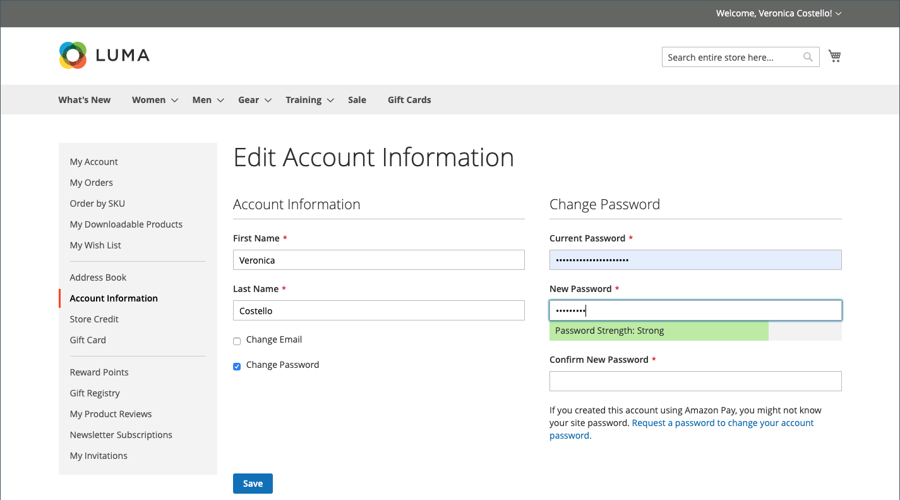

# Kundkontoinformation

Den grundläggande kundkontoinformationen innehåller ditt namn, din e-postadress och ditt lösenord, och kan underhållas från kundkontots kontrollpanel i butiken.

{width="700" zoomable="yes"}

I sidofältet för ditt konto kan kunden välja **[!UICONTROL Account Information]** och göra något av följande för att uppdatera sin kontoinformation.

## Uppdatera namnet på kontonamnet

Kunden ändrar värdena i fälten **[!UICONTROL First Name]** och **[!UICONTROL Last Name]** efter behov för att uppdatera namnet på kontot.

>[!INFO]
>
>Ytterligare fält visas som en del av namnet om [kundkonfigurationen](../configuration-reference/customers/customer-configuration.md) innehåller ett prefix, mellaninitial och suffix.

## Ändra e-postadress

1. Kunden markerar kryssrutan **[!UICONTROL Change Email]**.

1. Anger deras nya **[!UICONTROL Email]**-adress.

1. Ange deras **[!UICONTROL Current Password]**.

   {width="700" zoomable="yes"}

1. Klicka på **[!UICONTROL Save]**.

## Ändra lösenord

1. Kunden markerar kryssrutan **[!UICONTROL Change Password]**.

1. Ange deras **[!UICONTROL Current Password]**.

1. Ange deras **[!UICONTROL New Password]**.

   >[!INFO]
   >
   >Lösenordet måste innehålla minst åtta tecken och kan innehålla en kombination av gemener, versaler, siffror och symboler. Indikatorn för lösenordsstyrka hjälper kunden att välja det bästa lösenordet.

   {width="700" zoomable="yes"}

1. Skriver in den igen för att bekräfta.
