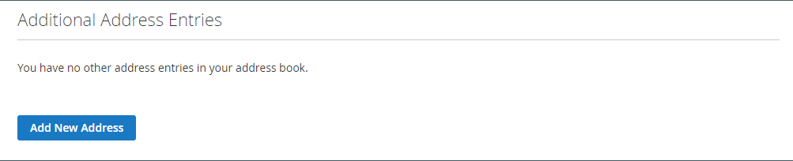
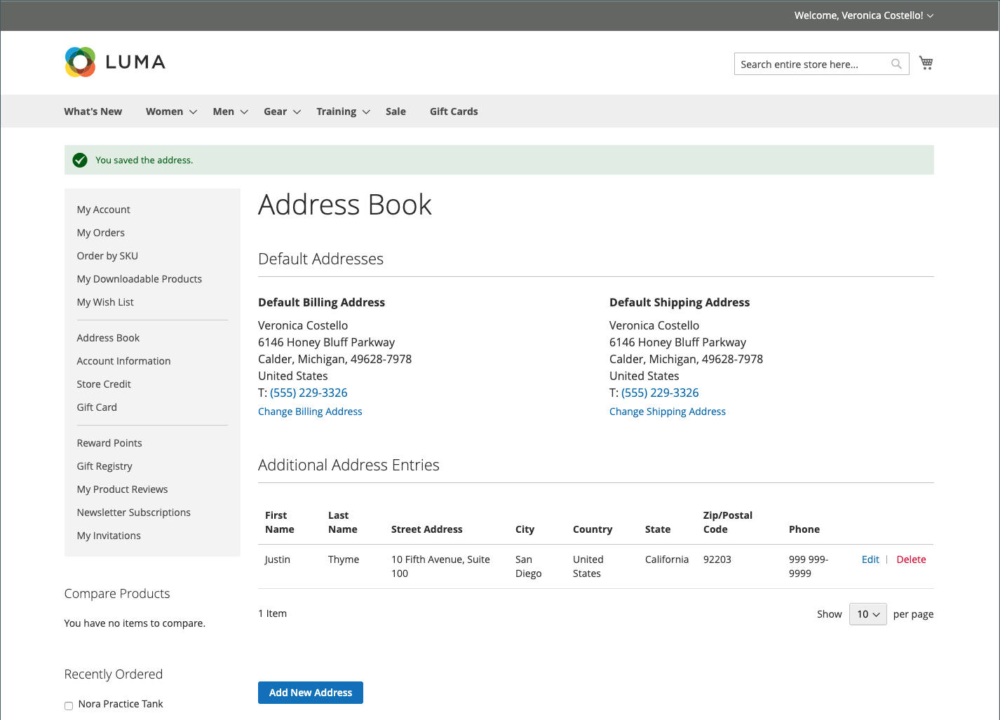

# Kundadressboken

Kunder som håller sina adressböcker aktuella kan snabba upp kassaprocessen. Adressboken innehåller kundens standardadresser för fakturering och leverans samt eventuella ytterligare adresser som de använder ofta. Ytterligare adressposter är enkla att komma åt och underhålla från rutnätet. Varje kundadressbok kan hantera över 3 000 adressboksposter utan att påverka prestanda.

{width="700" zoomable="yes"}

## Lägg till en adress

1. I den vänstra navigeringen för kundkontot väljer kunden **[!UICONTROL Address Book]**.

1. Klicka på **[!UICONTROL Add New Address]** på sidan _[!UICONTROL Address Book]_under_ Ytterligare adressposter _.

   {width="600" zoomable="yes"}

1. Definierar det nya adressobjektet.

1. Slutför kontakt- och adressinformationen.

   >[!INFO]
   >
   >Som standard visas kundens för- och efternamn först i formuläret.

1. Markerar följande kryssrutor för att ange hur adressen ska användas.

   Markerar båda kryssrutorna om samma adress används för både fakturering och leverans.

   * [!UICONTROL Use as my default billing address]
   * [!UICONTROL Use as my default shipping address]

1. Klicka på **[!UICONTROL Save Address]** när du är klar.

   >[!INFO]
   >
   >Den nya adressen listas under [!UICONTROL Additional Address Entries].

   {width="700" zoomable="yes"}

## Redigera en adress

1. Kunden väljer **[!UICONTROL Address Book]** i den vänstra navigeringen för sitt kundkonto.

1. Söker efter den adresspost som ska redigeras.

1. Klicka på **[!UICONTROL Edit]**.

1. Gör nödvändiga ändringar.

   >[!INFO]
   >
   >Kunden kan ange den här adressen som standardadress för **[!UICONTROL Shipping or Billing]** genom att markera kryssrutorna _Använd som standardfaktureringsadress_.

1. När ändringarna är klara klickar du på **[!UICONTROL Save Address]**.

## Ändra standardadressen

1. Kunden väljer **[!UICONTROL Address Book]** i den vänstra navigeringen för sitt kundkonto.

1. Väljer en av redigeringsmetoderna:

   * Klicka på **[!UICONTROL Change Billing/Shipping Address]** i avsnittet _[!UICONTROL Default Addresses]_.

   * Klicka på **[!UICONTROL Edit]** i rutnätet _[!UICONTROL Additional Address Entries]_.

1. Gör nödvändiga ändringar och klicka på **[!UICONTROL Save Address]**.

## Ta bort en adress

1. Kunden väljer **[!UICONTROL Address Book]** i den vänstra navigeringen för sitt kundkonto.

1. Söker efter adressposten som ska tas bort.

1. Klicka på **[!UICONTROL Delete]** i rutnätet _[!UICONTROL Additional Address Entries]_.

1. Bekräfta åtgärden genom att klicka på **[!UICONTROL OK]**.

   >[!IMPORTANT]
   >
   >Det går inte att ta bort standardadresserna för fakturering och leverans.
