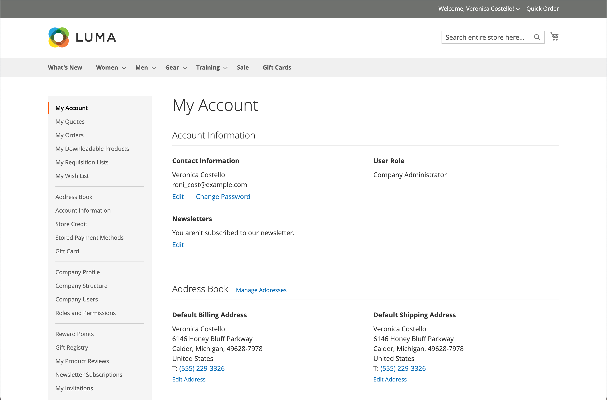

# Kontrollpanel för kundkonto

Kunderna kan hantera och övervaka sin egen information och sina aktiviteter via sin kontokontrollpanel. Kunderna kan ändra beställning, spåra beställningar, hantera leveransadresser och betalningsmetoder, produktrecensioner, prenumerationer på nyhetsbrev med mera.

{width="700" zoomable="yes"}

>[!NOTE]
>
> Med installation och aktivering av Adobe Commerce B2B kan köpupplevelsen personaliseras med företagsspecifika funktioner. Alla alternativ för kontrollpanelen för B2B-konton (inköpsorder, rekvisitionslistor och förhandlade offerter) kan aktiveras för kunder som är kopplade till ett företag. Mer information om B2B-funktionerna finns i [Användarhandbok för Adobe Commerce B2B](../b2b/introduction.md).

{width="700" zoomable="yes"}

## Sidnavigering i instrumentpanelen för konton

Tabellen nedan innehåller information om alla avsnitt som är tillgängliga i vänsternavigeringen på kundkontouppsättningen.

| Avsnitt | Beskrivning |
|------------------------------------------------------------------------------------------------------------------------------------------------------|----------------------------------------------------------------------------------------------------------------------------------------------------------------------------------------------------------------------------------------------------------------------------------------------------------------------------------------------------------------|
| [**[!UICONTROL My Account]**](../customers/account-dashboard-my-account.md) | Visar översiktsinformation för ditt konto, inklusive kontaktinformation, standardadresser från adressboken och senaste beställningar. |
| [**[!UICONTROL My Orders]**](../stores-purchase/orders-storefront.md#view-recently-ordered-products) | Visar en lista med alla kundorder, med en länk till varje. Om den är aktiverad i konfigurationen kan du ändra ordningsföljden genom att klicka på länken Ändra ordning. |
| [**[!UICONTROL My Downloadable Products]**](../catalog/product-create-downloadable.md#storefront-experience) | Visar alla hämtningsbara produkter som kunden har köpt, med en länk till varje. |
| [**[!UICONTROL My Wish List]**](../stores-purchase/wishlist-storefront.md) | Hantera era önskelistor och beställ utifrån önskelisteartiklar. |
| [**[!UICONTROL Address Book]**](../customers/account-dashboard-address-book.md) | Kundadressboken innehåller standardadressen för fakturering och leverans samt ytterligare adressposter. |
| [**[!UICONTROL Account Information]**](../customers/account-dashboard-account-information.md) | Kunderna kan uppdatera sin kontoinformation och ändra sitt lösenord efter behov. Butiksadministratören kan även uppdatera kundkonton och få tillgång till informationen för att kunna erbjuda shoppinghjälp. |
| [**[!UICONTROL Billing Agreements]**](../stores-purchase/paypal-billing-agreements.md#storefront-experience) | Visar en lista över eventuella kundfaktureringsavtal. |
| [**[!UICONTROL My Product Reviews]**](../merchandising-promotions/product-reviews.md#product-reviews-on-the-storefront) | Visar en lista över alla produktrecensioner som kunden har skickat in, med en länk till varje. |
| [**[!UICONTROL Newsletter Subscriptions]**](../merchandising-promotions/newsletters.md) | Visar alla tillgängliga nyhetsbrev, med en bock bredvid de objekt som kunden prenumererar på. |
|  [**[!UICONTROL Order by SKU]**](../stores-purchase/order-by-sku.md#order-by-sku-from-a-customer-account) | Ger dig möjlighet att lägga till enskilda artiklar i kundvagnen eller att importera en lista över produkter som ska beställas från en CSV-fil. |
|  [**[!UICONTROL Store Credit]**](../customers/account-dashboard-store-credit.md) | Visar aktuellt belopp för butikskrediter från returer, återbetalningar och inlösta presentkort som kan användas på inköp. |
| [**[!UICONTROL Stored Payment Methods]**](../stores-purchase/stored-payment-methods.md) | Visar alla betalningsmetoder med säkra valv som används av kunden för att lagra kreditkortsinformation. |
|  [**[!UICONTROL Gift Card]**](../catalog/product-gift-card-create.md) | Gör det möjligt för kunder att kontrollera det aktuella saldot på tillgängliga presentkort och att lösa in presentkort för butikskrediter. |
|  [**[!UICONTROL Reward Points]**](../merchandising-promotions/rewards-loyalty.md) | Visar alla belöningspoäng som kunden har tjänat och som kan tillämpas på inköp. |
|  [**[!UICONTROL Gift Registry]**](../merchandising-promotions/gift-registries.md) | Används för att lista och underhålla presentregister och lägga till nya. |
|  [**[!UICONTROL My Invitations]**](../merchandising-promotions/invitations.md) | Visar alla inbjudningar som kunden har skapat och skickat för schemalagda händelser. |
|  [**[!UICONTROL My Purchase Orders]**](../b2b/account-dashboard-my-purchase-orders.md) | (Endast företag) Visar en lista över alla inköpsorder som skickats eller kontrollerats av kunden, med en länk till detaljerad information. |
|  [**[!UICONTROL My Quotes]**](../b2b/account-dashboard-my-quotes.md) | (Endast företag) Visar alla offerter som kunden lämnat in, med en länk till detaljerad information. |
|  [**[!UICONTROL My Requisition Lists]**](../b2b/account-dashboard-requisition-lists-manage.md) | (Endast företag) Upprätthåller alla rekvisitionslistor som har skapats av kunden. |
|  [**[!UICONTROL Company Profile]**](../b2b/account-company-manage.md#update-a-company-profile) | (Endast företag) En företagsadministratör kan hantera företagsinformation, t.ex. företagsnamn och adress, kontaktinformation för företagsadministratör och betalningsinformation. |
|  [**[!UICONTROL Company Credit]**](../b2b/credit-company.md#storefront-credit-information) | (Endast företag) Visar aktuellt utestående saldo, tillgänglig kredit och kreditgränsen som allokeras till kontot, följt av en lista över utestående fakturor. Avsnittet Företagskrediter visas bara på kontrollpanelen när [Betalning à conto](../b2b/enable-basic-features.md#configure-payment-on-account) är aktiverat i konfigurationen. |
|  [**[!UICONTROL Company Structure]**](../b2b/account-company-structure.md) | (Endast företag) Används av företagsadministratören för att definiera företagets affärsstruktur. |
|  [**[!UICONTROL Company Users]**](../b2b/account-company-users.md) | (Endast företag) Används av företagsadministratören för att skapa användarkonton för företagsköpare. |
|  [**[!UICONTROL Roles and Permissions]**](../b2b/account-company-roles-permissions.md) | (Endast företag) Används av företagsadministratören för att definiera roller för företagsanvändare med olika behörighetsnivåer. |
|  [**[!UICONTROL Approval Rules]**](../b2b/account-dashboard-approval-rules.md) | (Endast företag) Används för att definiera godkännanderegler för inköpsorder. |

{style="table-layout:auto"}
