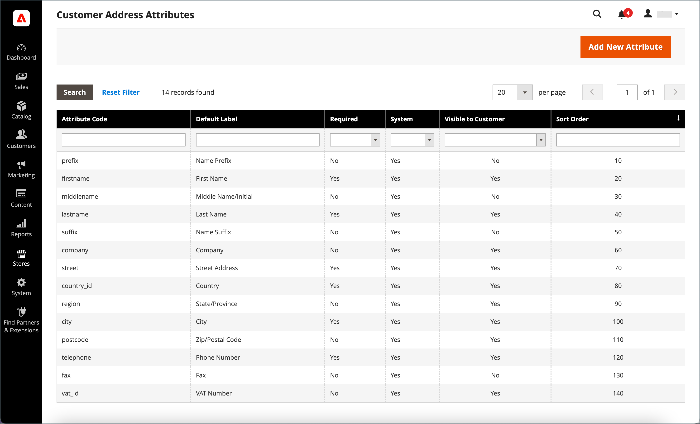

# Kundadressattribut

{{ee-feature}}

Attributet Kundadress avgör vilka egenskaper för gatuadresser som anges i [adressbok](account-dashboard-address-book.md) från kundens konto eller under [utcheckning](../stores-purchase/checkout-process.md).

Anpassade adressattribut kan konfigureras för att ge ytterligare information, t.ex. en valfri e-postadress, ett Skype-konto, alternativt telefonnummer, byggnad eller region. Det anpassade attributet kan sedan införlivas i [adressmall](address-templates.md) som används för att producera försäljningsdokument. Processen att skapa ett anpassat adressattribut är nästan densamma som att skapa ett [kundattribut](attribute-properties.md).

Kundadressattribut används i följande formulär:

- [Kundadressregistrering](account-create.md)
- [Kundkontoadress](account-dashboard-address-book.md)

{width="700" zoomable="yes"}

## Steg 1: Slutför attributegenskaperna

1. På _Administratör_ sidebar, gå till **[!UICONTROL Stores]** > _[!UICONTROL Attributes]_>**[!UICONTROL Customer Address]**.

1. Klicka på i det övre högra hörnet **[!UICONTROL Add New Attribute]**.

   {width="600" zoomable="yes"}

1. I **[!UICONTROL Attribute Properties]** gör du följande:

   - Ange en **[!UICONTROL Default Label]** som identifierar attributet under datainmatning.

   - Ange en **[!UICONTROL Attribute Code]** som identifierar attributet i systemet.

     Attributkoden måste börja med en bokstav och kan innehålla valfri kombination av gemener (a-z) och siffror (0-9). Koden får innehålla högst 30 tecken och får inte innehålla specialtecken eller blanksteg. Understrecket (_) kan användas för att ange ett mellanslag.

     >[!TIP]
     >
     >**_Kortkommando:_** Om du bara vill fylla i de obligatoriska fälten bläddrar du nedåt till [!UICONTROL Storefront Properties], anger [!UICONTROL Sort Order]och spara.

1. Ange vilken typ av indatakontroll som ska användas för datainmatning **[!UICONTROL Input Type]** till något av följande:

   - `Text Field` - Ett textfält med en rad.
   - `Text Area` - Ett textområde med flera rader.
   - `Multiple Line` - Skapar flera textrader för attributet, ungefär som en gatuadress med flera rader. Antalet separata datainmatningsrader kan vara mellan 2 och 20. Använd `Default Value` för att ange fältets ursprungliga värde.
   - `Date` - Visar ett datumfält med en popup-kalender. Ytterligare egenskaper: Använd `Default Value` för att ange fältets ursprungliga värde.  Använd `Minimal Value` för att ange det tidigaste datum som kan anges.  Använd `Maximum Value` för att ange det senaste datumet som kan anges.
   - `Dropdown` - En nedrullningsbar lista där endast ett värde kan väljas.
   - `Multiple Select` - En nedrullningsbar lista där flera värden kan väljas.
   - `Yes/No` - Ett fält som bara erbjuder `Yes` eller `No` värden.
   - `File (attachment)` - Ett fält som gör att en fil kan överföras och associeras med kundattributet som en bifogad fil.
   - `Image File` - Ett fält som tillåter att en bild överförs till galleriet och associeras med kundattributet.

1. Om kunden måste ange ett värde i fältet anger du **[!UICONTROL Values Required]** till `Yes`.

1. Om du vill tilldela ett initialt värde till fältet anger du ett **[!UICONTROL Default Value]**.

1. Om du vill kontrollera om de data som anges i fältet är korrekta innan posten sparas anger du **[!UICONTROL Input Validation]** till den typ av data som ska tillåtas i fältet. Vilka värden som är tillgängliga beror på _[!UICONTROL Input Type]_anges.

   - `None` - Fältet har ingen indatavalidering vid datainmatning.
   - `Alphanumeric` - Accepterar alla kombinationer av siffror (0-9) och alfabetiska tecken (a-z, A-Z) under datainmatningen. Information om hur du inkluderar specialtecken finns i [!UICONTROL Escape HTML Entities] i nästa steg.
   - `Alphanumeric with Space` - Accepterar alla kombinationer av siffror (0-9), alfabetiska tecken (a-z, A-Z) och mellanslag under datainmatning.
   - `Numeric Only` - Accepterar endast tal (0-9) under datainmatning.
   - `Alpha Only` - Accepterar endast alfabetiska tecken (a-z, A-Z) under datainmatning.
   - `URL` - Accepterar endast en URL under datainmatning.
   - `Email` - Accepterar endast en e-postadress under datainmatning.
   - `Length Only` - Validerar indata baserat på längden på de data som anges i fältet.

1. Om du vill använda ett förbearbetningsfilter på värden som anges i ett textfält, ett textområde eller en indatatyp med flera rader anger du **[!UICONTROL Input/Output Filter]** till något av följande:

   - `None` - Använder inte något filter på text som anges i fältet.
   - `Strip HTML Tags` - Tar bort HTML-taggar från texten. Det här filtret kan hjälpa dig att rensa data som klistras in i ett fält från en annan källa som innehåller HTML-taggar.
   - `Escape  HTML Entities`  - Konverterar specialtecken som finns i texten till en giltig HTML-escape-sekvens, till exempel `&;`. Escape-sekvenser placeras mellan ett et-tecken och ett semikolon och används ofta för typografiska citattecken, copyright och varumärkessymboler. Escape-sekvenser används också för att identifiera tecken som mindre än (`<`) och större än (`>`) och et-tecknet som också används i koden. Det här filtret kan hjälpa dig att rensa specialtecken som ibland klistras in i databasfält från ordbehandlare.

1. Fyll i kundrutnät och segmentegenskaper:

   - Om du vill kunna inkludera kolumnen i kundrutnätet anger du **[!UICONTROL Add to Column Options]** till `Yes`.

   - Om du vill filtrera kundrutnätet efter det här attributet anger du **[!UICONTROL Use in Filter Options]** till `Yes`.

   - Om du vill filtrera kundens rutnät efter textattribut med olika filtermatchningsvillkor anger du **[!UICONTROL Grid Filter Condition Type]** till `Partial Match`, `Prefix Match`, eller `Full Match`. Det påverkar inte _Sök efter nyckelord_ för rutnätet.

   - Om du vill söka efter kundstödrastret efter det här attributet anger du **[!UICONTROL Use in Search Options]** till `Yes`.

   - Gör attributet tillgängligt för [kundsegment](customer-segments.md), ange **[!UICONTROL Use in Customer Segment]** till `Yes`.

## Steg 2: Slutför butiksegenskaperna

1. Bläddra nedåt till **[!UICONTROL Storefront Properties]** -avsnitt.

   {width="600" zoomable="yes"}

1. Ange attributet så att det blir synligt för kunderna **[!UICONTROL Show on Storefront]** till `Yes`.

1. Ange ett tal i dialogrutan **[!UICONTROL Sort Order]** -fält, som bestämmer utseendeordningen när det listas med andra attribut.

1. Ange **[!UICONTROL Forms to Use]** till varje formulär som ska innehålla attributet.

   Om du vill välja båda alternativen håller du ned Ctrl-tangenten (PC) eller Kommando-tangenten (Mac) när du klickar på varje formulär.

   - [Kundadressregistrering](account-create.md)
   - [Kundkontoadress](account-dashboard-address-book.md)

## Steg 3: Slutför etiketten och spara

1. Välj **[!UICONTROL Manage Labels/Options]**.

1. Under **[!UICONTROL Manage Titles]**, anger du en etikett som identifierar attributet för varje [butiksvy](../getting-started/websites-stores-views.md).

1. När du är klar klickar du på **[!UICONTROL Save Attribute]**.

   {width="600" zoomable="yes"}

## Fältbeskrivningar

### [!UICONTROL Attribute Properties]

| Fält | Beskrivning |
|--- |--- |
| [!UICONTROL Default Label] | Standardetiketten som identifierar attributet i Admin och storefront. |
| [!UICONTROL Attribute Code] | En unik kod som identifierar attributet i systemet. Koden kan innehålla upp till 21 tecken och får inte innehålla mellanslag eller specialtecken. Understreckssymbolen kan användas i stället för ett mellanslag. |
| [!UICONTROL Input Type] | Bestämmer [indatakontroll](../catalog/attributes-input-types.md) som används för datainmatning. Alternativ:  **`Text Field`**- Ett textfält med en rad. **`Text Area`** - Ett textområde med flera rader.  **`Multiple Line`**- Skapar flera textrader för attributet, ungefär som en gatuadress med flera rader. Antalet separata datainmatningsrader kan vara mellan 2 och 20. **`Date`** - Visar ett datumfält med en popup-kalender. **`Dropdown`**- En nedrullningsbar lista där endast ett värde kan väljas. **`Multiple Select`** - En nedrullningsbar lista där flera värden kan väljas.  **`Yes/No`**- Ett fält som bara erbjuder `Yes` eller `No` värden. **`File (attachment)`** - Ett fält som gör att en fil kan överföras och associeras med kundattributet som en bifogad fil.  **`Image File`**- Ett fält som tillåter att en bild överförs till galleriet och associeras med kundattributet. |
| [!UICONTROL Values Required] | Anger om ett värde måste anges i fältet. Alternativ: `Yes` / `No` |
| [!UICONTROL Default Value] | Anger det inledande värdet för attributet. |
| [!UICONTROL Input Validation] | Valet av alternativ avgörs av indatatypen. Alternativ:  **`None`**- Fältet har ingen indatavalidering vid datainmatning. **`Alphanumeric`** - Accepterar alla kombinationer av siffror (0-9) och alfabetiska tecken (a-z, A-Z) under datainmatningen.  **`Alphanumeric with Space`**- Tillåter att utrymmen på gatuadressen uppfyller transportörens längsta krav. Vid utcheckning kan kunden ange valfri kombination av siffror (0-9), alfabetiska tecken (a-z, A-Z) och blanksteg i mottagarens och avsändarens gatuadress. Eventuella extra blanksteg trimmas när adressen sparas. **`Numeric Only`** - Accepterar endast tal (0-9) under datainmatning.  **`Alpha Only`**- Accepterar endast alfabetiska tecken (a-z, A-Z) under datainmatning. ** URL **- Accepterar endast en URL under datainmatning. **`Email`** - Accepterar endast en e-postadress under datainmatning.  **`Length Only`**- Validerar indata baserat på längden på de data som anges i fältet. |
| [!UICONTROL Input/Output Filter] | Tillämpar ett förbearbetningsfilter på värden som anges i ett textfält, textområde eller flera rader innan posten sparas. Alternativ:  **`None`**- Använder inte något filter på text som anges i fältet. **`Strip HTML Tags`** - Tar bort HTML-taggar från texten. Det här filtret kan hjälpa dig att rensa data som klistras in i ett fält från en annan källa som innehåller HTML-taggar.  **`Escape HTML Entities`**- Konverterar specialtecken som finns i texten till en giltig HTML-escape-sekvens, till exempel `amp;`. Escape-sekvenser placeras mellan ett et-tecken och ett semikolon och används ofta för typografiska citattecken, copyrightsymboler och varumärkessymboler. Escape-sekvenser används också för att identifiera tecken som mindre än (`<`) och större än (`>`) och et-tecknet som också används i koden. Det här filtret kan hjälpa dig att rensa specialtecken som ibland klistras in i databasfält från ordbehandlare. |
| [!UICONTROL Add to Column Options] | Anger om attributet ingår som en kolumn i [Kunder](./customers-all.md) rutnät. Alternativ: `Yes` / `No` |
| Använd i filteralternativ | Anger om attributet kan användas som ett filter för sökåtgärder från rutnätet. Alternativ: `Yes` / `No` |
| [!UICONTROL Grid Filter Condition Type] | Anger filtermatchningsvillkor för attribut i sökåtgärder från rutnätet. Det påverkar inte _[!UICONTROL Search by keyword]_för rutnätet. Alternativ: `Partial Match` / `Prefix Match` / `Full Match` |
| [!UICONTROL Use in Search Options] | Anger om attributvärdet kan användas som nyckelord i sökåtgärder. Alternativ: `Yes` / `No` |
| [!UICONTROL Use in Customer Segment] | Bestämmer om attributet ingår i [kundsegment](./customer-segments.md) villkor. Alternativ: `Yes` / `No` |

### [!UICONTROL Storefront Properties]

| Fält | Beskrivning |
|--- |--- |
| [!UICONTROL Show on Storefront] | Avgör om attributet visas som ett fält i kundinformationen i butiken. Alternativ: `Yes` / `No` |
| [!UICONTROL Sort Order] | Anger sorteringsordningen för det här attributet i relation till andra kundattribut. Sorteringsordningen bestämmer den sekvens som fält får fokus under datainmatning när tangentbordsnavigering används. |
| [!UICONTROL Forms to Use in] | Anger vilka sidor med datainmatningsformulär som attributet finns på. Alternativ:  [`Customer Address Registration`](account-create.md)  [`Customer Account Address`](account-dashboard-address-book.md) |
