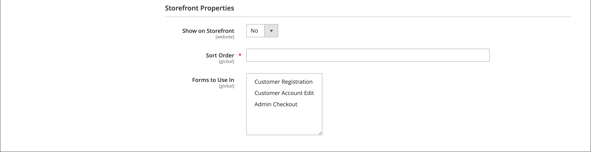

# Egenskaper för kundattribut

{{ee-feature}}

Kundattribut tillhandahåller den information som krävs för att stödja beställnings-, uppfyllelse- och kundhanteringsprocesserna. Eftersom din verksamhet är unik kan du behöva fält utöver standardobjekten som tillhandahålls av systemet. Du kan lägga till anpassade attribut till avsnitten Kontoinformation, Adressbok och Faktureringsinformation i kundens konto. Kund [adressattribut](address-attributes.md) kan även användas i _Faktureringsinformation_ under utcheckning eller när gäster registrerar sig för ett konto.

{width="700" zoomable="yes"}

## Steg 1: Slutför attributegenskaperna

1. På _Administratör_ sidebar, gå till **[!UICONTROL Stores]** > _[!UICONTROL Attributes]_>**[!UICONTROL Customer]**.

1. Klicka på i det övre högra hörnet **[!UICONTROL Add New Attribute]**.

   {width="600" zoomable="yes"}

1. I **[!UICONTROL Attribute Properties]** gör du följande:

   - Ange en **[!UICONTROL Default Label]** som identifierar attributet under datainmatning.

   - Ange en **[!UICONTROL Attribute Code]** som identifierar attributet i systemet.

   Attributkoden måste börja med en bokstav och kan innehålla valfri kombination av gemener (a-z) och siffror (0-9). Koden får innehålla högst 30 tecken och får inte innehålla specialtecken eller blanksteg. Understrecket (`_`) kan användas för att ange ett mellanslag.

   >[!TIP]
   >
   >**Kortkommando:** Om du bara vill fylla i de obligatoriska fälten bläddrar du nedåt till _[!UICONTROL Storefront Properties]_, anger_[!UICONTROL Sort Order]_ och spara.

1. Fyll i datainmatningsegenskaperna:

   - Ange vilken typ av indatakontroll som ska användas för datainmatning **[!UICONTROL Input Type]** till något av följande:

     | Typ | Beskrivning |
     |----|-----------|
     | `Text Field` | Ett textfält med en rad. |
     | `Text Area` | Ett inmatningsfält med flera rader för att skriva textstycken, som en produktbeskrivning. Du kan använda WYSIWYG-redigeraren för att formatera texten med HTML-taggar, eller ange taggarna direkt i texten. |
     | `Multiple Line` | Skapar flera textrader för attributet, ungefär som en gatuadress med flera rader. Antalet separata datainmatningsrader kan vara mellan två och 20. Använd `Default Value` för att ange fältets ursprungliga värde. |
     | `Date` | Visar ett datumvärde i det önskade datumformatet och tidszonen. Datumvärden kan väljas från en lista eller en kalender (  ).   **_Obs!_**Beroende på systemkonfigurationen,_Administratör _-användare kan ange datum direkt i ett fält eller välja ett datum i kalendern eller listan. Mer information om hur du anger datum- och tidsvärden finns i [Alternativ för datum och tid](../catalog/attributes-input-types.md#date-and-time-options). |
     | `Yes/No` | Visar en nedrullningsbar lista med fördefinierade alternativ för `Yes` och `No`. |
     | `Dropdown` | Visar en nedrullningsbar lista med värden som endast accepterar ett val. Indatatypen för listrutan är en nyckelkomponent i [konfigurerbara produkter](../catalog/product-create-configurable.md). |
     | `Multiple Select` | En nedrullningsbar lista där flera värden kan väljas. |
     | `File (attachment)` | Ett fält som gör att en fil kan överföras och associeras med kundattributet som en bifogad fil. |
     | `Image File` | Ett fält som tillåter att en bild överförs till galleriet och associeras med kundattributet. |

   - Om kunden måste ange ett värde i fältet anger du **[!UICONTROL Values Required]** till `Yes`.

   - Om du vill tilldela ett initialt värde till fältet anger du ett **[!UICONTROL Default Value]**.

   - Om du vill kontrollera om de data som anges i fältet är korrekta innan posten sparas anger du **[!UICONTROL Input Validation]** till den typ av data som ska tillåtas i fältet. Vilka värden som är tillgängliga beror på [!UICONTROL Input Type] anges.

     | Värde | Beskrivning |
     |-----|-----------|
     | `None` | Fältet har ingen indatavalidering vid datainmatning. |
     | `Alphanumeric` | Accepterar alla kombinationer av siffror (0-9) och alfabetiska tecken (a-z, A-Z) under datainmatningen. Information om hur du inkluderar specialtecken finns i _Enheter i Escape HTML_. |
     | `Alphanumeric with Space` | Accepterar alla kombinationer av tal (0-9), alfabetiska tecken (a-z, A-Z) och blanksteg under datainmatning. |
     | `Numeric Only` | Accepterar endast tal (0-9) under datainmatning. |
     | `Alpha Only` | Accepterar endast alfabetiska tecken (a-z, A-Z) under datainmatning. |
     | `URL` | Accepterar endast en URL under datainmatning. |
     | `Email` | Accepterar endast en e-postadress under datainmatning. |
     | `Length Only` | Validerar indata baserat på längden på de data som anges i fältet. |

   - Om du vill begränsa storleken på indatatyperna Textfält och Textområde anger du **[!UICONTROL Minimum Text Length]** och **[!UICONTROL Maximum Text Length]**.

   - Om du vill använda ett förbearbetningsfilter på värden som anges i ett textfält, ett textområde eller en indatatyp med flera rader anger du **[!UICONTROL Input/Output Filter]** till något av följande:

     | Värde | Beskrivning |
     |-----|-----------|
     | `None` | Tillämpar inte något filter på text som anges i fältet. |
     | `Strip HTML Tags` | Tar bort HTML-taggar från texten. Det här filtret kan hjälpa dig att rensa data som klistras in i ett fält från en annan källa som innehåller HTML-taggar. |
     | `Escape  HTML Entities` | Konverterar specialtecken som finns i texten till en giltig HTML-escape-sekvens, till exempel `&;`. Escape-sekvenser placeras mellan ett et-tecken och ett semikolon och används ofta för typografiska citattecken, copyright och varumärkessymboler. Escape-sekvenser används också för att identifiera tecken som mindre än (`<`) och större än (`>`) och et-tecknet som också används i koden. Det här filtret kan hjälpa dig att rensa specialtecken som ibland klistras in i databasfält från ordbehandlare. |

1. Fyll i kundrutnät och segmentegenskaper:

   - Om du vill kunna inkludera kolumnen i kundrutnätet anger du **[!UICONTROL Add to Column Options]** till `Yes`.

   - Om du vill filtrera kundrutnätet efter det här attributet anger du **[!UICONTROL Use in Filter Options]** till `Yes`.

   - Om du vill filtrera kundens rutnät efter textattribut med olika filtermatchningsvillkor anger du **[!UICONTROL Grid Filter Condition Type]** till `Partial Match`, `Prefix Match`, eller `Full Match`. Det påverkar inte _Sök efter nyckelord_  för rutnätet.

   - Om du vill söka efter kundstödrastret efter det här attributet anger du **[!UICONTROL Use in Search Options]** till `Yes`.

   - Gör attributet tillgängligt för [kundsegment](customer-segments.md), ange **[!UICONTROL Use in Customer Segment]** till `Yes`.

## Steg 2: Slutför butiksegenskaperna

1. Bläddra nedåt till **[!UICONTROL Storefront Properties]** -avsnitt.

   {width="600" zoomable="yes"}

1. Ange attributet så att det blir synligt för kunderna **[!UICONTROL Show on Storefront]** till `Yes`.

1. Ange ett tal i dialogrutan **[!UICONTROL Sort Order]** -fält, som bestämmer utseendeordningen när det listas med andra attribut.

1. Ange **[!UICONTROL Forms to Use]** till varje formulär som ska innehålla attributet. Om du vill välja flera alternativ håller du ned Ctrl-tangenten och klickar på varje formulär.

   - [&quot;Kundregistrering&quot;](customer-sign-in.md)
   - [&quot;Redigera kundkonto&quot;](account-create.md)
   - [&quot;Admin Checkout&quot;](../stores-purchase/checkout-process.md)

## Steg 3: Slutför etiketten och spara

1. Välj **[!UICONTROL Manage Labels/Options]**.

1. Under **[!UICONTROL Manage Titles]**, anger du en etikett som identifierar attributet för varje [butiksvy](../getting-started/websites-stores-views.md).

1. När du är klar klickar du på **[!UICONTROL Save Attribute]**.

   {width="600" zoomable="yes"}

## Fältbeskrivningar

### [!UICONTROL Attribute Properties]

| Fält | Beskrivning |
|--- |--- |
| [!UICONTROL Default Label] | Standardetiketten som identifierar attributet i Admin och storefront. |
| [!UICONTROL Attribute Code] | En unik kod som identifierar attributet i systemet. Koden kan innehålla upp till 60 tecken och får inte innehålla mellanslag eller specialtecken. Understreckssymbolen kan användas i stället för ett mellanslag. |
| [!UICONTROL Input Type] | Anger den indatakontroll som används för datainmatning. Alternativ:  **`Text Field`**- Ett textfält med en rad. **`Text Area`** - Ett textområde med flera rader.  **`Multiple Line`**- Skapar flera textrader för attributet, ungefär som en gatuadress med flera rader. Antalet separata datainmatningsrader kan vara mellan 2 och 20. **`Date`** - Visar ett datumfält med en popup-kalender. **`Dropdown`**- En nedrullningsbar lista där endast ett värde kan väljas. **`Multiple Select`** - En nedrullningsbar lista där flera värden kan väljas.  **`Yes/No`**- Ett fält som bara erbjuder `Yes` eller `No` värden. **`File (attachment)`** - Ett fält som gör att en fil kan överföras och associeras med kundattributet som en bifogad fil.  **`Image File`**- Ett fält som tillåter att en bild överförs till galleriet och associeras med kundattributet. |
| [!UICONTROL Values Required] | Anger om ett värde måste anges i fältet. Alternativ: `Yes` / `No` |
| [!UICONTROL Default Value] | Anger det inledande värdet för attributet. |
| [!UICONTROL Input Validation] | Valet av alternativ avgörs av indatatypen. Alternativ:  **`None`**- Fältet har ingen indatavalidering vid datainmatning. **`Alphanumeric`** - Accepterar alla kombinationer av siffror (0-9) och alfabetiska tecken (a-z, A-Z) under datainmatningen.  **`Alphanumeric with Space`**- Tillåter att utrymmen på gatuadressen uppfyller transportörens längsta krav. Vid utcheckning kan kunden ange valfri kombination av siffror (0-9), alfabetiska tecken (a-z, A-Z) och blanksteg i mottagarens och avsändarens gatuadress. Eventuella extra blanksteg trimmas när adressen sparas. **`Numeric Only`** - Accepterar endast tal (0-9) under datainmatning.  **`Alpha Only`**- Accepterar endast alfabetiska tecken (a-z, A-Z) under datainmatning. **`URL`** - Accepterar endast en URL under datainmatning.  **`Email`**- Accepterar endast en e-postadress under datainmatning. **`Length Only`** - Validerar indata baserat på längden på de data som anges i fältet. |
| [!UICONTROL Input/Output Filter] | Tillämpar ett förbearbetningsfilter på värden som anges i ett textfält, textområde eller flera rader innan posten sparas. Alternativ:  **`None`**- Använder inte något filter på text som anges i fältet. **`Strip HTML Tags`** - Tar bort HTML-taggar från texten. Det här filtret kan hjälpa dig att rensa data som klistras in i ett fält från en annan källa som innehåller HTML-taggar.  **`Escape HTML Entities`**- Konverterar specialtecken som finns i texten till en giltig HTML-escape-sekvens, till exempel `amp;`. Escape-sekvenser placeras mellan ett et-tecken och ett semikolon och används ofta för typografiska citattecken, copyrightsymboler och varumärkessymboler. Escape-sekvenser används också för att identifiera tecken som mindre än (`<`) och större än (`>`) och et-tecknet som också används i koden. Det här filtret kan hjälpa dig att rensa specialtecken som ibland klistras in i databasfält från ordbehandlare. |
| [!UICONTROL Add to Column Options] | Anger om attributet ingår som en kolumn i [Kunder](customers-all.md) rutnät. Alternativ: `Yes` / `No` |
| [!UICONTROL Use in Filter Options] | Anger om attributet kan användas som ett filter för sökåtgärder från rutnätet. Alternativ: `Yes` / `No` |
| [!UICONTROL Grid Filter Condition Type] | Anger filtermatchningsvillkoren för attribut för sökåtgärder från rutnätet. Det påverkar inte _Sök efter nyckelord_ för rutnätet. Alternativ: `Partial Match` / `Prefix Match` / `Full Match` |
| [!UICONTROL Use in Search Options] | Anger om attributvärdet kan användas som nyckelord i sökåtgärder. Alternativ: `Yes` / `No` |
| [!UICONTROL Use in Customer Segment] | Bestämmer om attributet ingår i [kundsegment](customer-segments.md) villkor. Alternativ: `Yes` / `No` |

### [!UICONTROL Storefront Properties]

| Fält | Beskrivning |
|--- |--- |
| [!UICONTROL Show on Storefront] | Avgör om attributet visas som ett fält i kundinformationen i butiken. Alternativ: `Yes` / `No` |
| [!UICONTROL Sort Order] | Anger sorteringsordningen för det här attributet i relation till andra kundattribut. Sorteringsordningen bestämmer den sekvens som fält får fokus under datainmatning när tangentbordsnavigering används. |
| [!UICONTROL Forms to Use in] | Anger vilka sidor med datainmatningsformulär som attributet finns på. Alternativ:  [`Customer Registration`](account-dashboard-account-information.md)  [`Customer Account Edit`](account-create.md)  [`Admin Checkout`](../stores-purchase/checkout-process.md) |

## Standardkundattribut

| Attributkod | Beskrivning |
| --------------- | ------------------ |
| `created_at` | Datumet då kundkontot skapades. |
| `updated_at` | Datumet då kundkontot senast uppdaterades. |
| `website_id` | Webbplats-ID för webbplatsen där kundkontot skapades. |
| `store_id` | Butiks-ID för webbplatsen där kundkontot skapades. |
| `created_in` | Butiksvyn där kontot skapades. |
| `group_id` | ID för kundgruppen där kunden är tilldelad. |
| `disable_auto_group_change` | Avgör om kundgrupper kan tilldelas dynamiskt under [moms-ID-validering](../stores-purchase/vat.md#configure-vat-id-validation). |
| `prefix` | Alla prefix som används med kundnamnet (t.ex. Mr., Ms. eller Dr.). |
| `firstname` | Kundens förnamn. |
| `middlename` | Kundens mellannamn eller mellaninitial. |
| `lastname` | Kundens efternamn. |
| `suffix` | Alla suffix som används med kundens namn. (t.ex. Jr, Sr eller Esquire) |
| `email` | Kundens e-postadress. |
| `dob` | Kundens födelsedatum.    **_Viktigt:_**I enlighet med gällande säkerhets- och integritetspraxis bör du vara medveten om eventuella juridiska risker och säkerhetsrisker som är förknippade med lagring av kundernas fullständiga födelsedatum (månad, dag, år) med andra personliga identifierare. Vi rekommenderar att du begränsar lagringen av kundernas födelsedatum och föreslår att du använder kundens födelseår som ett alternativ. |
| `taxvat` | Det momsregistreringsnummer (VAT) som tilldelats kunden. Standardetiketten för det här attributet är `VAT Number`. Fältet för momsregistreringsnummer finns alltid i alla kundadresser för leverans och fakturering när det visas från administratören, men är inte ett obligatoriskt fält. |
| `gender` | Kundens kön. |

## Demo av kundattribut

Titta på den här videon om du vill se en demonstration av hur du skapar kundattribut:

>[!VIDEO](https://video.tv.adobe.com/v/343661?quality=12)
