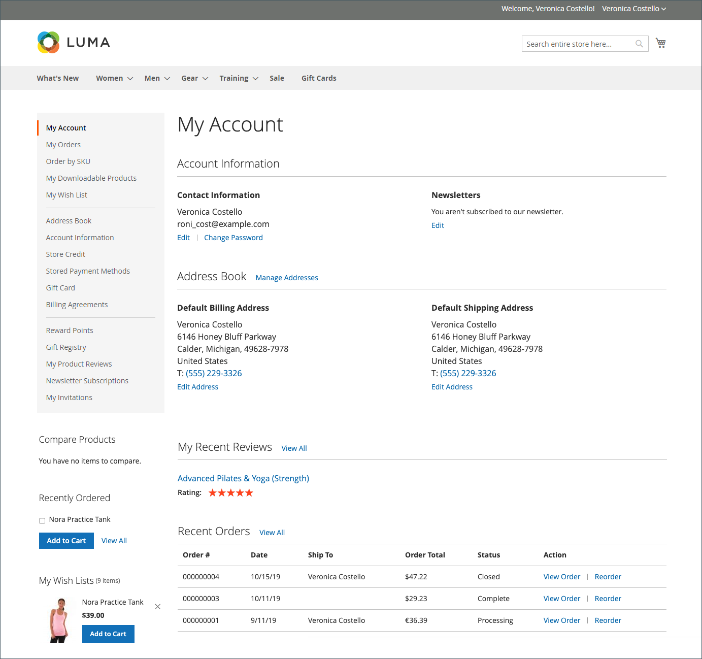

# Omfattning av kundkonto

Sidhuvudet på alla sidor i din butik utökar en inbjudan till kunderna att _logga in eller registrera_ för ett konto hos din butik. Kunder som öppnar ett konto har en rad fördelar, bland annat:

* **Skapa kundkonto** - Besökare kan skapa ett kundkonto så att de kan använda butiken som en registrerad kund.
* **Skapa ett företagskonto** Beroende på konfigurationen kan en besökare i din butik välja att skapa ett företagskonto. Mer information finns i [Adobe Commerce B2B](../b2b/introduction.md).
* **Snabbare utcheckning** - Registrerade kunder går igenom utcheckningen snabbare eftersom mycket av informationen redan finns på deras konton.
* **Självbetjäning** - Registrerade kunder kan uppdatera sin information, kontrollera status för beställningar och till och med ordna om från sina konton.

Kunder kan komma åt sitt konto genom att klicka på länken **[!UICONTROL My Account]** i butikens huvud. Från sitt konto kan kunderna visa och ändra information, inklusive tidigare och aktuella adresser, inställningar för fakturering och frakt, prenumerationer på nyhetsbrev, önskelistor med mera.

{width="600" zoomable="yes"}

## Ange omfattningen för kundkonton

Omfånget för kundkonton kan begränsas till webbplatsen där kontot skapades eller delas med alla webbplatser och butiker i butikshierarkin.

>[!NOTE]
>
>Om webbplatsen utesluts från kundgruppen får kunden inte logga in på webbplatsen när omfattningen av kundkontona är begränsad till webbplatsen eller delas med alla webbplatser. Se [Skapa en kundgrupp](customer-groups.md#create-a-customer-group) om du vill ha mer information om hur du utesluter webbplatser från grupper.

1. Gå till **[!UICONTROL Stores]** > [!UICONTROL _[!UICONTROL Settings]_] > **[!UICONTROL Configuration]** på sidofältet _Admin_.

1. Expandera **[!UICONTROL Customers]** i den vänstra panelen och välj **[!UICONTROL Customer Configuration]**.

1. Expandera avsnittet **[!UICONTROL Account Sharing Options]**.

   {width="600" zoomable="yes"}

1. Ange **[!UICONTROL Share Customer Accounts]** till något av följande:

   | Alternativ | Beskrivning |
   | --- | --- |
   | `Global` | Delar kundkontoinformation med alla webbplatser och butiker i installationen. |
   | `Per Website` | Begränsar kundkontoinformationen till webbplatsen där kontot skapades. |

   {style="table-layout:auto"}

   >[!INFO]
   >
   > Om det behövs avmarkerar du kryssrutan **[!UICONTROL User system value]** för att göra ändringen.

1. Klicka på **[!UICONTROL Save Config]** när du är klar.

   >[!NOTE]
   >
   >När `Global` har valts delas kundinformationen i **Mitt konto** (adresser och kontoinformation som kontaktinformation).
