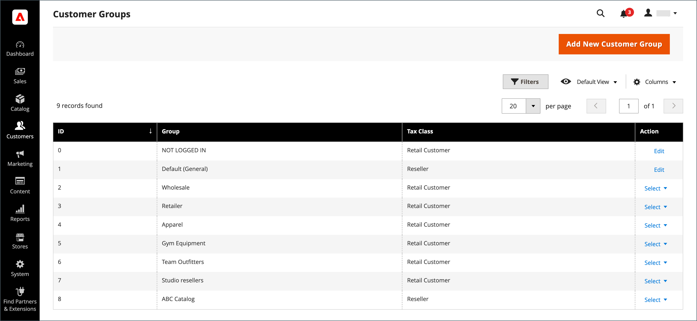

# Kundgrupper

Kundgrupper avgör vilka rabatter som är tillgängliga och vilken skatteklass som är associerad med gruppen. Standardkundgrupperna är `General`, `Not Logged In` och `Wholesale`.

{width="700" zoomable="yes"}

## Filtrera listan [!UICONTROL Customer Groups]

1. Gå till **[!UICONTROL Customers]** > **[!UICONTROL Customer Groups]** på sidofältet _Admin_.

1. Klicka på **[!UICONTROL Filters]**.

1. Ange sökvillkor för grupper, inklusive ett intervall med ID:n, grupper eller momsklass.

   {width="600" zoomable="yes"}

1. Klicka på **[!UICONTROL Apply Filters]** när du är klar.

## Skapa en kundgrupp

>[!NOTE]
>
>Administratörsanvändare som inte har åtkomst till alla webbplatser (tilldelade en roll med en Custom [!UICONTROL Role Scope]) kan inte skapa, ändra eller ta bort kundgrupper.

1. Gå till **[!UICONTROL Customers]** > **[!UICONTROL Customer Groups]** på sidofältet _Admin_.

1. Klicka på **[!UICONTROL Add New Customer Group]**.

1. För [!DNL **Group Name]** anger du ett unikt namn med färre än 32 tecken för att identifiera gruppen.

1. Markera **[!UICONTROL Tax Class]** som gäller för gruppen.

   {width="600" zoomable="yes"}

1. Välj den **[!UICONTROL Excluded Website(s)]** som du vill utesluta från gruppen.

   >[!IMPORTANT]
   >
   >Om du utesluter webbplatser kan du minska produktpriset och indexeringstiden för katalogregler, eftersom uteslutna webbplatser inte indexeras. När en kundgrupp sparas med ett tillagt undantag för en webbplats blir produktpriset, katalogregeln och katalogens sökindex ogiltiga. Om du har många produkter, webbplatser och kundgrupper rekommenderar vi att du gör en paus i indexeringsprocessen tills du har uteslutit webbplatser från kundgrupperna.

   Inga webbplatser utesluts som standard. Om du vill markera flera värden håller du ned _Ctrl_ (PC) eller _Kommando_ (Mac) och klickar på varje alternativ.

1. Klicka på **[!UICONTROL Save Customer Group]** när du är klar.

## Redigera en kundgrupp

1. Gå till **[!UICONTROL Customers]** > **[!UICONTROL Customer Groups]** på sidofältet _Admin_.

1. Öppna posten i redigeringsläge.

1. Gör de ändringar som behövs.

1. Klicka på **[!UICONTROL Save Customer Group]** när du är klar.

## Tilldela en kund till en annan grupp

>[!NOTE]
>
>När företagsgruppen har ändrats måste en företagsanvändare logga ut och logga in på Storefront för att se nya priser i katalogen.

1. Gå till **[!UICONTROL Customers]** > **[!UICONTROL All Customers]** på sidofältet _Admin_.

1. Hitta kunden i listan och markera kryssrutan i den första kolumnen.

1. Ställ in kontrollen **Åtgärder** på `Assign a Customer Group` och välj gruppen på menyn.

   {width="600" zoomable="yes"}

1. När du uppmanas att bekräfta klickar du på **OK**.

## Associera en grupp kunder med specifika rabatter

1. Gå till **[!UICONTROL Marketing]** > _Kampanjer_ > **[!UICONTROL Cart Price Rules]** på sidofältet _Admin_.

1. Välj den kundprisregel där du vill associera en grupp för rabatten eller [skapa en prisregel](../merchandising-promotions/price-rules-catalog.md).

1. Välj de kundgrupper som regeln gäller för.

   {width="600" zoomable="yes"}

1. Klicka på **[!UICONTROL Save]**.

>[!NOTE]
>
> Du kan också använda avancerad prissättning för att tillämpa produktrabatter på kundgrupper. Se [Avancerade priser](../catalog/product-price-group.md).

## Ta bort en kundgrupp

1. Gå till **[!UICONTROL Customers]** > **[!UICONTROL Customer Groups]** på sidofältet _Admin_.

1. Öppna posten i redigeringsläge.

1. Klicka på **[!UICONTROL Delete Customer Group]** i knappfältet.

1. När du uppmanas att bekräfta klickar du på **OK**.

## Demo av kundgrupper

Läs om hur du skapar kundgrupper i den här demon:

>[!VIDEO](https://video.tv.adobe.com/v/343660/?quality=12)
