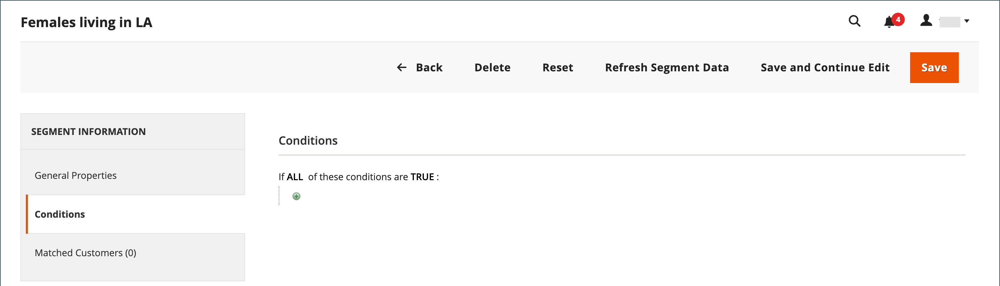

# Skapa och ta bort kundsegment

{{ee-feature}}

Att skapa ett kundsegment liknar att skapa en [kundprisregel](../merchandising-promotions/price-rules-cart.md), förutom att alternativen innehåller [kundsegmentsspecifika attribut](../customers/customer-segments.md).

{width="700" zoomable="yes"}

_**[!UICONTROL Customer Segments]rutnät **_

| Kolumn | Beskrivning |
|--- |--- |
| **[!UICONTROL ID]** | Unikt ID för kundsegment. |
| **[!UICONTROL Segment]** | Namnet på kundsegmentet. |
| **[!UICONTROL Status]** | Anger om kundsegmentet är _[!UICONTROL Active]_eller_[!UICONTROL Inactive]_. |
| **[!UICONTROL Website]** | Anger den webbplats som kundsegmentet tillhör. |

{style="table-layout:auto"}

## Krav: Aktivera kundsegment

1. Gå till _>_ > **[!UICONTROL Stores]** på sidofältet _[!UICONTROL Settings]_Admin **[!UICONTROL Configuration]**.

1. Expandera **[!UICONTROL Customers]** i den vänstra panelen och välj **[!UICONTROL Customer Configuration]**.

1. Expandera avsnittet **[!UICONTROL Customer Segments]**.

1. Kontrollera att **[!UICONTROL Enable Customer Segment Functionality]** är inställd på `Yes`.

   {width="600" zoomable="yes"}

1. (Valfritt) Om du vill inaktivera realtidsvalidering för kundsegment anger du **[!UICONTROL Real-time Check if Customer is Matched by Segment]** till `No`.

   När du inaktiverar realtidsvalidering valideras kundsegment av en enda SQL-villkorsfråga. Om du inaktiverar den här funktionen förbättras prestanda för segmentvalidering om det finns många kundsegment i systemet. Valideringen fungerar dock inte med en delad databas eller när det inte finns några registrerade kunder.

1. Klicka på **[!UICONTROL Save Config]** när du är klar.

## Skapa ett segment

I följande steg används ett exempel för att skapa ett kundsegment som riktar sig till kvinnliga kunder i Los Angeles.

### Steg 1: Lägg till ett kundsegment

1. Gå till _>_ på sidofältet **[!UICONTROL Customers]** Admin **[!UICONTROL Segments]**.

1. Klicka på **[!UICONTROL Add Segment]** i det övre högra hörnet.

1. Ange en **[!UICONTROL Segment Name]** som identifierar kundsegmentet när du arbetar i Admin.

1. Ange en kort **[!UICONTROL Description]** som förklarar syftet med segmentet.

1. Ange **[!UICONTROL Assigned to Website]** till webbplatsen där kundsegmentet kan användas.

1. Ange **[!UICONTROL Status]** som _Aktiv_ eller _Inaktiv_.

1. Om du vill identifiera de kundtyper som du vill använda för att tillämpa segmentet anger du **[!UICONTROL Apply to]** till något av följande:

   - `Visitors and Registered Customers` - Inkluderar alla kunder, oavsett om de är inloggade på ett konto eller inte.
   - `Registered Customers` - Inkluderar endast kunder som är inloggade på ett konto.
   - `Visitors` - Inkluderar endast kunder som inte är inloggade på ett konto.

   >[!TIP]
   >
   >Om du skapar ett segment baserat på kundattribut som lagras i ett kundkonto är det en god vana att endast tillämpa segmentet på registrerade kunder.

   >[!NOTE]
   >
   > Om ett segment gäller för `Visitors and Registered Customers` visas bara [!UICONTROL Matched Customers] i `Registered Customers`. Detta gäller även om besökarna kan målinrikta sig baserat på villkor som gäller dem. Ingen `Visitors`-flik visas för `Matched Customers` bara segment.

1. Klicka på **[!UICONTROL Save and Continue Edit]**.

   När du har sparat segmentet _[!UICONTROL General Properties]_blir ytterligare alternativ tillgängliga på den vänstra panelen.

   {width="600" zoomable="yes"}

**_[!UICONTROL General Properties]_**

| Fält | Beskrivning |
|--- |---|
| **[!UICONTROL Segment Name]** | Ett namn som identifierar segmentet för intern referens. |
| **[!UICONTROL Description]** | En kort beskrivning som förklarar syftet med segmentet för intern referens. |
| **[!UICONTROL Assigned to Website]** | Den enda webbplats där segmentet kan användas. |
| **[!UICONTROL Status]** | Aktiverar och inaktiverar segmentet. Alla associerade prisregler och banners inaktiveras när segmentet är inaktiverat. Alternativ: `Active` / `Inactive` |
| **[!UICONTROL Apply to]** | Definierar de kundtyper som segmentet används på. Markeringen påverkar den uppsättning villkor som är tillgängliga för att skapa segmentet. Inställningen kan inte ändras efter att segmentet har sparats. |

{style="table-layout:auto"}

### Steg 2: Definiera villkoren

>[!NOTE]
>
> För besökare gäller endast följande villkor: Kundvagnsvillkor (delsumma i kundvagn, varukorgsartiklar och kvantitet i kundvagn), Produktregler (produkter i kundvagn och produkthistorik) samt kombinationer av dessa artiklar. Om ett segment ska gälla för både besökare och registrerade kunder spåras besökarna endast utifrån de listade villkoren.

Möjliga villkor är ordnade i följande grupper:

| Grupp | Beskrivning |
|--- |--- |
| **[!UICONTROL Customer]** | Villkor baserade på kundkontoattribut. Endast tillgängligt om segmentet gäller för registrerade kunder. |
| **[!UICONTROL Shopping Cart]** | Villkor baserade på innehållet i kundvagnen. Dessa villkor är tillgängliga för alla segmenttyper. |
| **[!UICONTROL Products]** | Villkor baserade på produkter i kundvagnen eller produktens webbhistorik. Dessa villkor är tillgängliga för alla segmenttyper. |
| **[!UICONTROL **Sales]** | Villkor baserade på slutförda order. Endast tillgängligt om segmentet gäller för registrerade kunder. |

1. Klicka på **[!UICONTROL Conditions]** i den vänstra rutan.

   Standardvillkoret börjar med _[!UICONTROL If ALL of these conditions are TRUE:]_på sidan.

   {width="600" zoomable="yes"}

1. Skapa ett villkor för kvinnliga kunder:

   - Klicka på ikonen **[!UICONTROL Add]** för att visa listan med villkor och välj `Gender`.

   - Lämna standardalternativet **är** för villkorskontroll.

   - Klicka på **..** och välj `female`.

   {width="600" zoomable="yes"}

1. Skapa ett nytt villkor som riktar sig till Los Angeles-invånare:

   - På nästa rad klickar du på ikonen **[!UICONTROL Add]** och väljer `Customer Address`.

     Den här åtgärden skapar ett överordnat villkor där du kan definiera ett eller flera adressfält som ska matchas.

   - Klicka på ikonen **[!UICONTROL Add]** för att visa listan med adressfält och välj `City`.

   - Klicka på **is** för att visa alternativen för villkorskontroll och välj `contains`.

   - Klicka på **..** och ange `Los Angeles`.

   - På nästa rad klickar du på ikonen **[!UICONTROL Add]** och väljer `State/Province`.

   - Lämna standardalternativet **är** för villkorskontroll.

   - Klicka på **..** och välj `United States > California`.

   {width="600" zoomable="yes"}

1. Klicka på **[!UICONTROL Save and Continue Edit]**.

### Steg 3: Granska listan över matchade kunder

1. Klicka på **[!UICONTROL Matched Customers]** i den vänstra rutan för att visa alla kunder som matchar villkoret.

   {width="600" zoomable="yes"}

1. Om listan med kunder uppfyller ditt mål klickar du på **[!UICONTROL Save]** för att slutföra kundsegmentet.

1. Kundsegmentet kan nu användas för riktade kampanjer, innehåll och utskick.

_**[!UICONTROL Matched Customers]rutnät **_

| Kolumn | Beskrivning |
|--- |--- |
| **[!UICONTROL ID]** | Kund-ID för en registrerad kund. |
| **[!UICONTROL Name]** | Namnet på en registrerad kund. |
| **[!UICONTROL Email]** | E-postadressen till en registrerad kund. |
| **[!UICONTROL Group]** | Kundgruppen som kunden är tilldelad till. |
| **[!UICONTROL Phone]** | Kundens telefonnummer. |
| **[!UICONTROL ZIP]** | Kundens postnummer. |
| **[!UICONTROL Country]** | Det land där kunden finns. |
| **[!UICONTROL State / Province]** | Delstaten eller regionen där kunden finns. |
| **[!UICONTROL Customer Since]** | Datum och tid då kundkontot skapades. |

{style="table-layout:auto"}

## Ta bort ett kundsegment

1. Gå till _>_ på sidofältet **[!UICONTROL Customers]** Admin **[!UICONTROL Segments]**.

1. Sök efter det segment som ska tas bort och markera det.

1. Klicka på knappen **[!UICONTROL Delete]** på menyraden.

1. Bekräfta åtgärden genom att klicka på **[!UICONTROL OK]**.

## Knappfält

| Knapp | Beskrivning |
|--- |--- |
| **[!UICONTROL Back]** | Återgår till sidan _[!UICONTROL Customer Segments]_utan att spara ändringarna. |
| **[!UICONTROL Delete]** | Tar bort aktuellt kundsegment. Kunder eller slutförda order som är kopplade till kunden i segmentet tas inte bort. |
| **[!UICONTROL Reset]** | Återställer alla osparade ändringar i kundsegmentsformuläret till deras tidigare värden. |
| **[!UICONTROL Refresh Segment Data]** | Uppdaterar segmentdata till de senast sparade värdena. Relevant om segmentdata inte är tillgängliga eller inaktuella. |
| **[!UICONTROL Save and Continue Edit]** | Sparar ändringar och håller kundsegmentet öppet. |
| **[!UICONTROL Save]** | Sparar ändringar och stänger kundsegmentet. |

{style="table-layout:auto"}

## Kundsegment - demo

I den här videon visas hur du skapar kundsegment:

>[!VIDEO](https://video.tv.adobe.com/v/343659/?quality=12&learn=on)
