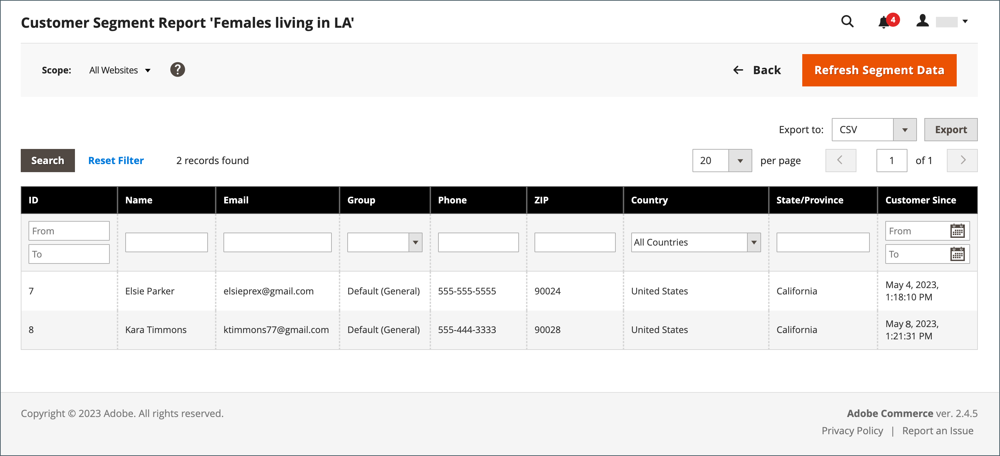

# Kundsegmentrapport

{{ee-feature}}

Kundsegmentrapporten innehåller information om antalet kunder i varje segment.

{width="700" zoomable="yes"}

| Kolumn | Beskrivning |
|--- |--- |
| **[!UICONTROL Select]** | Markera kryssrutan för varje segment som ska bli föremål för en åtgärd, eller använd markeringskontrollen i kolumnrubriken. Alternativ: `Select All` / `Deselect All` / `Select Visible` / `Unselect Visible` |
| **[!UICONTROL ID]** | En unik numerisk identifierare som tilldelas varje segment |
| **[!UICONTROL Segment]** | Segmentnamn |
| **[!UICONTROL Status]** | Segmentstatus. Alternativ: `Active` / `Inactive` |
| **[!UICONTROL Website]** | Webbplats som segmentet är tilldelat till |
| **[!UICONTROL Customers]** | Antal kunder som tilldelats ett segment |

{style="table-layout:auto"}

Du kan gå ned på en lista med kunder i segmentet och exportera data.

{width="600" zoomable="yes"}

Om du vill vara säker på att du har de senaste data måste segmentdata uppdateras. Om segmentdata inte är tillgängliga eller är inaktuella kan du uppdatera genom att klicka på **[!UICONTROL Refresh Segment Data]** i knappfältet.

1. Välj ett exportformat för **[!UICONTROL Export to]**:

   * CSV - En kommaavgränsad värdefil som innehåller oformaterade textdata.
   * Excel XML - ett XML-baserat kalkylbladsdataformat.

1. Klicka på **[!UICONTROL Export]**.

   | Kolumn | Beskrivning |
   |--- |--- |
   | **[!UICONTROL ID]** | En unik numerisk identifierare som tilldelas varje användare |
   | **[!UICONTROL Name]** | Kundnamn |
   | **[!UICONTROL Email]** | E-postadressen till en registrerad kund |
   | **[!UICONTROL Group]** | Kundgruppen som kunden är tilldelad till |
   | **[!UICONTROL Phone]** | Kundens telefonnummer |
   | **[!UICONTROL ZIP]** | Postnumret där kunden finns |
   | **[!UICONTROL Country]** | Det land där kunden finns |
   | **[!UICONTROL State/Province]** | Delstaten eller regionen där kunden finns |
   | **[!UICONTROL Customer Since]** | Datum och tid då kundkontot skapades |

   {style="table-layout:auto"}

1. Den genererade filen sparas automatiskt på den lokala datorn.
