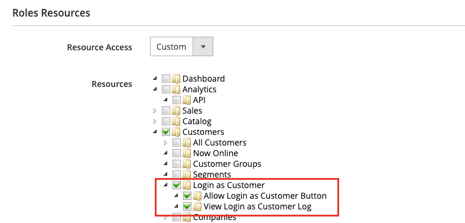

# Hjälp till kunderna

Ibland behöver kunderna hjälp med beställningen. Butiksadministratörer kan använda _Logga in som kund_, som gör det möjligt för dem att se vad kunden ser och göra uppdateringar för att hjälpa dem.

Alla åtgärder som vidtas när kunden är inloggad tillämpas på den faktiska kundens konto.

När det är aktiverat för en _Administratör_ användare, _[!UICONTROL Login as Customer]_visas på flera sidor:

* [Kundredigeringssida](../customers/update-account.md)
* [Sidan Ordervy](../stores-purchase/order-processing.md)
* [Fakturavy page](../stores-purchase/invoices.md)
* [Sidan Leveransvy](../stores-purchase/shipments.md)
* [Visa kreditnota](../stores-purchase/credit-memo-create.md)

{width="600" zoomable="yes"}

## Aktivera inloggning som kund

Aktivering _Logga in som kund_ kräver att du aktiverar funktionen i din Commerce-instans och sedan aktiverar åtkomst för administratörsanvändare i användarrollens behörigheter.

### Aktivera funktionen

1. Gå till sidlisten Admin  **[!UICONTROL Stores]** > _[!UICONTROL Settings]_>**[!UICONTROL Configuration]**.

1. Expandera på den vänstra panelen **[!UICONTROL Customers]** och välja  **[!UICONTROL Login as Customer]**.

   {width="600" zoomable="yes"}

1. Ange **[!UICONTROL Enable Login as Customer]** till `Yes`.

1. _(Valfritt)_ Ange **[!UICONTROL Disable Page Cache for Admin User]** till `No` för att aktivera sidcachen när administratören loggar in som kund.

   >[!WARNING]
   >
   > Inaktiverar sidcachen (`Yes` - standard) ser till att användaren loggar in när kunden får aktuella, ocachelagrade data.

1. _(Valfritt)_ Ange **[!UICONTROL Store View to Log in]** till `Manual Selection` om du har en konfiguration för flera platser och/eller flera butiker och vill att administratören ska välja butiksvyn när du loggar in som kund.

1. När du är klar klickar du på **[!UICONTROL Save Config]**.

### Aktivera åtkomst för administratörsanvändare

1. På _Administratör_ sidebar, gå till **[!UICONTROL System]** > _Behörigheter_ > **[!UICONTROL User Roles]**.

1. Klicka på rollen i listan.

1. I [!UICONTROL _Rollinformation_] vänster panel, klicka **[!UICONTROL Role Resources]**.

1. Ändra **[!UICONTROL Role Resources]** på sidan till `Custom`.

   >[!INFO]
   >
   > När det här alternativet är markerat visas resurshierarkin på sidan.

1. Bläddra till  **[!UICONTROL Customers]** överordnat objekt och **[!UICONTROL Login as Customer]** objekt under. Välj sedan de resurser som du vill aktivera för rollen:

   * **[!UICONTROL Allow Login as Customer]** - Tillåter att Admin-användaren använder _Logga in som kund_ -funktion.
   * **[!UICONTROL View Login as Customer Log]** - Gör att administratören kan se _Logga in som kund_ Logg.

   {width="400" zoomable="yes"}

1. Klicka på **[!UICONTROL Save Role]**.

## Logga in som kund från administratören

1. På _Administratör_ sidebar, gå till **[!UICONTROL Customers]** > [!UICONTROL _Alla kunder_].

1. Öppna en användare i redigeringsläge.

1. I **[!UICONTROL Customer Information]** väljer du **[!UICONTROL Account Information]** -avsnitt.

1. Ange **[!UICONTROL Allow remote shopping assistance]** till `Yes`.

   >[!INFO]
   >
   >Administratören kan nu logga in som en användare utan tillstånd från butiken.

## Kundkontobehörighet för fjärrshoppingassistans

Om du vill aktivera kontoåtkomst för butiksupporten från administratören måste kunden aktivera funktionen för sitt konto:

1. Kunden går till **[!UICONTROL Account Information]** sida.

1. Markerar **[!UICONTROL Allow remote shopping assistance]** kryssrutan.

1. Kunden klickar **[!UICONTROL Save]**.

{width="700" zoomable="yes"}

>[!WARNING]
>
>Utan den här behörigheten kan en Admin-användare inte logga in som den här kunden.

## Använd inloggning som kund

>[!INFO]
>
>Används _Logga in som kund_ kontrollerar du att din administratör är konfigurerad enligt beskrivningen ovan.

_Logga in som kund_ gör att du kan se webbplatsen på samma sätt som kunden gör och kan felsöka och vidta andra åtgärder för kunden. Om du har en tilldelad användarroll med nödvändig behörighet:

1. Klicka **[!UICONTROL Login as Customer]** på de sidor som listas i föregående avsnitt.
1. Inloggningen som kund-åtgärder finns i åtgärdsrapporten.

>[!WARNING]
>
>Åtgärder som vidtas när du är inloggad [!UICONTROL _som kund_] (som att lägga till/ta bort produkter) tillämpas på den faktiska kundens order. En banderoll visas när du är `logged in as customer_name` för att ge en påminnelse om det speciella läget.

## Logga in som kund

{{ee-feature}}

Adobe Commerce loggar _Logga in som kund_ åtgärder. Den innehåller alla sessioner där en Admin-användare får åtkomst till funktionen. Om du vill komma åt loggade åtgärder går du till [Rapport om administrationsåtgärder](../systems/action-log-report.md).

Du kan filtrera rapportinställningarna **[!UICONTROL Action Group]** till `Login As Customer` längst upp på sidan och klicka på **[!UICONTROL Search]**.

{width="700" zoomable="yes"}
