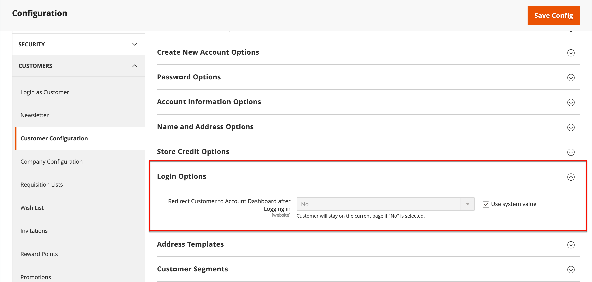

# Startsida för kundinloggning

Du kan konfigurera din butik så att den omdirigerar kunder till deras kontokontrollpanel efter att de har loggat in eller låta dem fortsätta handla.

1. På _Administratör_ sidebar, gå till **[!UICONTROL Stores]** > _[!UICONTROL Settings]_>**[!UICONTROL Configuration]**.

1. Expandera på den vänstra panelen **[!UICONTROL Customers]** och välja **[!UICONTROL Customer Configuration]**.

1. Expandera avsnittet **[!UICONTROL Login Options]**.

   {width="600" zoomable="yes"}

1. Ange **[!UICONTROL Redirect Customer to Account Dashboard after Logging in]** till något av följande:

   - `Yes` - Kontrollpanelen för kontot visas när kunderna loggar in på sina konton.
   - `No` - Kunderna kan fortsätta handla efter att ha loggat in på sina konton.

   >[!INFO]
   >
   >Rensa **[!UICONTROL User system value]** för att göra ändringen.

1. När du är klar klickar du på **[!UICONTROL Save Config]**.
