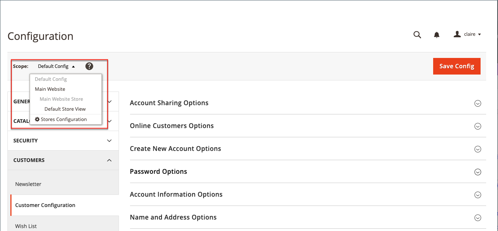
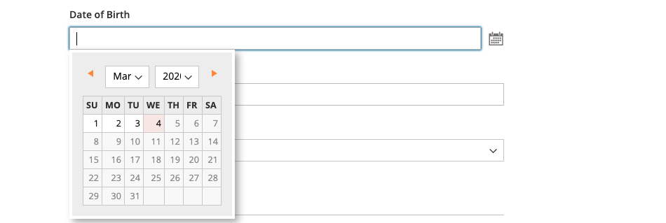

# Alternativ för kundnamn och adress

_Namn- och adressalternativen_ avgör vilka fält som inkluderas i namn- och adressformulären när kunderna skapar ett [konto](../customers/account-create.md) i din butik.

{width="500" zoomable="yes"}

Stegen för konfiguration av namn- och adressalternativen skiljer sig åt för Adobe Commerce och Magento Open Source.

## Konfigurera namn- och adressalternativ för Adobe Commerce

Du kan konfigurera de namn- och adressalternativ som visas för kunderna på butiken när de skapar sitt konto.

### Steg 1: Ange omfattningen för konfigurationen

1. Gå till **[!UICONTROL Stores]** > _[!UICONTROL Settings]_>**[!UICONTROL Configuration]**&#x200B;på sidofältet_ Admin _.

1. Expandera **[!UICONTROL Customers]** i den vänstra panelen och välj **[!UICONTROL Customer Configuration]**.

1. Expandera avsnittet **[!UICONTROL Name and Address Options]**.

   >[!INFO]
   >
   >Observera att omfattningen för namn- och adressalternativen gäller på nivån `website`.

1. Rulla upp till sidans överkant och ställ in konfigurationens omfattning på något av följande:

   - `Default Config`
   - `Main Website` (eller specifik plats för installationer på flera platser)

   >[!INFO]
   >
   >Avsnittet _[!UICONTROL Name and Address Options]_&#x200B;visas inte när omfånget är `Default Store View`.

   {width="700" zoomable="yes"}

### Steg 2: Konfigurera alternativen för namn och adress

1. Gå tillbaka till avsnittet [!UICONTROL _Namn och adressalternativ_] på sidan Kundkonfiguration.

   >[!INFO]
   >
   > Om du inte använder omfångsinställningen `Default config` måste du avmarkera kryssrutan `Use Default` för varje fält innan du ändrar värdet.

   {width="600" zoomable="yes"}

1. För **[!UICONTROL Prefix Dropdown Options]** anger du varje prefix som du vill ska visas i listan, avgränsat med ett semikolon.

   >[!IMPORTANT]
   >
   >Placera ett semikolon före det första värdet om du vill visa ett tomt värde högst upp i listan.

1. För **[!UICONTROL Suffix Dropdown Options]** anger du varje suffix som du vill ska visas i listan, avgränsat med ett semikolon.

1. Om du vill inkludera följande fält i kundformulär anger du värdet för vart och ett till `Optional` eller `Required` efter behov.

   - **[!UICONTROL Show Telephone]**
   - **[!UICONTROL Show Company]**
   - **[!UICONTROL Show Fax]**

### Steg 3: Spara och uppdatera

1. Klicka på **[!UICONTROL Save Config]** när du är klar.

1. Klicka på **[!UICONTROL Cache Management]** och [uppdatera](../systems/cache-management.md) i meddelandet längst upp på sidan.

## Konfigurera namn- och adressalternativ för Magento Open Source

Konfigurera de namn- och adressalternativ som visas för kunderna på butiken när de skapar sitt konto.

{width="500" zoomable="yes"}

### Steg 1: Ange omfattningen för konfigurationen

1. Gå till **[!UICONTROL Stores]** > _[!UICONTROL Settings]_>**[!UICONTROL Configuration]**&#x200B;på sidofältet_ Admin _.

1. Expandera **[!UICONTROL Customers]** i den vänstra panelen och välj **[!UICONTROL Customer Configuration]**.

1. Expandera avsnittet **[!UICONTROL Name and Address Options]**.

   >[!IMPORTANT]
   >
   > Observera att omfattningen för namn- och adressalternativen gäller på nivån `website`.

   {width="600" zoomable="yes"}

1. Rulla tillbaka upp till sidans överkant och ställ in konfigurationens omfattning på något av följande:

   - `Default Config`
   - `Main Website` (eller specifik plats för installationer på flera platser)

   >[!NOTE]
   >
   >Avsnittet _Namn och adressalternativ_ visas inte när omfånget är inställt på `Default Store View`.

   {width="600" zoomable="yes"}

### Steg 2: Konfigurera alternativen för namn och adress

1. Gå tillbaka till avsnittet [!UICONTROL _Namn och adressalternativ_] på sidan Kundkonfiguration.

   >[!INFO]
   >
   >Om du inte använder omfångsinställningen `Default config` måste du avmarkera kryssrutan `Use Default` för varje fält innan du ändrar värdet.

1. Ange ett nummer mellan 1 och 4 för **Antal rader i en gatuadress**.

   >[!WARNING]
   >
   >Som standard är gatuadressen tre linjer.

1. Om du vill ta med ett prefix (till exempel Mr eller MS) som en del av namnet anger du **Visa prefix** till `Yes`.

   {width="600" zoomable="yes"}

   >[!INFO]
   >
   >Ange varje prefix som du vill ska visas i listan, avgränsat med ett semikolon, för **Prefix-listrutealternativ**. Du kan placera ett semikolon före det första värdet om du vill visa ett tomt värde högst upp i listan.

1. Om du vill inkludera ett valfritt fält för kundens mellannamn eller initiala värde anger du **[!UICONTROL Show Middle Name (initial)]** till `Yes`.

1. Att inkludera ett suffix (t.ex. Jr. eller Sr.) efter kundnamnet anger du **[!UICONTROL Show Suffix]** till något av följande:

   - `Optional`
   - `Required`

   >[!INFO]
   >
   >I listrutan **Alternativ för suffix** anger du varje suffix som du vill ska visas i listan, avgränsat med ett semikolon. Du kan placera ett semikolon före det första värdet om du vill visa ett tomt värde högst upp i listan.

1. Om du vill inkludera födelsedatumet anger du **[!UICONTROL Show Date of Birth]** till något av följande:

   - `Optional`
   - `Required`

   >[!INFO]
   >
   >I enlighet med gällande säkerhets- och integritetspraxis bör du vara medveten om eventuella juridiska risker och säkerhetsrisker som är förknippade med lagring av kundernas fullständiga födelsedatum (månad, dag, år) med andra personliga identifierare. Vi rekommenderar att du begränsar lagringen av kundernas födelsedatum och föreslår att du använder kundens födelseår som ett alternativ.

   Kunder kan använda kalenderikonen efter fältet för att välja födelsedatum från en popup-kalender.

   {width="600" zoomable="yes"}

1. Om du vill tillåta kunderna att ange sin moms eller [moms](../stores-purchase/vat.md)-nummer anger du **[!UICONTROL Show Tax/VAT Number]** till något av följande:

   - `Optional`
   - `Required`

1. Om du vill inkludera ett fält för kön i kundformuläret anger du **[!UICONTROL Show Gender]** till något av följande:

   - `Optional`
   - `Required`

   {width="600" zoomable="yes"}

1. Om du vill inkludera följande fält i kundformulär anger du värdet för vart och ett till `Optional` eller `Required` efter behov.

   - **[!UICONTROL Show Telephone]**
   - **[!UICONTROL Show Company]**
   - **[!UICONTROL Show Fax]**

### Steg 3: Spara och uppdatera

1. Klicka på **[!UICONTROL Save Config]** när du är klar.

1. Klicka på **[!UICONTROL Cache Management]** och [uppdatera](../systems/cache-management.md) i meddelandet längst upp på sidan.
