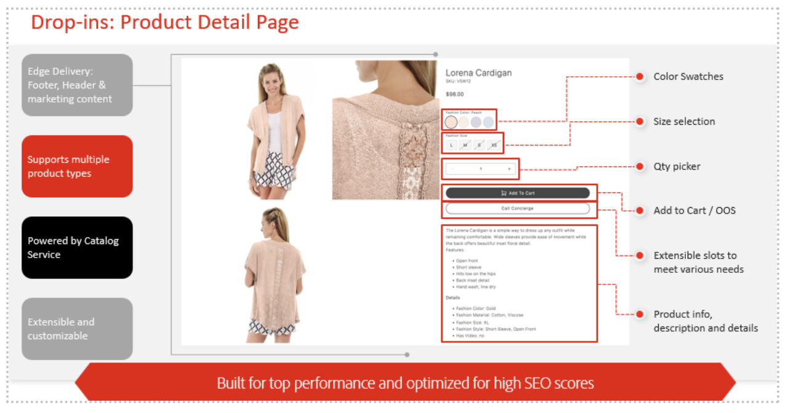

# Skapa övertygande, personaliserade upplevelser i stor skala

Adobe [!DNL Commerce] har en kraftfull verktygslåda för att personalisera alla kundkontaktytor och öka kundernas engagemang, konvertering och intäkter.

I den här artikeln får du lära dig:

- Vad är personalisering?
- Vilka data behöver jag för att uppnå personalisering?
- Hur låser Adobe [!DNL Commerce] upp personaliseringen?
- Tillgängliga användningsfall för personalisering

## Vad är personalisering?

Personalization innebär att skräddarsy olika aspekter av varje kunds köpupplevelse för att uppfylla deras unika behov, sammanhang och önskemål. Personalization är inte begränsat till innehåll på webbplatsen eller rekommenderar bäst lämpade produkter, utan omfattar i stället alla kontaktytor under hela kundresan, inklusive:

- **Kampanjer och kommunikation** - Leverera relevanta och konsekventa meddelanden via kampanjer och kommunikation
- **Produktidentifiering** - Visar rätt produkter för rätt kunder i rätt ögonblick
- **Kampanjer och erbjudanden** - Målinriktade kampanjer och erbjudanden som får varje kund att konvertera
- **Innehållsupplevelser** - Anpassa webbplatsinnehåll så att det känns hyper relevant för varje kund och deras resa

{width="700" zoomable="yes"}

Även om den här typen av personaliserade upplevelser kan tyckas vara genomförbara för en liten del av kunderna, och personalisering i stor skala för tusentals eller miljontals kunder över alla kontaktytor och kanaler, kan allt i realtid kännas omöjligt. I följande avsnitt får du lära dig hur Adobe [!DNL Commerce] och Adobe Experience Cloud kan hjälpa dig.

## Vilka data behöver jag för att uppnå personalisering?

Effektiv personalisering kräver sammanhang eller signaler som ger information om kunder som sedan kan användas för att ändra deras upplevelse. Följande tabell innehåller de olika datatyperna och den roll som Adobe [!DNL Commerce] spelar när det gäller att samla in och aktivera data.

| Datatyper | data från Storefront (beteendehändelser) | Back office-data (händelser på serversidan) | Kundprofil och segmentdata |
|---|---|---|---|
| **Definition** | Klicka på eller vidta de åtgärder som kunderna ska vidta på er webbplats. | Information om livscykeln och detaljer för varje order (tidigare och aktuell). | Vilka era kunder är och vilka segment är de kvalificerade för? |
| **Händelser som hämtats av Adobe Commerce** | [pageView](https://experienceleague.adobe.com/en/docs/commerce/data-connection/event-forwarding/events#pageview) [productPageView](https://experienceleague.adobe.com/en/docs/commerce/data-connection/event-forwarding/events) [searchRequestSent](https://experienceleague.adobe.com/en/docs/commerce/data-connection/event-forwarding/events#searchrequestsent) [searchResponseReceived](https://experienceleague.adobe.com/en/docs/commerce/data-connection/event-forwarding/events#searchresponsereceived) [addToCart](https://experienceleague.adobe.com/en/docs/commerce/data-connection/event-forwarding/events#addtocart) [openCart](https://experienceleague.adobe.com/en/docs/commerce/data-connection/event-forwarding/events#opencart) [signIn](https://experienceleague.adobe.com/en/docs/commerce/data-connection/event-forwarding/events#signin) [signOut](https://experienceleague.adobe.com/en/docs/commerce/data-connection/event-forwarding/events#signout){11 6}startCheckout[&#128279;](https://experienceleague.adobe.com/en/docs/commerce/data-connection/event-forwarding/events#startcheckout) [completeCheckout](https://experienceleague.adobe.com/en/docs/commerce/data-connection/event-forwarding/events#completecheckout) [createRequisitionList](https://experienceleague.adobe.com/en/docs/commerce/data-connection/event-forwarding/events#createrequisitionlist) [addToRequisitionList](https://experienceleague.adobe.com/en/docs/commerce/data-connection/event-forwarding/events#addtorequisitionlist) [removeFromRequisitionList](https://experienceleague.adobe.com/en/docs/commerce/data-connection/event-forwarding/events#removefromrequisitionlist)  | **Orderstatus**: [orderPlaced](https://experienceleague.adobe.com/en/docs/commerce/data-connection/event-forwarding/events-backoffice#orderplaced) [orderItemsReturnedInitiated](https://experienceleague.adobe.com/en/docs/commerce/data-connection/event-forwarding/events-backoffice#orderitemsreturnedinitiated) [orderItemsShipped](https://experienceleague.adobe.com/en/docs/commerce/data-connection/event-forwarding/events-backoffice#orderitemsshipped) [orderCanceled](https://experienceleague.adobe.com/en/docs/commerce/data-connection/event-forwarding/events-backoffice#ordercancelled) [**Orderhistorik**](https://experienceleague.adobe.com/en/docs/commerce/data-connection/fundamentals/connect-data#send-historical-order-data): - SKU, namn, pris, rabatt - produktkategori  - Betalningsbelopp, Typ, Valuta   - Leveransmetod och Belopp   - Återbetalnings-ID, Belopp, Valuta   - Returorsak, villkor, Lösning   - Adress   - E-post | [**Profilpost**](https://experienceleague.adobe.com/en/docs/commerce/data-connection/event-forwarding/events-profilerecord): (Namn, kön, adress, lojalitetsstatus, telefonnummer, e-postadress) **Kontostatus**: [KontoSkapat](https://experienceleague.adobe.com/en/docs/commerce/data-connection/event-forwarding/events-backoffice#accountcreated) [KontoUppdaterat](https://experienceleague.adobe.com/en/docs/commerce/data-connection/event-forwarding/events-backoffice#accountupdated) [KontoBorttaget](https://experienceleague.adobe.com/en/docs/commerce/data-connection/event-forwarding/events-backoffice#accountdeleted) |

Med alla dessa omfattande, förstapartsdata [!DNL Commerce] är du redo att målinrikta och personalisera varje kundupplevelse. I nästa avsnitt får du lära dig hur [!DNL Commerce] och Adobe Experience Cloud hjälper dig att skapa personaliserade upplevelser och de användningsfall som du kan aktivera.

## Hur möjliggör Adobe [!DNL Commerce] personalisering?

Med Adobe [!DNL Commerce] Data Sharing kan du samla in och dela datatyperna i den föregående tabellen med andra Adobe Experience Cloud-produkter för att få enhetliga kundprofiler och målgrupper, personaliserade kampanjer samt omfattande analyser och insikter.

{width="700" zoomable="yes"}

Adobe [!DNL Commerce]-datadelning innehåller två huvudkomponenter:

1. [Dataanslutning](https://experienceleague.adobe.com/en/docs/commerce/data-connection/overview): Dela butiks-, back office- och kundprofilsdata från Adobe [!DNL Commerce] till Adobe Experience Platform Edge-nätverket för användning i Adobe Experience Cloud-program, inklusive:

   - [Adobe [!DNL Real-Time CDP]](https://experienceleague.adobe.com/en/docs/experience-platform/rtcdp/intro/rtcdp-intro/overview): Häfta kunddata från olika källor (ERP, CRM, POS) till enhetliga profiler och skapa regelbaserade eller AI-baserade segment.
   - [Adobe [!DNL Journey Optimizer]](https://experienceleague.adobe.com/en/docs/journey-optimizer/using/get-started/get-started): Kör personliga flerkanalsresor, inklusive e-postkampanjer, SMS, push-meddelanden med mera.
   - [Customer Journey Analytics](https://experienceleague.adobe.com/en/docs/analytics-platform/using/cja-overview/cja-overview) och [Adobe [!DNL Analytics]](https://experienceleague.adobe.com/en/docs/analytics/analyze/admin-overview/analytics-overview): Få insikter om kunden och företaget.
   - [Adobe [!DNL Target]](https://experienceleague.adobe.com/en/docs/target/using/introduction/intro): Testa och optimera innehåll, rekommenderade produkter, erbjudanden, navigering med mera.

1. [[!DNL Audience Activation]](https://experienceleague.adobe.com/en/docs/commerce-admin/customers/audience-activation): Använd [!DNL Real-Time CDP] målgrupper för att anpassa dynamiska innehållsblock, kampanjer och relaterade produktregler på din Adobe [!DNL Commerce] -webbplats.

### Personaliserade Adobe Storefront-upplevelser i alla kanaler, i stor skala

Adobe [!DNL Commerce] kan dra nytta av en högpresterande butik som kallas [ Edge Delivery Services](https://experienceleague.adobe.com/developer/commerce/storefront/) för att leverera personaliserade upplevelser i alla kanaler, med AI-funktioner i centrum och snabbhet som grund.

Med Edge Delivery Services kan man

- **Skapa personaliserat innehåll**: Använd dokumentbaserad redigering, inbyggda experiment med generativ AI-text och bildvariationer för att personalisera upplevelsen i stor skala. Använd Assets och Generative AI för att skapa bilder i stor skala.

- **Generera variationer**: Innehållsförfattare kan använda Generative AI för att skapa stora volymer personaliserat AI-drivet [textinnehåll och bildvariationer](https://experienceleague.adobe.com/en/docs/experience-manager-learn/sites/generative-ai/generate-variations) med Adobe Firefly.

- **Distribuera via Edge Delivery Services Storefront**: Innehåll i Edge- och Commerce-funktionerna som bygger på instickskomponenter för att skapa anpassade shoppingupplevelser för era målgrupper.

- **Commerce och Adobe Experience Manager Assets**: Generativ AI-produktresurs och variationer i stor skala. Skapa, leverera och övervaka innehållsleverans över alla kanaler.

{width="700" zoomable="yes"}

### Körklar Personalization: Kom igång med inbyggda Adobe [!DNL Commerce]-funktioner

Adobe [!DNL Commerce] levererar kraftfull personalisering med sina inbyggda färdiga funktioner. I följande tabell beskrivs [!DNL Commerce] funktioner som du kan aktivera direkt för att komma igång med din personaliseringsresa.

| Kategori | Funktioner |
|---|---|
| Personaliserad produktupptäckt | [[!DNL Live Search]](https://experienceleague.adobe.com/en/docs/commerce/live-search/overview): Personalisera och optimera sökresultat baserat på en kunds beteendebeteende och tillhörighet på plats med hjälp av AI-baserad sökning. [Intelligent Category Merchandising](https://experienceleague.adobe.com/en/docs/commerce/live-search/live-search-admin/category-merch): AI-driven produktrankning på kategorisidor baserat på en kunds beteendebeteende och tillhörighet på plats. [Produktrekommendationer](https://experienceleague.adobe.com/en/docs/commerce/product-recommendations/guide-overview): AI-baserade produktrekommendationer baserade på kundbeteende, trender och kundtillhörighet. [Relaterade produktregler](https://experienceleague.adobe.com/en/docs/commerce-admin/marketing/promotions/product-relationships/product-related-rules): Definiera anpassade regler för att visa produkter från din katalog för att driva korsförsäljning och merförsäljning. |
| Personaliserat webbplatsinnehåll | [Dynamiska innehållsblock](https://experienceleague.adobe.com/en/docs/commerce-admin/content-design/elements/dynamic-blocks/dynamic-blocks): Visa personliga innehållsblock, till exempel banners, baserat på kundsegment i Adobe Commerce. |
| Personaliserade erbjudanden och kampanjer | [Kundprisregler](https://experienceleague.adobe.com/en/docs/commerce-admin/marketing/promotions/cart-rules/price-rules-cart): Tillämpa rabatter på artiklar i kundvagnen baserat på en uppsättning villkor, inklusive kundsegment i Adobe [!DNL Commerce]. |
| Insikter och mätning | [Adobe [!DNL Commerce] Intelligence](https://experienceleague.adobe.com/en/docs/commerce-business-intelligence/mbi/getting-started): Förstå hur era personaliseringsstrategier fungerar och förbättras över tid. |

## De vanligaste användningsområdena för personalisering

Adobe [!DNL Commerce]-kunder använder färdiga funktioner och delar data med Adobe Experience Cloud för en rad olika användningsområden. I följande avsnitt beskrivs de vanligaste användningsfallen och hur de implementeras med Adobe [!DNL Commerce] Endast eller [!DNL Commerce] plus Experience Cloud-appar.

### Personaliserade kampanjer och kommunikation

| Användningsfall | Lösning |
|---|---|
| **Övergiven kundvagn och bläddring** - Leverera ett personligt e-postmeddelande om återengagemang när en kund överger sin kundvagn eller surfsession efter att ha visat hög engagemang | **Adobe [!DNL Commerce] Endast**: [E-postpåminnelser](https://experienceleague.adobe.com/en/docs/commerce-admin/marketing/communications/email-reminders/email-reminder-rules) **Adobe [!DNL Commerce] med Adobe Journey Optimizer**: [!DNL Commerce]-data fungerar som utlösare för en flerkanalig avbrottsresa. Anpassa den resan utifrån kundattribut, vad de överger, andra shoppingbeteenden och tidigare köp. Commerce med Adobe Journey Optimizer och Real-Time CDP: Skräddarsy kampanjer för att överge kunder baserat på enhetliga kundprofiler och centralt hanterade målgrupper, till exempel för att skapa en stor målgrupp för att överge kunderna. |
| **Centraliserad målgruppsgenerering** - Skapa regelbaserade eller AI-drivna målgrupper baserat på beteenden på plats, tidigare köp, profilattribut, kategoritillhörighet, lojalitetsstatus, kundvärde med mera | **Adobe [!DNL Commerce] Endast**: Samla in kundprofilinformation när [!DNL Commerce] kunder skapar konton. Skapa regelbaserade [kundsegment](https://experienceleague.adobe.com/en/docs/commerce-admin/customers/segments/customer-segments) och kundgrupper för att anpassa innehåll och kampanjer. **Adobe [!DNL Commerce] med Adobe Real-Time CDP**:  [Enhetliga profiler](https://experienceleague.adobe.com/en/docs/experience-platform/segmentation/home) från olika datakällor och kanaler, regelbaserade eller AI-baserade målgrupper. |
| **Personaliserat e-post-/SMS-erbjudande baserat på köpbeteende** - Skicka personaliserade erbjudanden till kunder via riktad e-post baserat på tidigare köp och kundbeteende, till exempel skicka erbjudanden för produkter eller kategorier som kunderna har tittat på eller varit engagerade i. | **Adobe [!DNL Commerce] Endast**: Exportera data för användning med automatiserade marknadsföringslösningar. **Adobe [!DNL Commerce] med Adobe Journey Optimizer- och Real-Time CDP**: [!DNL Commerce]-data fungerar som utlösare för e-post- eller SMS-erbjudanden och ger signaler (kundbeteenden) om att personalisera utifrån. Real-Time CDP behövs inte, men i allmänhet skapas dessa erbjudanden och kampanjer runt målgrupper, som skapas och hanteras inom Real-Time CDP. |
| **Korsförsäljning eller merförsäljning Kompatibla produkter/varumärken** - Om en kund köper en produkt eller ett varumärke som är kompatibelt eller indikerar hög affinitet till en annan produkt eller ett annat varumärke skickar du en kampanj (e-post/SMS) för att driva konverteringen av korsförsäljning. | **Adobe [!DNL Commerce] Endast**: Använd Adobe [!DNL Commerce] [Produktrekommendationer](https://experienceleague.adobe.com/en/docs/commerce/product-recommendations/guide-overview) för att rekommendera specifika produkter på webbplatsen. Du kan också använda [Relaterade produktregler](https://experienceleague.adobe.com/en/docs/commerce-admin/marketing/promotions/product-relationships/product-related-rules) för att föreslå andra produkter. **[!DNL Commerce] med [!DNL Target]**: Adobe [!DNL Target] har också en inbyggd produktrekommendationsmotor med kraftfulla funktioner som kategoritillhörighet. Detta kan användas för korsning eller merförsäljning. **[!DNL Commerce] med Adobe Journey Optimizer**: Använd [!DNL Target] eller [!DNL Commerce] för att avgöra vilka produkter som ska rekommenderas och leverera sedan via Adobe Journey Optimizer. |

### Personaliserade webbplatsupplevelser

| Användningsfall | Lösning |
|---|---|
| **Personaliserat webbplatsinnehåll** - Anpassa webbplatsbanners och annat sidinnehåll baserat på kundaktiviteter, som produktbläddring och kategoritillhörigheter. Distribuera innehåll som passar bäst baserat på resultaten från A/B-tester eller affärsmål. | **Adobe [!DNL Commerce] Endast**: Distribuera segmentspecifika [dynamiska innehållsblock](https://experienceleague.adobe.com/en/docs/commerce-admin/content-design/elements/dynamic-blocks/dynamic-blocks). **[!DNL Commerce] med Real-Time CDP &#x200B;**: Använd [Audience Activation](https://experienceleague.adobe.com/en/docs/commerce-admin/customers/audience-activation) för att distribuera målgruppsspecifika dynamiska innehållsblock som svarar på realtidsåtgärder och enhetliga kundprofildata, samtidigt som profiler och målgrupper hanteras centralt i Real-Time CDP. **[!DNL Commerce] med[!DNL Target]**: Anpassa alla delar av webbplatsupplevelsen, inklusive innehåll, navigeringsobjekt, helsideslayouter med mera med Adobe [!DNL Commerce]-data i Adobe [!DNL Target]. A/B-testinnehåll, välj och distribuera automatiskt vinnande innehåll för varje kund. **[!DNL Commerce] med AEM Assets &#x200B;**: Lagra allt innehåll i Adobe Experience Manager Assets. Få direkt tillgång till materialet inifrån Adobe Commerce. Använd generativ AI för att skapa innehållsvariationer som kan anpassas för olika segment eller målgrupper. |
| **Personaliserat erbjudande på plats baserat på beteende** - Anpassa kampanjer baserat på kundaktiviteter, till exempel produktsurfning och kategoritillhörighet. Distribuera nästa bästa erbjudande baserat på resultaten av A/B-tester eller affärsmål. | **Adobe [!DNL Commerce] Endast**: Distribuera segmentspecifik katalog och [kundvagnsprisregler](https://experienceleague.adobe.com/en/docs/commerce-admin/marketing/promotions/cart-rules/price-rules-cart). **Adobe [!DNL Commerce] med Real-Time CDP**: Använd [Audience Activation](https://experienceleague.adobe.com/en/docs/commerce-admin/customers/audience-activation) för att distribuera målgruppsspecifika erbjudanden, samtidigt som du centralt hanterar profiler/målgrupper i Real-Time CDP. **Commerce med[!DNL Target]**: Använd offertbeslut för att avgöra vilket erbjudande som ska distribueras, A/B-test eller ange affärsmål för att vägleda erbjudanden som distribueras i Adobe Commerce. |

### Analyser och insikter

| Användningsfall | Lösning |
|---|---|
| **Kundbeteende per kanal** - Förstå nyanserna i hur kunderna interagerar i varje kanal (webb, personlig, app, annan) för att påverka marknadsföringsstrategier för varje kanal. Förstå kundtratten och svagheterna i kundupplevelsen. | **Adobe [!DNL Commerce] Endast**: [Adobe [!DNL Commerce] Intelligence](https://experienceleague.adobe.com/en/docs/commerce-business-intelligence/mbi/getting-started) innehåller omfattande analyser om den digitala [!DNL Commerce]-kanalen, men inte över flera kanaler eller delar av kundresan. **Adobe [!DNL Commerce] med Customer Journey Analytics**: [!DNL Commerce] data matar datapaneler för detaljerad information om alla faser av kundupplevelsen (i alla kanaler). Förstå alla kontaktytor och den bredare tratten för att identifiera svaga punkter i kundresan där kunderna kan falla bort. |
| **Inköpstrender** - Förstå inköpsbeteenden under en viss tidsperiod (till exempel kundkorgsanalys, produktanalys) för att identifiera trender, säsongsvariation och optimera marknadsföring baserat på historiska inköpsmönster. | **Adobe [!DNL Commerce] Endast**: [Adobe [!DNL Commerce] Intelligence](https://experienceleague.adobe.com/en/docs/commerce-business-intelligence/mbi/getting-started) innehåller omfattande analyser om den digitala [!DNL Commerce]-kanalen, men inte över flera kanaler eller delar av kundresan. **Adobe [!DNL Commerce] med Customer Journey Analytics**: [!DNL Commerce] data matar datapaneler för detaljerad information om alla faser av kundupplevelsen (i alla kanaler). Förstå alla kontaktytor och den bredare tratten för att identifiera svaga punkter i kundresan där kunderna kan falla bort. |

## Exempel på användningsfall

- Lär dig hur du kan använda Adobe Journey Optimizer för att [skicka ett övergivet kundvagnsmeddelande](https://experienceleague.adobe.com/en/docs/commerce/data-connection/use-cases/using-ajo).
- Lär dig hur du [skapar en målgrupp i Real-Time CDP](https://experienceleague.adobe.com/en/docs/commerce/data-connection/use-cases/create-audience) för att informera om en kundprisregel i Adobe [!DNL Commerce].
