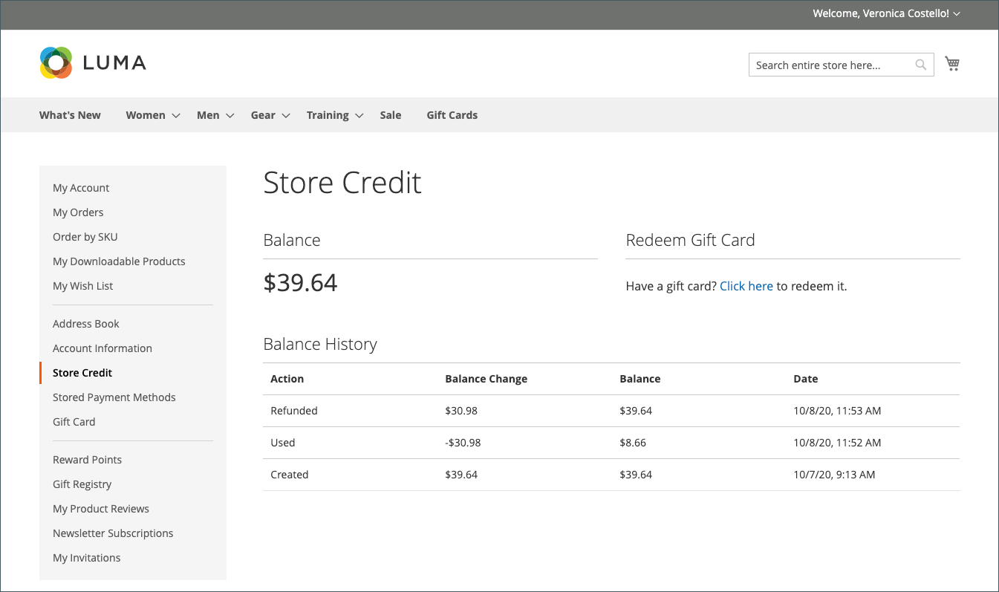

# Återbetalningar på kontrollpanelen för kundkonton

{{ee-feature}}

Om en återbetalning har utfärdats för en beställning kan kunderna visa den återbetalningsinformation som är kopplad till beställningen på sin kontokontrollpanel. Om du har aktiverat [!UICONTROL _Visa butikskredithistorik för kunder_] alternativ för [Konfiguration av butikskrediter](../customers/credit-configure.md), kan kunderna även få åtkomst till sina [Butikskrediter](../customers/store-credit.md) historik.

## Visa en återbetalning i butiken

1. Från butiken loggar kunden in på sitt konto.

1. Söker efter deras ordning på något av följande sätt:

   * Hitta ordningen i listan med **Senaste order** och klicka **[!UICONTROL View]**.
   * Välj **[!UICONTROL My Orders]**. Leta reda på ordningen i listan och klicka på **[!UICONTROL View]**.

1. Kunden klickar på **[!UICONTROL Refunds]** för att visa information om återbetalningen.

   {width="700" zoomable="yes"}

## Visa saldo och historik för butikskrediter på butiken

Metod 1: **Från kundkontokontrollpanelen**

1. Från butiken loggar kunden in på kontot.

1. Om återbetalningen tillämpades på butikskrediten väljer **[!UICONTROL Store Credit]** till vänster.

1. Det belopp som återbetalas till deras butikskrediter visas i listan med datum och tid för åtgärden.

   {width="700" zoomable="yes"}

   >[!INFO]
   >
   >Butikskreditsidan innehåller även en länk där kunden kan lösa in en [presentkort](../stores-purchase/product-gift-card-workflow.md#check-status-and-balance-of-the-gift-card).

Metod 2: **Från _Granska och betala_ page**

1. Kunden lägger till en produkt i kundvagnen.

2. Fortsätt till _Utcheckning_ sida.

3. Skickar **[!UICONTROL Shipping]** steg.

4. Om butikskrediten är tillgänglig klickar kunden **[!UICONTROL Use Store Credit]**.

   {width="700" zoomable="yes"}

5. Om kunden ändrar sig när det gäller att använda butikskrediten klickar du **[!UICONTROL Remove]** i _Ordersammanfattning_ -avsnitt.

## Betalningsåtgärder i administratören

Du kan konfigurera betalningsåtgärder för dina specifika [Betalningssätt](../configuration-reference/sales/payment-methods.md). Varje betalningsmetod har en egen uppsättning betalningsåtgärder.

| Betalningsåtgärd | Beskrivning |
|--- |---|
| [!UICONTROL Capture Online] | När fakturan skickas hämtar systemet betalningen från tredjepartsbetalningsgatewayen. En Admin-användare kan sedan skapa en kreditnota och annullera fakturan. |
| [!UICONTROL Capture Offline] | När fakturan skickas registreras inte betalningen. Det antas att betalningen hämtas direkt via gatewayen och att betalningen inte kan hämtas via Adobe Commerce. En administratör kan sedan skapa en kreditnota, men kan inte annullera fakturan. (Även om ordern innehöll en onlinebetalning är fakturan i princip en offlinefaktura.) |
| [!UICONTROL Not Capture] | När fakturan skickas registreras inte betalningen. Det antas att betalningen görs via Adobe Commerce senare. Det finns en [!UICONTROL _Hämtning_] i den ifyllda fakturan. Innan du hämtar fakturan kan du annullera den. När du har hämtat kan du skapa en kreditnota och annullera fakturan. |

{style="table-layout:auto"}

>[!WARNING]
>
>Välj [!UICONTROL _Inte hämtad_] om du inte är säker på att du senare kommer att betala via Adobe Commerce. Du kan inte skapa en kreditnota förrän betalningen har hämtats med [!UICONTROL _Hämtning_] -knappen.
