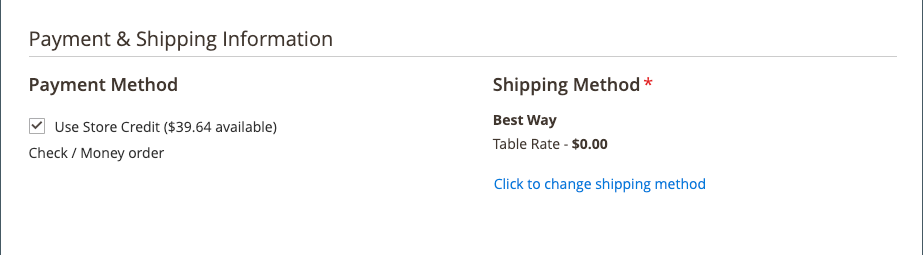

# Använd butikskredit

{{ee-feature}}

Butiksadministratörer kan visa kreditsaldo och kredithistorik från kundkontot och även tillämpa butikskrediter på ett inköp.

{width="600" zoomable="yes"}

## Visa kreditsaldot

1. Gå till **[!UICONTROL Customers]** > **[!UICONTROL All Customers]** på sidofältet _Admin_.

1. Hitta kunden i rutnätet.

1. Klicka på **[!UICONTROL Edit]** i kolumnen _Åtgärd_.

1. Rulla sidan _[!UICONTROL Customer View]_och visa **[!UICONTROL Store Credit Balance]**längst ned.

{width="600" zoomable="yes"}

## Uppdatera butikens kreditsaldo

1. Gå till **[!UICONTROL Customers]** > _Åtgärder_ > **[!UICONTROL All Customers]** på sidofältet _Admin_.

1. Hitta kunden i rutnätet.

1. Klicka på **[!UICONTROL Edit]** i kolumnen _Åtgärd_.

1. Välj **[!UICONTROL Store Credit]** på den vänstra panelen.

1. Välj webbplatsen (storefront) som du vill koppla till saldot.

1. Ange det nya värdet för **[!UICONTROL Update Balance]**.

1. Om du vill meddela kunden om saldouppdateringen markerar du kryssrutan **[!UICONTROL Notify Customer by Email]** och väljer butiksvyn från **[!UICONTROL Send Email Notification From the Following Store View]**.

1. Ange en **[!UICONTROL Comment]** om ändringen.

1. När uppdateringarna är klara klickar du på **[!UICONTROL Save and Continue Edit]** eller **[!UICONTROL Save Customer]**.

Det uppdaterade saldot ska visas i **[!UICONTROL Balance History]**.

## Använda ett kreditsaldo på en order som butiksadministratör

Som butiksadministratör kan du göra olika saker för en kunds räkning, inklusive skicka order. När du [skapar en beställning](../stores-purchase/customer-account-create-order.md) kan du använda ett kreditsaldo för butik som tillkommer kunden. Det tillgängliga saldot visas i avsnittet _Betalnings- och leveransinformation_. Markera kryssrutan **[!UICONTROL Use Store Credit]** om du vill använda saldot, eller en del av saldot om ordersumman är mindre.

{width="500" zoomable="yes"}

## Använd butikskredit vid utcheckning

Om det finns ett kreditsaldo för webbplatsen kan kunden tillämpa butikskrediter på ordersaldot innan ordern läggs i butiken.

1. Kunden ser mängden tillgänglig butikskrediter.

   Under steget _Granska och betala_ visas det tillgängliga beloppet under _[!UICONTROL Store Credit]_.

1. Klicka på **[!UICONTROL Use Store Credit]** om du vill tillämpa beloppet på ordern.

   >[!INFO]
   >
   >Ordersumman beräknas om och beloppet för butikskrediten som tillämpas visas i _[!UICONTROL Order Summary]_.

   {width="700" zoomable="yes"}

1. Klicka på **[!UICONTROL Place Order]** när du är klar.
