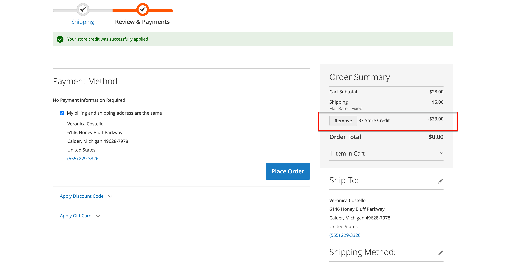

# Använd butikskredit

{{ee-feature}}

Butiksadministratörer kan visa kreditsaldo och kredithistorik från kundkontot och även tillämpa butikskrediter på ett inköp.

{width="600" zoomable="yes"}

## Visa kreditsaldot

1. På _Administratör_ sidebar, gå till **[!UICONTROL Customers]** > **[!UICONTROL All Customers]**.

1. Hitta kunden i rutnätet.

1. I _Åtgärd_ kolumn, klicka **[!UICONTROL Edit]**.

1. Rulla _[!UICONTROL Customer View]_sidan och visa **[!UICONTROL Store Credit Balance]**längst ned.

{width="600" zoomable="yes"}

## Uppdatera butikens kreditsaldo

1. På _Administratör_ sidebar, gå till **[!UICONTROL Customers]** > _Operationer_ > **[!UICONTROL All Customers]**.

1. Hitta kunden i rutnätet.

1. I _Åtgärd_ kolumn, klicka **[!UICONTROL Edit]**.

1. Välj **[!UICONTROL Store Credit]**.

1. Välj webbplatsen (storefront) som du vill koppla till saldot.

1. För **[!UICONTROL Update Balance]** anger du det nya värdet.

1. Om du vill meddela kunden om saldouppdateringen väljer du **[!UICONTROL Notify Customer by Email]** och välj butiksvy **[!UICONTROL Send Email Notification From the Following Store View]**.

1. Ange en **[!UICONTROL Comment]** om förändringen.

1. När uppdateringarna är klara klickar du **[!UICONTROL Save and Continue Edit]** eller **[!UICONTROL Save Customer]**.

Det uppdaterade saldot ska visas i **[!UICONTROL Balance History]**.

## Använda ett kreditsaldo på en order som butiksadministratör

Som butiksadministratör kan du göra olika saker för en kunds räkning, inklusive skicka order. När du [skapa en order](../stores-purchase/customer-account-create-order.md)kan du använda ett kreditsaldo för butik som ska betalas till kunden. Det tillgängliga saldot visas i _Betalnings- och leveransinformation_ -avsnitt. Välj **[!UICONTROL Use Store Credit]** om du vill använda saldot, eller en del av saldot om ordersumman är mindre.

{width="500" zoomable="yes"}

## Använd butikskredit vid utcheckning

Om det finns ett kreditsaldo för webbplatsen kan kunden tillämpa butikskrediter på ordersaldot innan ordern läggs i butiken.

1. Kunden ser mängden tillgänglig butikskrediter.

   Under _Granska och betala_ det tillgängliga beloppet visas under _[!UICONTROL Store Credit]_.

1. Om du vill använda beloppet på ordern klickar du **[!UICONTROL Use Store Credit]**.

   >[!INFO]
   >
   >Ordersumman beräknas om och beloppet för butikskrediten som tillämpas visas i _[!UICONTROL Order Summary]_.

   {width="700" zoomable="yes"}

1. När det är klart klickar du **[!UICONTROL Place Order]**.
