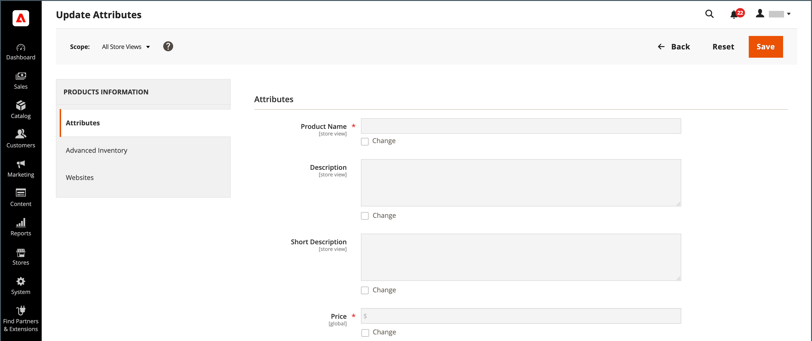

# Åtgärdskontroll

När du arbetar med en samling poster i rutnätet kan du använda åtgärdskontrollen för att tillämpa en åtgärd på en eller flera poster. Kontrollen Åtgärder visar alla åtgärder som är tillgängliga för den specifika datatypen. Du kan till exempel använda åtgärdskontrollen för att uppdatera attributen för valda produkter, ändra status från `Disabled` till `Enabled` eller för att ta bort poster från databasen.

Du kan göra så många ändringar som behövs och sedan uppdatera posterna i ett enda steg. Det är mycket effektivare än att ändra inställningarna individuellt för varje produkt. Att redigera en grupp med poster är en asynkron åtgärd som körs i bakgrunden så att du kan fortsätta arbeta i administratören utan att vänta på att åtgärden ska slutföras. Ett meddelande visas när uppgiften är slutförd.

Valet av tillgängliga åtgärder varierar beroende på listan och ytterligare alternativ kan visas beroende på vilken åtgärd som har valts. Om du till exempel ändrar status för en grupp med poster visas en _[!UICONTROL Status]_-ruta bredvid åtgärdskontrollen med ytterligare alternativ.

## Steg 1: Välj poster

Kryssrutan i den första kolumnen i listan identifierar varje post som är mål för åtgärden. [filterkontrollerna](admin-grid-controls.md) kan användas för att begränsa listan till de poster som du vill ha som mål för åtgärden.

1. Om det behövs ställer du in filtren längst upp i varje kolumn så att bara de poster som du vill ta med visas.

1. Markera kryssrutan för varje post som är mål för åtgärden, eller använd kolumnväljaren för att välja en gruppmarkering.

{width="500"}

## Steg 2: Tillämpa en åtgärd på valda poster

1. Ange kontrollen **[!UICONTROL Actions]** för den åtgärd som du vill använda.

   **_Exempel:_** Uppdatera attribut

   - Markera kryssrutan för varje post som ska uppdateras i listan.

   - Ställ in kontrollen **[!UICONTROL Actions]** på `Update Attributes`.

     {width="450"}

   - Klicka på **[!UICONTROL Submit]**.

     På sidan Uppdatera attribut visas alla tillgängliga attribut, ordnade efter grupp på panelen till vänster.

     {width="700" zoomable="yes"}

   - Markera kryssrutan **[!UICONTROL Change]** bredvid varje attribut och gör de ändringar som behövs.

   - Klicka på **[!UICONTROL Save]** om du vill uppdatera attributen för gruppen med markerade poster.

1. Klicka på **[!UICONTROL Submit]** när du är klar.

## Åtgärder för kryssrutor

| Åtgärd | Beskrivning |
|--- |--- |
| [!UICONTROL Select All] | Markerar kryssrutan för alla poster i listan. |
| [!UICONTROL Unselect All] | Rensar kryssrutan för alla poster i listan. |
| [!UICONTROL Select All on This Page] | Markerar kryssrutan för poster som visas på den aktuella sidan. |
| [!UICONTROL Deselect All on This Page] | Rensar kryssrutan för poster som visas på den aktuella sidan. |

{style="table-layout:auto"}
