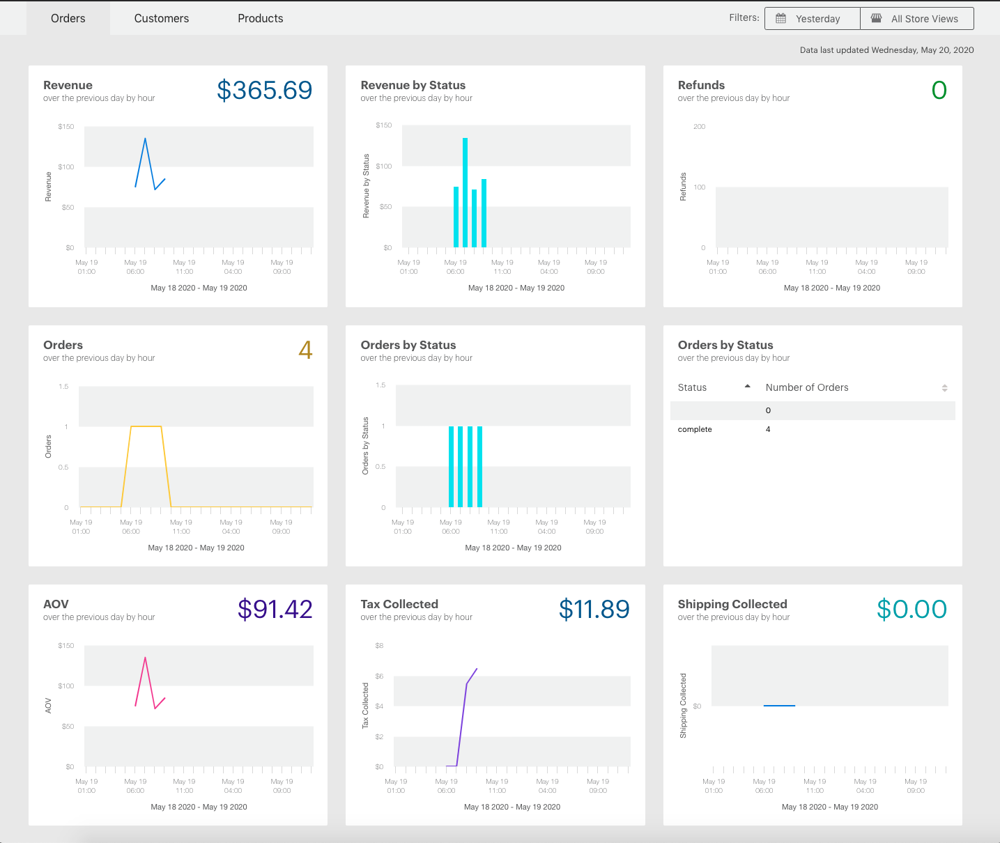
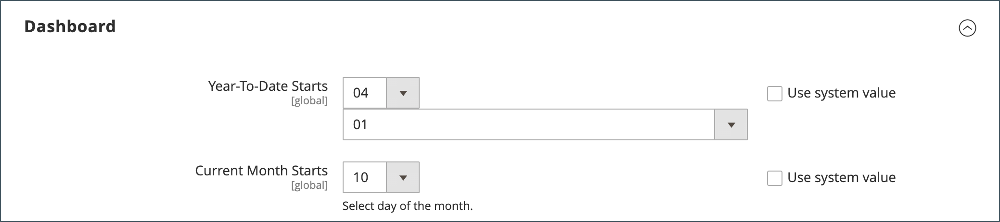

# Kontrollpanel för administratörer

Kontrollpanelen är vanligtvis den första sidan som visas när du loggar in på _Admin_ och kan ge en realtidsöversikt över försäljning och kundaktivitet. Instrumentpanelsdata ger en ögonblicksbild av försäljning under hela löptiden, genomsnittligt orderbelopp, senaste beställningar och söktermer. Diagrammet visar slutförda order och belopp för det valda datumintervallet och kan genereras från antingen dynamiska realtidsdata eller historiska aggregerade data. Flikarna längst ned ger snabba rapporter om era bästsäljande produkter, de mest visade produkterna, nya kunder och kunder som har köpt mest.

Om du har en stor mängd data att bearbeta kan diagrammet stängas av för att förbättra prestandan. Kontrollpanelen i följande exempel är konfigurerad att använda realtidsdata och visar slutförda order per timme under de senaste 24 timmarna. Diagrammet uppdateras för varje slutförd order.

{zoomable="yes"}

[Avancerad rapportering](business-intelligence.md#advanced-reporting) visar en anpassad kontrollpanel baserad på produkt-, order- och kunddata.

{zoomable="yes"}

## Konfigurera instrumentpanelen

1. Gå till **[!UICONTROL Stores]** > _[!UICONTROL Settings]_>**[!UICONTROL Configuration]**på sidofältet_ Admin _och fyll i någon av följande inställningar.

1. När konfigurationen är klar klickar du på **[!UICONTROL Save Config]**.

1. När du har sparat ändringarna klickar du på **[!UICONTROL Cache Management]** och uppdaterar alla ogiltiga cacheminnen.

### Aktivera diagram

Om du har en stor mängd data att bearbeta kan du stänga av visningen av diagrammet för att förbättra prestandan. Om alternativet inte är aktiverat visas meddelandet&quot;Inga data hittades&quot; i stället för diagrammet, även om sammanfattningssummorna nedan fortfarande genereras.

1. Välj **[!UICONTROL Admin]** i den vänstra navigeringspanelen under **[!UICONTROL Advanced]**.

1. Expandera avsnittet **[!UICONTROL Dashboard]** om det behövs.

   {width="600"}

1. Om du vill ändra standardvärdet avmarkerar du kryssrutan **[!UICONTROL Use system value]**.

1. Ange **Aktivera diagram** till `Yes`.

Mer information om alternativen för administratörskonfiguration finns i [referenshandboken för konfiguration](../configuration-reference/advanced/admin.md).

### Ändra startsidan

Kontrollpanelen är standardstartsida [för administratören](../configuration-reference/advanced/admin.md), men du kan konfigurera en annan startsida.

1. Om du inte redan har administratörskonfigurationsalternativen öppna väljer du **[!UICONTROL Admin]** under _[!UICONTROL Advanced]_i den vänstra navigeringspanelen.

1. Klicka för att expandera avsnittet **Startsida**.

   {width="600"}

1. Avmarkera kryssrutan **[!UICONTROL Use system value]** och välj den **startsida** som du vill ska visas när du loggar in på Admin.

### Välj startdatum

1. Välj **Rapporter** i den vänstra navigeringspanelen under **[!UICONTROL General]**.

1. Expandera avsnittet **[!UICONTROL Dashboard]** på sidan.

1. Avmarkera kryssrutorna **[!UICONTROL Use system value]** för datuminställningarna och gör följande:

   - Ange **år till datum från** till **månad** och **dag**.

   - Ange **Aktuell månadsstart** till **Dag**.

   {width="600"}

Mer information om konfigurationsalternativen för [!UICONTROL Reports] finns i [_referenshandboken för konfiguration_](../configuration-reference/general/reports.md).

### Konfigurera datakällan

Instrumentpanelsdiagrammet kan genereras i realtid eller med hjälp av historiska, aggregerade data. Om prestanda är ett problem kan du snabba upp saker genom att använda aggregerade data.

1. Klicka för att expandera **Försäljning** i den vänstra navigeringspanelen och välj **Försäljning** under.

1. Expandera avsnittet **[!UICONTROL Dashboard]** på sidan.

   {width="600"}

1. Avmarkera kryssrutan **[!UICONTROL Use system value]** och ange **[!UICONTROL Use Aggregated Data]** till något av följande:

   - Välj `Yes` för historiska, aggregerade data.
   - Välj `No` för realtidsdata.

## Diagramavsnitt

| Avsnitt | Beskrivning |
|--- |--- |
| [!UICONTROL Orders] | På den här fliken visas en realtidskarta över alla slutförda order för den aktuella butiksvyn och den angivna tidsperioden. |
| [!UICONTROL Amounts] | På den här fliken visas en realtidskarta över alla slutförda orderbelopp för den aktuella butiksvyn och den angivna tidsperioden. |
| [!UICONTROL Time Range] | Bestämmer vilka data som ska visas i diagrammet och summeringssummorna nedan. Alternativ: `Last 7 Days` / `Current Month` / `YTD` / `2YTD` |
| [!UICONTROL Summary Totals] | Summorna för intäkter, skatt, frakt och kvantitet under diagrammet baseras på diagramdata och aktuella tidsintervall. |

{style="table-layout:auto"}

## Ögonblicksbildsdata

| Avsnitt | Beskrivning |
|--- |--- |
| [!UICONTROL Lifetime Sales] | Den sammanlagda totala försäljningen under butikens livstid. |
| [!UICONTROL Average Order] | Det genomsnittliga orderbeloppet under butikens livstid. |
| [!UICONTROL Last Orders] | En sammanfattning av de fem sista beställningarna. |
| [!UICONTROL Last Search Terms] | De fem sista söktermerna. |
| [!UICONTROL Top Search Terms] | De fem vanligaste söktermerna. |

{style="table-layout:auto"}

## Rapportflikar

| Avsnitt | Beskrivning |
|--- |--- |
| [!UICONTROL Bestsellers] | De fem bästsäljande produkterna under den angivna tidsperioden. |
| [!UICONTROL Most Viewed Products] | De fem produkterna visade mest under den angivna tidsperioden. |
| [!UICONTROL New Customers] | De senaste fem kunderna som registrerade ett konto under den angivna tidsperioden. |
| [!UICONTROL Customers] | De fem senaste kunderna med en beställning som slutförde bearbetningen under den angivna tidsperioden. |

{style="table-layout:auto"}

## Kontrollpanelsknappar

| Knapp | Beskrivning |
|--- |--- |
| [!UICONTROL Reload Data] | Uppdaterar instrumentpanelsdata. |
| [!UICONTROL Go to Advanced Reporting] | Visar en anpassad kontrollpanel med dynamiska diagram och rapporter baserade på produkt-, order- och kunddata. Mer utförlig analys finns i [Avancerad rapportering](business-intelligence.md#advanced-reporting). |

{style="table-layout:auto"}
