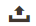

# Kontroller för administratörsstödraster

Administratörssidor som hanterar data visar en samling med poster i ett rutnät. Kontrollerna högst upp i varje kolumn kan användas för att sortera data. Den aktuella sorteringsordningen anges med en stigande eller fallande pil i kolumnrubriken. Du kan ange vilka kolumner som ska visas i stödrastret och dra dem till olika positioner. Du kan också spara olika kolumnupplägg som vyer som kan användas senare. Kolumnen **[!UICONTROL Action]** visar åtgärder som kan tillämpas på en enskild post. Dessutom kan datum från den aktuella vyn med de flesta stödraster exporteras till en [CSV](../systems/data-csv.md) - eller XML-fil.

{width="700" zoomable="yes"}

## Sortera listan

1. Klicka på en kolumnrubrik.

   Pilen anger att den aktuella ordningen är antingen stigande eller fallande.

1. Använd sidnumreringskontrollerna för att visa ytterligare sidor i samlingen.

   {width="300"}

## Sidindela listan

1. Ställ in kontrollen **[!UICONTROL Pagination]** på det antal poster som du vill visa per sida.

1. Klicka på **[!UICONTROL Next]** och **[!UICONTROL Previous]** om du vill bläddra igenom listan eller ange en specifik **[!UICONTROL Page Number]**.

## Filtrera listan

1. Klicka på **[!UICONTROL Filters]**.

1. Fyll i så många filter som behövs för att beskriva den post du vill hitta.

1. Klicka på **[!UICONTROL Apply Filters]**.

   {width="700" zoomable="yes"}

## Exportera data

1. Markera de poster som du vill exportera.

   >[!NOTE]
   >
   >Produktdata kan inte exporteras från rutnätet. Mer information finns i [Exportera](../systems/data-export.md).

1. Välj något av följande filformat på menyn _Exportera_ () i det övre högra hörnet:

   - `CSV`
   - `Excel XML`

   {width="700" zoomable="yes"}

1. Klicka på **[!UICONTROL Export]**.

1. Leta efter den hämtade filen med exporterade data på den plats som webbläsaren använder för nedladdning.

## Stödrasterlayout

Markeringen av kolumner och deras ordning i rutnätet kan ändras enligt dina önskemål och sparas som en _vy_. Du kan styra vilka attribut som visas i rutnätet under den enskilda attributkonfigurationen. Många attribut som visas i produktrutnätet kan påverka administratörens inläsningstid och prestanda.

{width="700" zoomable="yes"}

### Ändra markeringen av kolumner

1. Klicka på kontrollen _Kolumner_ () i det övre högra hörnet.

1. Ändra kolumnmarkeringar:

   - Markera kryssrutan för den kolumn som du vill lägga till i rutnätet.
   - Avmarkera kryssrutan för de kolumner som du vill ta bort från stödrastret.
   - Om du vill returnera standardstödrastervyn klickar du på **[!UICONTROL Reset]**.

Se till att rulla nedåt för att se alla tillgängliga kolumner.

### Flytta en kolumn

1. Klicka på kolumnrubriken och håll ned.

1. Dra kolumnen till den nya positionen och släpp den.

### Spara en stödrastervy

1. Klicka på kontrollen _Visa_ ().

1. Klicka på **[!UICONTROL Save Current View]**.

1. Ange **[!UICONTROL name]** som vy.

1. Om du vill spara alla ändringar klickar du på _pilen_ ().

   Namnet på vyn visas nu som den aktuella vyn.

### Ändra stödrastervyn

1. Klicka på kontrollen _Visa_ ().

1. Gör något av följande:

   - Om du vill använda en annan vy klickar du på vyns namn.
   - Om du vill ändra namnet på en vy klickar du på ikonen _Redigera_ () och uppdaterar namnet.
   - Om du vill ta bort en vy klickar du på ikonen _Redigera_ () och sedan på ikonen _Ta bort_ ().
