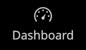
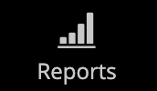

# Sidlisten Administratör

Sidlisten till vänster är huvudmenyn för butiken _Admin_ och är utformad för både datorer och mobila enheter. Den utfällbara menyn ger tillgång till alla verktyg du använder för att hantera din butik dagligen.

| Menyikon | Länk | Beskrivning |
| --------- | ---- | ----------- |
|  | **[Startsida för administratör](../configuration-reference/advanced/admin.md)** | Visar startsidan för Admin, som är kontrollpanelen som standard. |
|  | **[[!UICONTROL Dashboard]](admin-dashboard.md)** | Kontrollpanelen ger en snabb översikt över försäljnings- och kundaktiviteten i din butik, och är vanligtvis den första sidan som visas när du loggar in på Admin. |
|  | **[[!UICONTROL Sales]](../stores-purchase/sales-menu.md)** | På menyn [!UICONTROL Sales] hittar du allt som rör bearbetning av order, fakturor, leveranser, kreditnotor och transaktioner. |
|  | **[[!UICONTROL Catalog]](../catalog/catalog-menu.md)** | Menyn [!UICONTROL Catalog] används för att skapa produkter och definiera kategorier. |
|  | **[[!UICONTROL Customers]](../customers/customers-introduction.md)** | På menyn [!UICONTROL Customers] kan du hantera kundkonton och se vilka kunder som är online just nu. |
|  | **[[!UICONTROL Marketing]](../merchandising-promotions/marketing-menu.md)** | På menyn [!UICONTROL Marketing] ställer du in prisregler och kuponger för katalog och kundvagn. Prisreglerna utlöser åtgärder när en uppsättning specifika villkor uppfylls. |
|  | **[[!UICONTROL Content]](../content-design/content-menu.md)** | På menyn [!UICONTROL Content] hanterar du innehållselementen och designen för din butik. Lär dig hur du skapar sidor, blockerar och förhandsvisar appar och hanterar presentationen av din butik. |
|  | **[[!UICONTROL Reports]](reports-menu.md)** | Menyn [!UICONTROL Reports] innehåller ett brett urval av rapporter som ger dig insikt i alla aspekter av din butik, inklusive försäljning, kundvagn, produkter, kunder, taggar, recensioner, sökvillkor och realtidsövervakning av prestanda och rekommendationer från [Site-Wide Analysis Tool](https://experienceleague.adobe.com/sv/docs/commerce-operations/tools/site-wide-analysis-tool/intro). |
|  | **[[!UICONTROL Stores]](../stores-purchase/stores-menu.md)** | Menyn [!UICONTROL Stores] innehåller verktyg för att konfigurera och underhålla alla delar av din butik, inklusive installationsinställningar för flera platser, skatter, valuta, produktattribut och kundgrupper. |
|  | **[[!UICONTROL System]](../systems/system-menu.md)** | Menyn [!UICONTROL System] innehåller verktyg för att hantera systemåtgärder, installera tillägg och hantera webbtjänster för integrering med andra program. |
|  | **[[!UICONTROL Find Partners & Extensions]](commerce-marketplace.md)** | I [!DNL Commerce Marketplace] hittar du Adobe Commerce- och Magento Open Source-lösningar för din butik. |

{style="table-layout:auto"}
