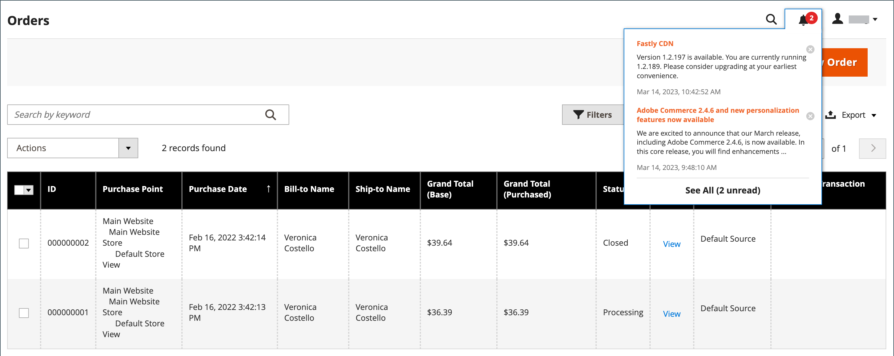

# Inkorg för administratörsmeddelande

Din butik får meddelanden från Adobe regelbundet. Meddelandena klassas som viktiga och kan gälla systemuppdateringar, korrigeringar, nya versioner, schemalagt underhåll eller kommande evenemang. Klockikonen i sidhuvudet anger antalet olästa meddelanden i inkorgen.

{width="700" zoomable="yes"}

På sidan _[!UICONTROL Notifications]_visas alla meddelanden ordnade efter datum._[!UICONTROL Action]_-kommandona kan användas för att markera enskilda meddelanden som lästa, visa mer detaljerad information eller för att ta bort meddelandet från inkorgen.

Konfigurationen avgör hur ofta inkorgen uppdateras och hur meddelandena levereras. Om din butiksadministratör har en säker URL måste meddelanden levereras via HTTPS.

## Visa nya inkommande meddelanden

1. Klicka på ikonen **[!UICONTROL Notification]** i sidhuvudet och läs sammanfattningen.

1. Gör något av följande:

   - Om det behövs klickar du på meddelandet för att visa den fullständiga texten.
   - Om du vill ta bort meddelandet klickar du på borttagningsikonen till höger om meddelandet.
   - Om du vill visa den fullständiga meddelandelistan klickar du på **[!UICONTROL See All]**.

## Åtgärda ett kritiskt meddelande

Gör något av följande om du vill få ett meddelande av avgörande betydelse:

- Klicka på **[!UICONTROL Read Details]**.
- Klicka på **[!UICONTROL Close]** om du vill stänga varningsrutan men låta meddelandet vara aktivt.

## Administrera aviseringar

1. Öppna meddelandesidan genom att göra något av följande:

   - Klicka på ikonen **[!UICONTROL Notification]** i sidhuvudet. Om ett eller flera nya meddelanden visas klickar du på **[!UICONTROL See All]**.

   - Gå till **[!UICONTROL System]** > _[!UICONTROL Other Settings]_>**[!UICONTROL Notifications]**på sidofältet_ Admin _.

1. Gör något av följande i kolumnen **[!UICONTROL Action]**:

   - Om du vill ha mer information klickar du på **[!UICONTROL Read Details]** för att öppna den länkade sidan i ett nytt fönster.

   - Klicka på **[!UICONTROL Mark As Read]** om du vill behålla meddelandet i din inkorg.

     {width="700" zoomable="yes"}

   - Klicka på **[!UICONTROL Remove]** om du vill ta bort meddelandet.

1. Gör något av följande om du vill använda en åtgärd på flera meddelanden:

   - Markera kryssrutan i den första kolumnen för varje meddelande som ska hanteras.
   - Om du vill markera flera meddelanden anger du kontrollen **[!UICONTROL Mass Actions]** efter behov.

1. Ställ in kontrollen **[!UICONTROL Actions]** på något av följande:

   - `Mark as Read`
   - `Remove`

1. Klicka på **[!UICONTROL Submit]** för att slutföra processen.

## Konfigurera meddelanden

1. Gå till **[!UICONTROL Stores]** > _[!UICONTROL Settings]_>**[!UICONTROL Configuration]**på sidofältet_ Admin _.

1. Expandera **[!UICONTROL Advanced]** i den vänstra navigeringspanelen och välj **[!UICONTROL System]**.

1. Expandera i avsnittet **[!UICONTROL Notifications]**.

   {width="600"}

1. Om din butiksadministratör kör över en [säker URL](../stores-purchase/store-urls.md) anger du **[!UICONTROL Use HTTPS to Get Feed]** till `Yes`.

1. Ange **[!UICONTROL Update Frequency]** för att avgöra hur ofta din inkorg uppdateras.

   Intervallet kan vara mellan 1 och 24 timmar.

1. Klicka på **[!UICONTROL Save Config]** när du är klar.

Mer information om konfigurationsalternativen för [!UICONTROL System] finns i [_referenshandboken för konfiguration_](../configuration-reference/advanced/system.md).
