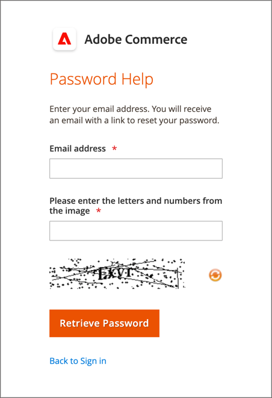

# Ditt administratörskonto

Det primära administratörskontot konfigurerades ursprungligen under installationen och kan innehålla inledande platshållarinformation eller exempeldatainformation. Den angivna ägaren av kontot kan anpassa användarnamnet och lösenordet och uppdatera förnamnet, efternamnet och e-postadressen när som helst. Det här kontot, _superanvändare_ med alla behörigheter som standard skapar vanligtvis de administratörskonton som behövs för verksamheten.

- Se [Skapa en användare](../systems/permissions-users-all.md#create-a-user) om du vill ha information om hur du lägger till eller redigerar användare.

- Se [Behörigheter](../systems/permissions.md) och [Användarroller](../systems/permissions-user-roles.md) om du vill ha information om Admin och användarroller.

{{ims-admin-note}}

## Administratörsinloggning

The [!DNL Commerce] _Administratör_ skyddas av flera lager av säkerhetsåtgärder för att förhindra obehörig åtkomst till din butik, beställning och kunddata. Första gången du loggar in på _Administratör_ måste du ange ditt användarnamn och lösenord och konfigurera [tvåfaktorsautentisering](../systems/security-two-factor-authentication.md) (2FA).

Beroende på hur din butik är konfigurerad kan det finnas en [CAPTCHA](../systems/security-google-recaptcha.md) problem som ska lösas, t.ex. att ange en serie tangentbordstecken, lösa ett pussel eller klicka på en serie bilder med ett gemensamt tema. Dessa tester är utformade för att identifiera dig som människa, snarare än som en automatiserad robot.

För ytterligare säkerhet kan du bestämma vilka delar av _Administratör_ varje användare har [behörighet](../systems/permissions.md) för att få tillgång till och även begränsa antalet [inloggningsförsök](../configuration-reference/advanced/admin.md). Som standard är kontot låst efter sex försök och användaren måste vänta några minuter innan han/hon försöker igen. [Låsta konton](../systems/permissions-users-all.md#locked-users) kan också återställas från _Administratör_.

>[!NOTE]
>
>Första gången du loggar in på _Administratör_ blir du ombedd att _Tillåt datainsamling för administratörsanvändning_. Se [Insamling av användningsdata](admin.md#usage-data-collection) för mer information.

{width="400"}

### Steg 1: Konfigurera tvåfaktorsautentisering

Innan du kan logga in på _Administratör_ i din butik måste du ha en autentiseringslösning med två faktorer konfigurerad och klar att använda. Mer information om autentiseringsprocessen som används av varje lösning finns i [Använda tvåfaktorsautentisering](../systems/security-two-factor-authentication-use.md). Som standard [!DNL Commerce] supports [Google Authenticator][1].

Fråga [!DNL Commerce] systemadministratör för vilka 2FA-lösningar som stöds för butiken. Slutför sedan konfigurationen av den 2FA-lösning du föredrar enligt leverantörens instruktioner.

### Steg 2: Logga in på administratören

1. Ange _Administratör_ URL som har angetts under [!DNL Commerce] installation.

   Standardvärdet _Administratör_ URL ser ut ungefär som `https://www.yourdomain.com/your-custom-admin-domain`.

   >[!NOTE]
   >
   >Dokumentationen använder `admin` som bas-URL i de flesta exempel rekommenderar vi att du väljer ett unikt och svårt att gissa [anpassad URL](../stores-purchase/store-urls.md) för _Administratör_ i din butik.

   Du kan lägga till ett bokmärke för sidan eller spara ett kortkommando på skrivbordet för enkel åtkomst.

1. Ange _Administratör_ **[!UICONTROL Username]** och **[!UICONTROL Password]**.

1. (Valfritt) Om en CAPTCHA är aktiverad för din butik följer du instruktionerna på skärmen för att lösa problemet.

   Mer information finns på [CAPTCHA](../systems/security-captcha.md) och [reCAPTCHA](../systems/security-google-recaptcha.md).

1. Klicka på **[!UICONTROL Sign in]**.

   Om det är första gången du loggar in på _Administratör_ från kontot bör du få ett e-postmeddelande med en länk till konfigurationsinstruktionerna.

### Steg 3: Slutför 2FA-konfigurationen

I följande exempel visas hur du parar _Administratör_ konto hos Google Authenticator.

1. När QR-koden visas kan du använda någon av följande metoder för att hämta koden och koppla Google Authenticator till din _Administratör_ konto.

   {width="400"}

   - Hämta QR-kod med en smartphone

     Starta Google Authenticator på smarttelefonen. Tryck på _plustecken_ (+) i appens övre högra hörn. Tryck på längst ned på skärmen **[!UICONTROL Scan Barcode]** och ta en bild på QR-koden.

   - Hämta QR-kod från webbläsare

     Om Google Authenticator är installerat som tillägg i webbläsaren klickar du på **Autentiserare** -ikonen i verktygsfältet och fånga sidan.

   - Ange QR-kod manuellt

     Kopiera textsträngen nedanför QR-koden. Starta Google Authenticator med antingen din smartphone eller webbläsare och klicka på plustecknet (+). Välj sedan **[!UICONTROL Manual Entry]**. Under **[!UICONTROL Account]** anger du den e-postadress som är kopplad till din _Administratör_ konto och klistra in QR-kodsträngen i **[!UICONTROL Key]** fält.

1. Logga in på _Administratör_ med tvåfaktorsautentisering anger du den sexsiffriga koden som genererats av Google Authenticator i **[!UICONTROL Authenticator code]** och sedan klicka **[!UICONTROL Confirm]**.

   {width="400"}

## Återställ lösenordet

Det är inte tillåtet att återanvända de fyra senaste lösenorden som tilldelats kontot.

1. Ange **[!UICONTROL Email Address]** som är associerad med _Administratör_ konto.

   {width="400"}

1. Klicka på **[!UICONTROL Retrieve Password]**.

   Om ett konto är kopplat till e-postadressen skickas ett e-postmeddelande för att återställa lösenordet.

   >[!NOTE]
   >
   >An _Administratör_ Lösenordet måste innehålla minst sju tecken och innehålla både bokstäver och siffror. Se [Konfigurerar _Administratör_ Säkerhet](../systems/security-admin.md) för information om lösenordsalternativ.

## Logga ut från administratören

1. Klicka i det övre högra hörnet på _Konto_ ().

1. Klicka på **[!UICONTROL Sign Out]**.

   {width="700" zoomable="yes"}

The _[!UICONTROL Sign In]_visas ett meddelande om att du är utloggad. Logga ut från_ Administratör _när du lämnar datorn obevakad.

## Redigera kontoinformation

1. Klicka på _Konto_ ().

1. Klicka på **[!UICONTROL Account Setting]**.

   {width="700" zoomable="yes"}

1. Gör nödvändiga ändringar i din kontoinformation.

   Om du ändrar dina inloggningsuppgifter måste du lagra dem på en säker plats.

1. Ange ditt aktuella kontolösenord.

1. Klicka på **[!UICONTROL Save Account]**.

## Tillåt flera administratörsinloggningar

Administratören ger åtkomst till funktionerna för att hantera order, kunder, produkter, frakt och betalningar. Standardkonfigurationen är inställd på att inte tillåta flera inloggningar för ett administratörskonto som en god säkerhetsrutin. Du kan dock ändra den här inställningen så att administratörsanvändare kan logga in från flera enheter för att få plats med dina arbetsflöden.

1. På _Administratör_ sidebar, gå till **[!UICONTROL Stores]** > _[!UICONTROL Settings]_>**[!UICONTROL Configuration]**.

1. Expandera i den vänstra navigeringspanelen **[!UICONTROL Advanced]** och välja **[!UICONTROL Admin]**.

1. Expandera  den **[!UICONTROL Security]** -avsnitt.

1. För **Kontodelning för administratörer**, markera `Yes`.

   {width="700" zoomable="yes"}

1. Klicka på **[!UICONTROL Save Config]**.

## Ange administratörens inloggningsnamn som skiftlägeskänsliga

1. På _Administratör_ sidebar, gå till **[!UICONTROL Stores]** > _[!UICONTROL Settings]_>**[!UICONTROL Configuration]**.

1. Expandera i den vänstra navigeringspanelen **[!UICONTROL Advanced]** och välja **[!UICONTROL Admin]**.

1. Expandera  den **[!UICONTROL Security]** -avsnitt.

1. Ange **[!UICONTROL Login is Case Sensitive]** fält till `Yes`.

1. Klicka på **[!UICONTROL Save Config]**.

[1]: https://play.google.com/store/apps/details?id=com.google.android.apps.authenticator2&amp;hl=en_US
