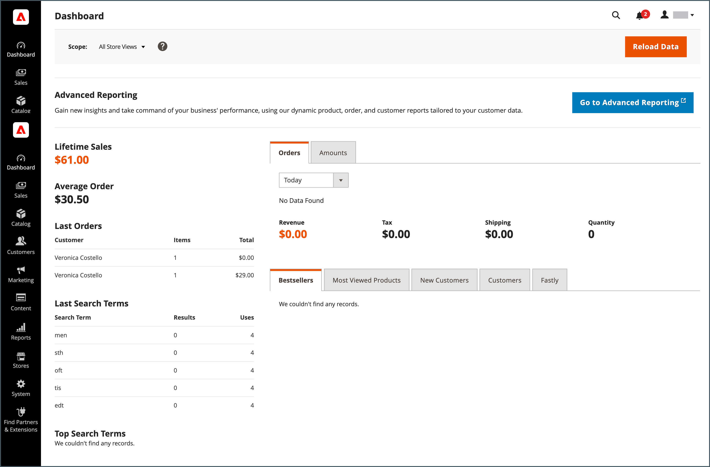

# Vad är administratören?

Din butik _Admin_ är det lösenordsskyddade kontoret där du, som handlare, ställer in produkter och kampanjer, hanterar beställningar och utför andra administrativa uppgifter. Alla grundläggande konfigurationsuppgifter och lagringshanteringsåtgärder utförs från _administratören_.

För ytterligare säkerhet skyddas inloggningen _Admin_ av [tvåfaktorsautentisering](../systems/security-two-factor-authentication.md) och kan konfigureras så att den kräver [CAPTCHA](../systems/security-captcha.md). Mer information finns i [Konfigurera administratörsskydd](../systems/security-admin.md).

{width="700" zoomable="yes"}

De första [inloggningsuppgifterna](admin-signin.md) konfigurerades under Adobe Commerce- eller Magento Open Source-installationen. Om du glömmer lösenordet kan du skicka ett tillfälligt lösenord till den e-postadress som är kopplad till kontot. Om du vill öka säkerheten konfigurerar du din butik så att den kräver ett skiftlägeskänsligt användarnamn och starkt lösenord.

Förutom det förvalda administratörskontot kan ditt företag skapa så många [ytterligare konton](../systems/permissions-users-all.md) som du behöver för att hantera butiken och ge support för kundkonton. Varje konto kan associeras med en specifik [roll](../systems/permissions-user-roles.md) och åtkomstnivå baserat på verksamhetens _behov att känna till_. E-postadressen som är kopplad till varje administratörskonto måste vara unik.

{{ims-admin-note}}

## Insamling av användningsdata

Första gången du loggar in på _Admin_ blir du ombedd att ge Adobe behörighet att samla in användningsdata för alla Admin-användare. Genom att tillåta datainsamling med administratörsinformation kan du hjälpa Adobe att förbättra upplevelsen av att använda Adobe Commerce Admin, och relaterade produkter och tjänster.

{width="600"}

Enskilda användare identifieras inte i användningsdata. Inställningen för datainsamling kan ändras när som helst från konfigurationen [Administratörsanvändning](../configuration-reference/advanced/admin.md#admin-usage).

Om du tillåter datainsamling för Adobe Commerce aktiveras även _Produktvägledning_, som är utformad för att ge _Admin_ interaktivt innehåll. Här finns hjälp, tips, guider, introduktionsinformation, funktionsmeddelanden med mera.
