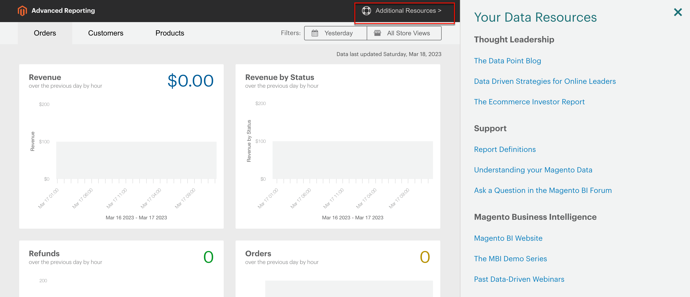

# [!DNL Commerce Intelligence]-verktyg

Använd Commerce Intelligence verktyg för att få den kunskap som behövs för att fatta sunda affärsbeslut.

## [!DNL Commerce Intelligence]-konto

När du aktiverar ett [!DNL Commerce Intelligence]-konto via Adobe får du tillgång till fem instrumentpaneler med ungefär 70 rapporter. Dessa rapporter är utformade för att ge insikter om era data och svara på frågor som&quot;Hur växer mina order månadsvis?&quot;,&quot;Vilka är mina mest lojala kunder?&quot; och&quot;Fungerar min kupongstrategi?&quot; Mer information om den här verktygsuppsättningen finns i [Commerce Intelligence användarhandbok][1].

## [!DNL Advanced Reporting]

[!DNL Advanced Reporting] ingår i Adobe Commerce och Magento Open Source. Den här funktionen ger er tillgång till en uppsättning dynamiska rapporter som baseras på era produkt-, order- och kunddata, med en anpassad kontrollpanel som är anpassad efter era affärsbehov. [!DNL Advanced Reporting] använder [!DNL Commerce Intelligence] för analys, men du behöver inte ha något Commerce Intelligence-konto för att använda [!DNL Advanced Reporting].

Teknisk information finns i avsnittet [[!DNL Advanced Reporting]][2]{:target="_blank"} i utvecklardokumentationen.

>[!NOTE]
>
>På grund av kompatibilitetsproblem med [!DNL Adobe Commerce Intelligence] kan Commerce för tillfället inte stödja avancerad rapportering med AWS S3 Bucket som medium för källdatafilen i [!DNL Commerce Intelligence].

{width="700"}

### Krav

* Webbplatsen måste köras på en offentlig webbserver.

* Domänen måste ha ett giltigt SSL-certifikat.

* [!DNL Commerce] måste ha installerats eller uppgraderats utan fel.

* I [!DNL Commerce]-konfigurationen för [butiks-URL:er](../stores-purchase/store-urls.md) måste inställningen **[!UICONTROL Base URL (Secure)]** för butiksvyn peka på den säkra URL:en. Till exempel: `https://yourdomain.com`.

* [!DNL Commerce] och **[!UICONTROL Use Secure URLs on Storefront]** måste anges till **[!UICONTROL Use Secure URLs in Admin]** i konfigurationen `Yes` för arkiv-URL:er.

* [[!DNL Commerce] crontab][3] skapas och cron-jobb körs på den installerade servern.

>[!NOTE]
>
>[!DNL Advanced Reporting] kan bara användas med [!DNL Commerce] installationer som kontinuerligt har använt en enda [basvaluta](../stores-purchase/currency-configuration.md).


### Steg 1: Aktivera [!DNL Advanced Reporting]

I [!DNL Commerce]-konfigurationen är [[!DNL Advanced Reporting]](../configuration-reference/general/advanced-reporting.md) aktiverad som standard och startar automatiskt om cron är [konfigurerad](../configuration-reference/advanced/system.md) och körs. Ett försök att upprätta prenumerationen påbörjas i början av varje timme under de kommande 24 timmarna tills det är klart. Prenumerationsstatusen är &quot;väntande&quot; tills prenumerationen har upprättats.

1. Gå till _>_ > **[!UICONTROL Stores]** på sidofältet _[!UICONTROL Settings]_Admin **[!UICONTROL Configuration]**.

1. Välj **[!UICONTROL General]** i den vänstra navigeringspanelen där **[!UICONTROL Advanced Reporting]** är expanderat och gör följande:

   * Kontrollera att **[!UICONTROL Advanced Reporting Service]** är inställt på `Enable` (standardinställningen).

   * Ange **[!UICONTROL Time of day to send data]** till timmen, minuten och sekunden, enligt en 24-timmarsklocka, som du vill att tjänsten ska ta emot uppdaterade data från din butik. Som standard skickas data kl. 2:00.

   * Under **[!UICONTROL Industry Data]** väljer du den **[!UICONTROL Industry]** som bäst beskriver ditt företag.

   {width="400"}

1. Klicka på **[!UICONTROL Save Config]** när du är klar.

1. När du uppmanas till det klickar du på **[[!UICONTROL Cache Management]](../systems/cache-management.md)** i meddelandet längst upp på sidan och uppdaterar alla ogiltiga cacheminnen.

1. Vänta över en natt, eller tills efter tidpunkten för nästa schemalagda uppdatering. Kontrollera sedan prenumerationens status. Om statusen fortfarande är _väntande_ kontrollerar du att din installation uppfyller alla krav.

### Steg 2: Åtkomst [!DNL Advanced Reporting]

1. Gör något av följande:

   * Välj _på sidofältet_ Admin **[!UICONTROL Dashboard]**. Klicka sedan på **[!UICONTROL Go to Advanced Reporting]**.
   * Gå till _>_ > **[!UICONTROL Reports]** på sidofältet _[!UICONTROL Business Intelligence]_Admin **[!UICONTROL Advanced Reporting]**.

   Kontrollpanelen [!DNL Advanced Reporting] innehåller en snabb sammanfattning av dina beställningar, kunder och produkter. Se till att bläddra nedåt för att se hela instrumentpanelen.

1. Om du vill få en bättre vy över data anger du **[!UICONTROL Filters]** i det övre högra hörnet till den tidsperiod och lagringsvy som du vill ta med i rapporten. Gör sedan följande:

   * Håll pekaren över en datapunkt för mer information.
   * Klicka på varje flik för att visa alla kontrollpanelsrapporter.

   {width="600" zoomable="yes"}

## Åtkomst till [!DNL Advanced Reporting]-dataresurser

Klicka på **[!UICONTROL Additional Resources]** i det övre högra hörnet av instrumentpanelen för avancerad rapportering.

{width="600" zoomable="yes"}

## Felsökning

Om du får ett 404-meddelande om att sidan inte hittades kontrollerar du att din butik uppfyller kraven för [!DNL Advanced Reporting]. Följ sedan instruktionerna för att kontrollera att integreringen är installerad.

### Kontrollera att integreringen är aktiv

1. Gå till _>_ > **[!UICONTROL System]** på sidofältet _[!UICONTROL Extensions]_Admin **[!UICONTROL Integration]**.

1. Kontrollera att integreringen av **[!UICONTROL Magento Analytics user]** visas i listan och att **[!UICONTROL Status]** är `Active`.

1. Om du vill återupprätta användaren klickar du på **[!UICONTROL Reauthorize]** och gör följande:

   {width="600"}

   * När du uppmanas till det klickar du på **[!UICONTROL Reauthorize]** för att godkänna åtkomst till API-resurserna.

     {width="600"}

   * Kontrollera att listan med integreringstoken för tillägg är slutförd. Klicka sedan på **Klar**.

     {width="600"}

1. Leta efter meddelandet som anger att integreringen `Magento Analytics user` har auktoriserats på nytt.

1. Vänta över en natt eller tills efter tidpunkten för nästa schemalagda uppdatering.

### Verifiera gemensam basvaluta

[!DNL Advanced Reporting] kan bara användas med [!DNL Commerce] installationer som bara har använt en enda [basvaluta](../stores-purchase/currency-configuration.md) sedan installationen. Resultatet är att i historiken används samma basvaluta för alla order. [!DNL Advanced Reporting] fungerar inte om du någon gång har ändrat din basvaluta och har order i din historik som har bearbetats med olika basvalutor.

Om du vill avgöra om din butik har flera basvalutor kan du fråga din [!DNL Commerce]-databas från kommandoraden med hjälp av följande MySQL-exempel. Du kan behöva ändra tabellnamnen så att de matchar datastrukturen:

```sql
select distinct base_currency_code from sales_order;
```

### Datamatchningsavvikelse

Om du märker att bildtexten `Data last updated...` visar gårdagens datum och inte dagens datum kan det uppstå en fördröjning på upp till en dag i uppdateringarna för avancerad rapportering. Fördröjningen beror på att kön är större än förväntat.

## Kontrollpanelrapporter

**[!UICONTROL Orders]**

| Fält | Beskrivning |
|--- |--- |
| [!UICONTROL Revenue] | Visar alla intäkter som har tagits emot av butiksvyn under den definierade tidsperioden. |
| [!UICONTROL Orders] | Visar alla order som placerats genom butiksvyn under den definierade tidsperioden. |
| [!UICONTROL AOV] | Visar det genomsnittliga ordervärdet som placerats genom butiksvyn under den definierade tidsperioden. |
| [!UICONTROL Refunds] | Visar alla återbetalningar som bearbetats genom butiksvyn under den definierade tidsperioden. |
| [!UICONTROL Tax Collected] | Visar all moms som samlats in via butiksvyn under den definierade tidsperioden. |
| [!UICONTROL Shipping Collected] | Visar alla fraktavgifter som samlats in via butiksvyn under den definierade tidsperioden. |
| [!UICONTROL Orders by Status] | Visar antalet order efter status för butiksvyn under den definierade tidsperioden. |
| [!UICONTROL Orders by Status] | Visar en sammanfattning av antalet order efter status. |
| [!UICONTROL Coupon Usage] | Visar alla kupongkoder och antalet användare för varje, inlösta via butiksvyn under den definierade tidsperioden. |
| [!UICONTROL Orders and Revenue by Billing Region] | Visar antalet order och intäkter per region för butiksvyn under den definierade tidsperioden. |
| [!UICONTROL Tax Collected by Billing Region] | Visar mängden moms som samlats in per region för butiksvyn under den definierade tidsperioden. |
| [!UICONTROL Shipping Fees Collected by Shipping Region] | Visar leveransavgifter som samlats in per region för butiksvyn under den definierade tidsperioden. |

{style="table-layout:auto"}

**[!UICONTROL Customers]**

| Fält | Beskrivning |
|--- |--- |
| [!UICONTROL Unique Customers] | Visar antalet unika kundkonton som är associerade med butiksvyn under den definierade tidsperioden. |
| [!UICONTROL New Registered Accounts] | Visar antalet nya kundkonton som registrerats i butiksvyn under den definierade tidsperioden. |
| [!UICONTROL Top Coupon Users] | Visar de övre kuponganvändarna per Kund-ID och antalet order som placerats med kuponger för butiksvyn under den definierade tidsperioden. |
| [!UICONTROL Customer KPI Table] | Visar antalet order, intäkter och genomsnittligt ordervärde per kund-ID för butiksvyn under den definierade tidsperioden. |

{style="table-layout:auto"}

**[!UICONTROL Products]**

| Fält | Beskrivning |
|--- |--- |
| [!UICONTROL Quantity of Products Sold] | Visar antalet produkter som sålts via butiksvyn under den definierade tidsperioden. |
| [!UICONTROL Products Added to Wishlists] | Listar alla produkter som lagts till i önskelistor via butiksvyn under den definierade tidsperioden. |
| [!UICONTROL Best Selling Products by Quantity] | Visar de bästsäljande produkterna och den kvantitet som sålts genom butiksvyn under den definierade tidsperioden. |
| [!UICONTROL Best Selling Products by Revenue] | Visar de mest säljande produkterna och intäkterna som genereras av försäljningen av produkten via butiksvyn under den definierade tidsperioden. |

{style="table-layout:auto"}


[1]: https://experienceleague.adobe.com/docs/commerce-business-intelligence/mbi/guide-overview.html
[2]: https://developer.adobe.com/commerce/php/development/advanced-reporting/
[3]: https://experienceleague.adobe.com/docs/commerce-operations/configuration-guide/cli/configure-cron-jobs.html
