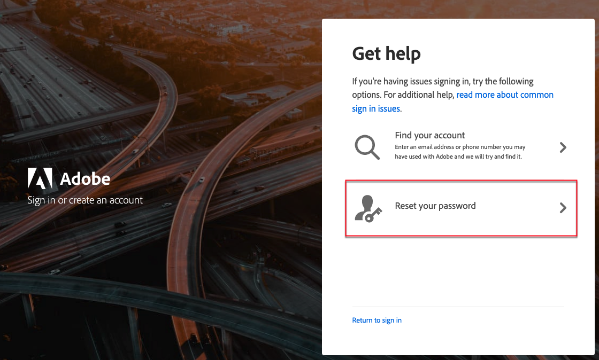

# Åtkomst till ditt [!DNL Commerce]-konto

Du kan komma åt ditt [!DNL Commerce]-konto från webbplatsen [!DNL Commerce]. På kontrollpanelen för ditt [!DNL Commerce]-konto hittar du information som är relaterad till de produkter och tjänster som du har köpt samt din kontakt- och faktureringsinformation. Viss information är endast synlig för licensägare.

![Ditt [!DNL Commerce]-konto](./assets/home-acct.png){width="700"}

Inloggningen för ditt [!DNL Commerce]-konto är skild från inloggningen för din administratör för butik. Du använder vanligtvis olika autentiseringsuppgifter för varje, och åtkomsten till varje system hanteras separat.

En användare som vill effektivisera sin inloggning på Adobe Commerce och Adobe Business-produkter kan dock konfigurera sin Adobe ID att logga in på butiksadministratören: [Konfigurera Commerce Admin Integration med Adobe ID](https://experienceleague.adobe.com/sv/docs/commerce-admin/start/admin/ims/adobe-ims-config) i *IMS Integration Guide for Commerce*.

>[!NOTE]
>
>När du har skapat ditt konto rekommenderar vi att du använder Tvåfaktorautentisering (TFA) för att [skydda ditt konto](commerce-account-secure.md).

## Logga in på ditt [!DNL Commerce]-konto

Du måste ha en Adobe ID för att få tillgång till ditt Commerce-konto. Om du har ett befintligt [!DNL Commerce]-konto men inte har loggat in sedan augusti 2022 måste du skapa en Adobe ID under inloggningsprocessen. Du måste slutföra det här steget innan du kan logga in på ditt konto.

>[!WARNING]
>
>Använd den e-postadress som är kopplad till ditt befintliga Commerce-konto MAGEID för att skapa Adobe ID. Om du använder en annan helt ny e-postadress skapas en ny MAGEID.

1. Gå till [[!DNL Commerce] platsen](https://account.magento.com/customer/account/login/).

1. Klicka på **[!UICONTROL Sign in with Adobe ID]**.

   {width="700"}

1. Ange din e-postadress och klicka på **[!UICONTROL Continue]**.

   >[!TIP]
   >
   >Om du använde en e-postadress som är kopplad till ett befintligt Commerce-konto-MAGEID, länkar inloggningsprocessen automatiskt till din Adobe ID.

## Skapa ett [!DNL Commerce]-konto

Alla kan skapa ett kostnadsfritt [!DNL Commerce]-konto. Den e-postadress du använder kan bara kopplas till ett Commerce-konto.

>[!NOTE]
>
>Använd en Adobe ID för att skapa och få tillgång till ett Commerce-konto.
>- Om du inte har något Commerce-konto kan du skapa ett under registreringsprocessen.
>- Om du redan har ett Commerce-konto men inte har någon Adobe ID kan du läsa [logga in på ett Commerce-konto](#log-in-to-your-dnl-commerce-account).

1. Gå till [[!DNL Commerce] platsen](https://account.magento.com/customer/account/login/).

1. Klicka på **[!UICONTROL Sign in with Adobe ID]**.

1. Klicka **[!UICONTROL Create an account]** om du inte har någon Adobe ID. Annars går du vidare till steg 7.

   {width="700"}

1. Fyll i anmälningsformuläret.

   {width="700"}

1. Klicka på **[!UICONTROL Create account]**.

1. Ange den verifieringskod som skickas till din e-postadress.

   {width="700"}

1. När din Adobe ID har skapats och verifierats går du tillbaka till https://account.magento.com/. Ett MAGE-ID genereras och länkas automatiskt till din Adobe ID.

## Återställ lösenordet

1. Gå till [[!DNL Commerce] platsen](https://account.magento.com/customer/account/login/).

1. Klicka på **[!UICONTROL Sign in with Adobe ID]**.

1. Klicka på **[!UICONTROL Get help signing in]**.

   {width="700"}

1. Klicka på **[!UICONTROL Reset your password]**.

   {width="700"}

1. Ange din e-postadress.

1. Klicka på **[!UICONTROL Continue]**.
