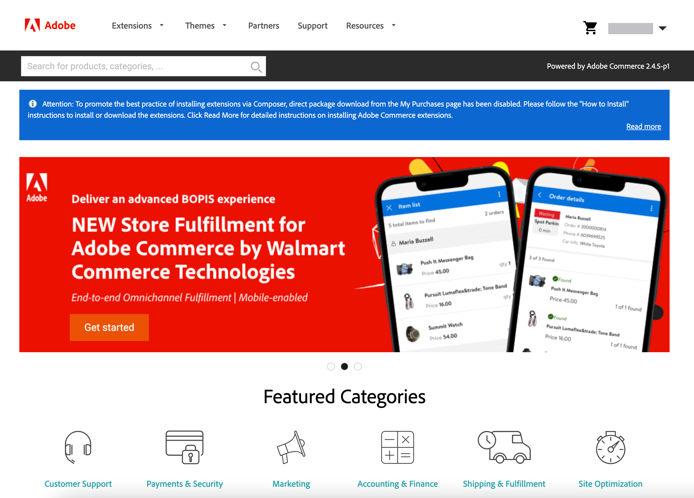

# Adobe Commerce Marketplace

[Adobe Commerce Marketplace][1] är den applikationsbutik som erbjuder handlare ett välstrukturerat urval av lösningar och ger kvalificerade utvecklare de verktyg, den plattform och den plats där de bäst kan bygga upp ett livskraftigt företag. [!DNL Commerce Marketplace] erbjuder ett urval tillägg som är tillgängliga utan kostnad och andra som är till salu. Inköp kan betalas med kreditkort eller [PayPal][2].

Alla tillägg är tillgängliga på [!DNL Commerce Marketplace] har gått igenom en omfattande granskning. The [Tilläggskvalitetsprogram][3] (EQP) kombinerar [!DNL Commerce] expertis, riktlinjer för utveckling och kontrollverktyg för att säkerställa att alla tillägg på Commerce Marketplace uppfyller kodningsstandarder och bästa praxis. Granskningsprocessen innefattar både en automatiserad kontroll och en manuell QA-granskning. Under processen undersöks och testas strukturen och koden för varje förlängning för tecken på virus-/virusinfektion och eventuella tecken på plagiarism. Översynen innehåller en djupgående teknisk undersökning och en hygienkontroll som utförs av en [!DNL Commerce] -tekniker, med fokus på dokumentation, kodningsstruktur, prestanda, skalbarhet, säkerhet och kompatibilitet med [!DNL Commerce] kärna.

Även om du kan köpa tillägg från andra källor är det bara de tillägg som är tillgängliga på [!DNL Commerce Marketplace] verifieras genom omfattande tekniska granskningar och marknadsföringsgranskningar inom Extension Quality Program.

## Appresurser

Utvecklare har traditionellt använt PHP för att skapa tillägg i processen som lägger till funktioner, funktioner, tjänster och integreringar i Adobe Commerce. Genom att skapa program med utbyggbarhet som inte har bearbetats, i motsats till tillägg, kan du undvika kompatibilitetsproblem.

Följande resurser är en startpunkt för nya användare som vill bekanta sig med appar:

### Commerce-resurser

- [Konfigurera I/O-händelser för Adobe Commerce](https://developer.adobe.com/commerce/extensibility/events/)
- [Konfigurera händelser för Adobe Commerce](https://developer.adobe.com/commerce/extensibility/events/configure-commerce/)
- [Konfigurera administratörens användargränssnitts-SDK](https://developer.adobe.com/commerce/extensibility/admin-ui-sdk/)
- [Konvertera ett tillägg till en app](https://developer.adobe.com/commerce/extensibility/app-development/#how-do-i-port-an-extension-into-an-app)

### App Builder-resurser

- [Commerce App Builder - översikt](https://developer.adobe.com/commerce/extensibility/app-development/)
- [Konfigurera API Mesh för Adobe Developer App Builder](https://developer.adobe.com/graphql-mesh-gateway/gateway/getting-started/)
- [Distribuera App Builder-program](https://developer.adobe.com/app-builder/docs/guides/deployment/)
- [CI/CD för App Builder-appar](https://developer.adobe.com/app-builder/docs/guides/deployment/ci_cd_for_firefly_apps/)
- Komma igång med App Builder/Developer Console
   - [Komma igång med App Builder](https://developer.adobe.com/app-builder/docs/getting_started/)
   - [Förstå projekt och arbetsytor](https://developer.adobe.com/app-builder/docs/resources/videos/exploring/projects-and-workspaces/)

## [!DNL Marketplace] autentiseringsuppgifter

Innan du kan installera ett tillägg som du köpt från [!DNL Commerce Marketplace], logga in på [!DNL Commerce] och verifiera att du har en aktiv åtkomstnyckel. Du kan logga in på [!DNL Commerce] konto från huvudet på [[!DNL Marketplace]][1] eller [Magento.com][6].

Din åtkomstnyckel är en uppsättning offentliga och privata nycklar som används för att synkronisera dina [!DNL Commerce] installera med [!DNL Commerce] och verifiera dina uppgifter. När ditt konto har synkroniserats måste du ange din privata nyckel varje gång du installerar ett tillägg eller en modul från Commerce Marketplace eller uppgraderar din [!DNL Commerce] installation.

Du kan skapa flera åtkomstnycklar för olika syften och aktivera eller inaktivera dem efter behov. Du måste dock använda samma åtkomstnyckel som användes för att installera [!DNL Commerce] program. Du kan till exempel inte använda en Magento Open Source-åtkomstnyckel för att uppdatera eller uppgradera Adobe Commerce, eller omvänt. Du kan inte heller använda en åtkomstnyckel som tillhör en annan användare eller en som kommer från en [delat konto](commerce-account-share.md).

### Skapa en åtkomstnyckel

1. Logga in på [!DNL Commerce] konto.

1. På _[!UICONTROL My Account]_väljer du **[!UICONTROL Marketplace]**-fliken.

1. Klicka på nedpilen i det övre högra hörnet bredvid ditt namn och välj **[!UICONTROL My Profile]**.

   ![Dina [!DNL Marketplace] profil](./assets/marketplace-profile.png){width="600"}

1. På _[!UICONTROL Marketplace]_flik under_[!UICONTROL My Products]_, klicka **[!UICONTROL Access Keys]** och gör sedan något av följande:

   - Kontrollera om du redan har en uppsättning nycklar för dina Marketplace-inköp. Du kan skapa flera uppsättningar åtkomstnycklar för olika syften.

   {width="600"}

   - Klicka på **[!UICONTROL Create a New Access Key]**. Ange ett namn för det nya nyckelparet och klicka på **[!UICONTROL OK]**. Giltiga tecken är versala och gemena tecken och bindestreck i stället för mellanslag.

1. När du är klar klickar du på **[!UICONTROL OK]**.

   Din nya åtkomstnyckel är aktiverad och visas i listan.

   Lägg märke till _Kopiera_ efter varje offentlig och privat nyckel. I nästa steg kommer du att kopiera och klistra in dessa värden för att synkronisera din butik med Commerce Marketplace.

## Installationsprocess

>[!IMPORTANT]
>
>Från och med Adobe Commerce och Magento Open Source 2.4.0 tas guiden Konfigurera webben bort och du måste använda kommandoraden för att [installera](https://experienceleague.adobe.com/docs/commerce-operations/installation-guide/advanced.html) eller [uppgradera](https://experienceleague.adobe.com/docs/commerce-operations/upgrade-guide/implementation/perform-upgrade.html) din instans. Detta krav omfattar även [moduler](https://experienceleague.adobe.com/docs/commerce-operations/upgrade-guide/modules/upgrade.html) och [tillägg](https://experienceleague.adobe.com/docs/commerce-operations/installation-guide/tutorials/extensions.html).

Installationsprocessen för [!DNL Marketplace] köp skiljer sig åt för _lokal_ installationer av Commerce än för installationer som ligger på [Adobe Cloud-arkitekturen][4].

{width="600"}

## Support

Om du behöver hjälp med att installera eller använda ett tillägg ska du först titta i dokumentationen som medföljer tillägget. Om du inte hittar svaret på din fråga kan du kontakta utvecklaren direkt med kontaktinformationen i tilläggslistan. Om det ni köper på Marketplace inte uppfyller era behov kan ni [begär återbetalning](#refund-requests) inom 25 dagar från inköpsdatumet. Adobe granskar alla ansökningar om återbetalning och (om det godkänns) utfärdar rätt återbetalning. Om du har frågor om Commerce Marketplace kontaktar du [Support](mailto:commercemarketplacesupport@adobe.com).

### Utcheckningsproblem

Adressfälten i din kontoprofil måste fyllas i för verifieringsändamål i Marketplace-inköpssystemet.

1. Lägg till adressfälten i din Marketplace-kontoprofil.
1. Spara den uppdaterade profilen.
1. Fortsätt med utcheckningen.

### Inloggningsproblem

Inloggningsproblem är vanligtvis relaterade till en felmatchning mellan ditt MAGEID och e-postadressen i kontodatabasen. Kontakta Marketplace Support om du behöver hjälp.

>[!INFO]
>
>Program- och tilläggsköp kan inte göras [överförd](#purchase-transfers) till ett nytt konto.

### Frågor om öppen källkod

Marketplace Support-teamet löser problem som rör [commercial.emarketplace.adobe.com/](https://commercemarketplace.adobe.com/) och [commercial developer.adobe.com/](https://commercedeveloper.adobe.com/) endast webbplatser. Skicka frågor om Magento Open Source till [Community Forum](https://community.magento.com/) eller [kontakta en partner](https://business.adobe.com/products/magento/partners.html) som kan hjälpa till med Magento Open Source.

### Återbetalningsbegäranden

Om du vill få pengarna tillbaka för ett Marketplace-köp loggar du in på ditt konto och följer dessa steg:

1. Klicka [!UICONTROL **Min profil**] > [!UICONTROL **Köphistorik**].
1. Leta upp köpet och klicka på [!UICONTROL **Begär återbetalning**].
1. Fyll i formuläret för återbetalningsorder.

Marketplace Support begär information när återbetalningsbegäran har genererats. Återbetalningsalternativet är tillgängligt i 25 dagar efter inköpsdatum. Se [Marketplace-kundavtal](https://www.adobe.com/legal/terms/enterprise-licensing/magento-legacy-terms.html).

### Orderfakturor

Du kan hämta orderfakturor från [!UICONTROL **Köphistorik**] på Marketplace-kontot. Fakturan anger inte säljarens moms eller adress eftersom det för närvarande inte är ett Marketplace-krav.

Om du vill hämta en orderfaktura för ett Marketplace-inköp loggar du in på ditt Marketplace-konto och följer dessa steg:

1. Klicka [!UICONTROL **Min profil**] > [!UICONTROL **Köphistorik**].
1. Hitta köpet.
1. Klicka på skrivarikonen i det övre högra hörnet av ordningen.

### Inköpsöverföringar

Marketplace Support-teamet har inte möjlighet att överföra inköp till ett annat konto. Du måste köpa alla program och tillägg under det primära Commerce-kontot för att undvika installations- och distributionsproblem. Adobe Commerce har rätt till en unik identifierare. Eftersom Composer används för installation är det bara en uppsättning [åtkomstnycklar](#create-an-access-key) som är knuten till det primära kontot kan användas. Den enda tillgängliga lösningen är att [begär återbetalning](#refund-requests) från Marketplace-inköpskontot (om det är tillåtet enligt Adobe Commerce återbetalningsvillkor).

Du kan [dela](commerce-account-share.md) en Commerce-instans via det primära kontot. Delad åtkomst ger särskilda behörigheter till ett underordnat konto från ett primärt konto. Den delade åtkomstpunkten genereras från det primära kontot. Det primära kontot kan vara Commerce-kontot, huvudhandelskontot eller ett konto som delas inom en organisation.

Dessa särskilda behörigheter ger samma åtkomstnivå på Adobe Commerce som den primära, men överförs inte till Adobe Commerce Marketplace eller Developer Portal. Det innebär att köp av ett tillägg från ett underordnat konto på Marketplace inte kan delas med det primära kontot. Delad åtkomst är en enkelriktad gata (primärt konto för underordnade). Det fungerar inte när ett underordnat konto försöker dela tillbaka till det primära kontot.

[1]: https://marketplace.magento.com/
[2]: https://www.paypal.com/us/home
[3]: https://developer.adobe.com/commerce/marketplace/guides/sellers/extension-quality-program/
[4]: https://www.adobe.com/commerce/magento/enterprise.html
[6]: https://business.adobe.com/products/magento/magento-commerce.html
