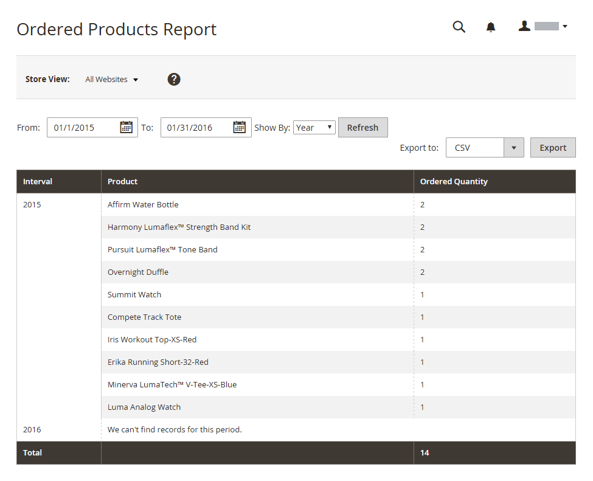

# Produktrapporter

Produktrapporterna ger dig insikt om vilka produkter som visas och beställs, vilka som är bäst på att sälja, vilka som har lagrad och vilka som har rätt att ladda ned.

## [!UICONTROL Product Views Report]

The [!UICONTROL Product Views Report] visar de produkter som har visats under ett tidsintervall eller datumintervall. Rapporten innehåller produktnamn, pris och antal visningar.

På _Administratör_ sidebar, gå till **[!UICONTROL Reports]** > _[!UICONTROL Products]_>**[!UICONTROL Views]**.

{width="600"}

## [!UICONTROL Bestsellers Report]

The [!UICONTROL Bestsellers Report] visar de fem populäraste fem under ett tids- eller datumintervall. Rapporten innehåller produktnamn, pris och beställd kvantitet.

På _Administratör_ sidebar, gå till **[!UICONTROL Reports]** > _[!UICONTROL Products]_>**[!UICONTROL Bestsellers]**.

{width="600"}

## [!UICONTROL Low Stock Report]

The [!UICONTROL Low Stock Report] listar alla produkter med lagernivåer inom ett angivet intervall. Med [[!DNL Inventory Management]](../inventory-management/introduction.md) aktiverat innehåller rapporten låga lagerbelopp per källa med den angivna källkoden.

På _Administratör_ sidebar, gå till **[!UICONTROL Reports]** > _[!UICONTROL Products]_>**[!UICONTROL Low Stock]**.

{width="600"}

## [!UICONTROL Ordered Products Report]

The [!UICONTROL Ordered Products Report] visar alla produkter som beställts för ett angivet tidsintervall eller datumintervall. Rapporten innehåller produktnamn och beställd kvantitet.

På _Administratör_ sidebar, gå till **[!UICONTROL Reports]** > _[!UICONTROL Products]_>**[!UICONTROL Ordered]**.

{width="600"}

## [!UICONTROL Downloads Report]

The [!UICONTROL Downloads Report] visar alla hämtningar under angivet tidsintervall eller datumintervall. Rapporten innehåller produktnamn, nedladdningslänk och SKU, samt antal inköp och nedladdningar.

På _Administratör_ sidebar, gå till **[!UICONTROL Reports]** > _[!UICONTROL Products]_>**[!UICONTROL Downloaded]**.

{width="600"}
