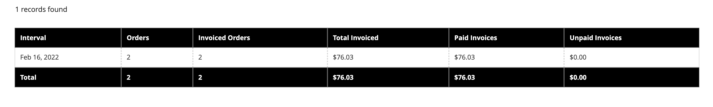
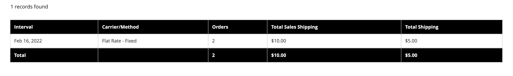

# Försäljningsrapporter

I urvalet av försäljningsrapporter ingår beställningar, moms, fakturerad, leverans, återbetalningar, kuponger och PayPal-kvittning.

## Rapportfilter

Du kan generera en försäljningsrapport för en hel webbplats eller för en butik. Försäljningsrapporterna kan filtreras efter tidsintervall, datum och status.

{width="600"}

Om du vill filtrera en försäljningsrapport anger du följande alternativ:

| Alternativ | Beskrivning |
|--- |--- |
| [!UICONTROL Date Used] | Anger vilka data som ska användas för rapporten. |
| [!UICONTROL Period] | Den period för vilken data används: Dag/månad/år. |
| [!UICONTROL From/To] | Används för att definiera sökdata efter start- och slutdatum. |
| [!UICONTROL Order Status] | Anger orderstatus |
| [!UICONTROL Empty Rows] | Anger om tomma rader ska läggas till i rapporten. |

## [!UICONTROL Orders Report]

The [!UICONTROL Orders Report] innehåller antalet beställningar som gjorts och annullerats, med totalsummor för försäljning, fakturerade, återbetalda, inbetalda skatter, fraktkostnader och rabatter.

1. På _Administratör_ sidebar, gå till **[!UICONTROL Reports]** > _[!UICONTROL Sales]_>**[!UICONTROL Orders]**.

1. I **[!UICONTROL Filter]** väljer du alternativ för rapporteringsperiod och orderstatus som används för att fylla i rapporten.

1. Klicka på **[!UICONTROL Show Report]**.

{width="600"}

## [!UICONTROL Tax Report]

The [!UICONTROL Tax Report] innehåller momsregel, momssats, antal order och momsbelopp.

1. På _Administratör_ sidebar, gå till **[!UICONTROL Reports]** > _[!UICONTROL Sales]_>**[!UICONTROL Tax]**.

1. I **[!UICONTROL Filter]** väljer du alternativ för rapporteringsperiod och orderstatus som används för att fylla i rapporten.

1. Klicka på **[!UICONTROL Show Report]**.

{width="600"}

## [!UICONTROL Invoice Report]

The [!UICONTROL Invoice Report] omfattar antalet order och fakturor under tidsperioden, med fakturerade, betalda och obetalda belopp.

1. På _Administratör_ sidebar, gå till **[!UICONTROL Reports]** > _[!UICONTROL Sales]_>**[!UICONTROL Invoiced]**.

1. I **[!UICONTROL Filter]** väljer du alternativ för rapporteringsperiod och orderstatus som används för att fylla i rapporten.

1. Klicka på **[!UICONTROL Show Report]**.

{width="600"}

## [!UICONTROL Shipping Report]

The [!UICONTROL Shipping Report] innehåller antalet beställningar för transportföretaget eller leveransmetoden, inklusive belopp för total försäljning och total frakt.

1. På _Administratör_ sidebar, gå till **[!UICONTROL Reports]** > _[!UICONTROL Sales]_>**[!UICONTROL Shipping]**.

1. I **[!UICONTROL Filter]** väljer du alternativ för rapporteringsperiod och orderstatus som används för att fylla i rapporten.

1. Klicka på **[!UICONTROL Show Report]**.

{width="600"}

## [!UICONTROL Refunds Report]

The [!UICONTROL Refunds Report] innehåller antalet återbetalningsorder samt totalt belopp som återbetalas online och offline.

1. På _Administratör_ sidebar, gå till **[!UICONTROL Reports]** > _[!UICONTROL Sales]_>**[!UICONTROL Refunds]**.

1. I **[!UICONTROL Filter]** väljer du alternativ för rapporteringsperiod och orderstatus som används för att fylla i rapporten.

1. Klicka på **[!UICONTROL Show Report]**.

{width="600"}

## [!UICONTROL Coupons Report]

The [!UICONTROL Coupons Report] omfattar varje kupongkod som används under angivet tidsintervall, relaterad prisregel och antal gånger som används, med summor och delsummor för försäljning och rabatter.

1. På _Administratör_ sidebar, gå till **[!UICONTROL Reports]** > _[!UICONTROL Sales]_>**[!UICONTROL Coupons]**.

1. I **[!UICONTROL Filter]** väljer du alternativ för rapporteringsperiod och orderstatus som används för att fylla i rapporten.

1. Klicka på **[!UICONTROL Show Report]**.

Mer information om hur du använder [!UICONTROL Coupons Report] om du vill samla in data för era marknadsföringskampanjer kan du läsa [Kupongrapportering](../merchandising-promotions/price-rules-cart-coupon.md#coupons-report) i _Handbok för marknadsföring och reklam_.

<!---  need coupon data  -->

## [!UICONTROL PayPal Settlement Reports]

The [PayPal-kvittningsrapporter] sidan innehåller typ av händelse, t.ex. en debetkortstransaktion, start- och avslutsdatum, bruttobelopp och tillhörande avgifter. Rapporten kan uppdateras automatiskt med de senaste data från PayPal. Det finns filtreringsalternativ för datumintervall, handelskonto, transaktions-ID, faktura-ID eller PayPal-referens-ID.

På _Administratör_ sidebar, gå till **[!UICONTROL Reports]** > _[!UICONTROL Sales]_>**[!UICONTROL PayPal Settlement]**.

{width="600"}

Mer information om hur du använder [!UICONTROL PayPal Settlement Reports] för att få information om varje PayPal-transaktion som påverkar kvittningen av medel, se [PayPal-kvittningsrapporter](../stores-purchase/paypal-settlement-reports.md) i _Butiks and Purchase Experience Guide_.

## [!UICONTROL Braintree Settlement Report]

The [Braintree](../stores-purchase/braintree.md) Kvittningsrapporten kan filtreras efter skapandedatum, belopp, status, transaktionstyp, betalningstyp, transaktions-ID, order-ID, PayPal-betalnings-ID, typ, handlarkonto-ID eller kvittningsbatch-ID. Rapporten innehåller transaktions-ID, beställnings-ID, PayPal-betalnings-ID, typ, skapandedatum, belopp, kvittningskod, status, kvittningssvarstext, återbetalning-ID, handlarkonto-ID, kvittningsbatch-ID och valuta.

På _Administratör_ sidebar, gå till **[!UICONTROL Reports]** > _[!UICONTROL Sales]_>**[!UICONTROL Braintree Settlement]**.

<!---  need a Braintree connection to update report screen -->

## Exportera rapporter

1. Om du vill exportera rapporten väljer du filtyp: `Excel XML` eller `CSV`

1. Klicka på **[!UICONTROL Export]**.

## Uppdatera statistik

För att minska prestandapåverkan av att generera försäljningsrapporter [!DNL Commerce] beräknar och lagrar den statistik som krävs för varje rapport. I stället för att räkna om statistiken varje gång en rapport genereras används den lagrade statistiken, såvida du inte uppdaterar statistiken. Om du vill inkludera de senaste uppgifterna måste rapportstatistiken uppdateras innan en försäljningsrapport genereras.

{width="700"}

1. På _Administratör_ sidebar, gå till **[!UICONTROL Reports]** > _[!UICONTROL Statistics]_>**[!UICONTROL Refresh Statistics]**.

1. Markera kryssrutan för varje rapport som ska uppdateras i listan.

1. Ange **[!UICONTROL Actions]** kontrollera något av följande:

   - `Refresh Lifetime Statistics`
   - `Refresh Statistics for the Last Day`

1. Klicka på **[!UICONTROL Submit]**.
