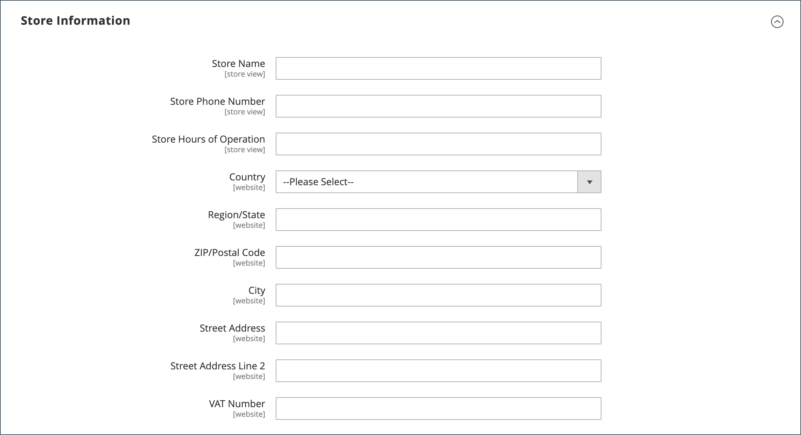

# Butiksinformation

Den grundläggande informationen för din butik omfattar butikens namn och adress, telefonnummer och e-postadress som visas i e-postmeddelanden, fakturor och annan kommunikation som skickas till dina kunder.

{width="900" zoomable="yes"}

## [!UICONTROL Store Information]

The _[!UICONTROL Store Information]_-avsnittet innehåller den grundläggande information som visas i försäljningsdokument och i annan kommunikation.

1. På _Administratör_ sidebar, gå till **[!UICONTROL Stores]** > _[!UICONTROL Settings]_>**[!UICONTROL Configuration]**.

1. Under **[!UICONTROL General]** i den vänstra navigeringspanelen väljer **[!UICONTROL General]**.

1. Expandera  den **[!UICONTROL Store Information]** -avsnitt.

   {width="700"}

1. Ange alternativen efter din butiksinformation:

   - Ange **[!UICONTROL Store Name]** som du vill använda i all kommunikation.

   - Ange **[!UICONTROL Store Phone Number]**, formaterad som du vill att den ska visas.

   - För **[!UICONTROL Store Hours of Operation]** anger du de öppethållande timmarna. Exempel: `Mon - Fri, 9-5, Sat 9-noon PST`.

   - Välj **[!UICONTROL Country]** där företaget finns.

   - Välj **[!UICONTROL Region/State]** med landet.

   - Ange **[!UICONTROL Store Address]**. Om adressen är lång fortsätter du med adressen på **Adressrad 2 för butik**.

   - Ange **[!UICONTROL VAT Number]** i din butik.

     Verifiera numret genom att klicka på **[!UICONTROL Validate VAT Number]** -knappen. Mer information finns på [moms-ID-validering](../stores-purchase/vat.md#vat-id-validation).

1. När du är klar klickar du på **[!UICONTROL Save Config]**.

Mer information om konfigurationsalternativen för lagringsinformation finns i [_Referenshandbok för konfiguration_](../configuration-reference/general/general.md#store-information).

## [!UICONTROL Locale Options]

Språkinställningen avgör antalet inställningar som används i hela butiken. Några av dem är:

- Språk
- Land
- Momssats
- Valuta
- Pris
- Nummerformat

Språkinställningen avgör vilken tidszon och vilket språk som används för varje butik och identifierar veckodagarna i området.

1. På _Administratör_ sidebar, gå till **[!UICONTROL Stores]** > _[!UICONTROL Settings]_>**[!UICONTROL Configuration]**.

1. I den vänstra navigeringspanelen under **[!UICONTROL General]**, välja **[!UICONTROL General]**.

1. Expandera  den **[!UICONTROL Locale Options]** -avsnitt.

   {width="700"}

1. Välj **[!UICONTROL Timezone]** från listan.

1. Ange **[!UICONTROL Locale]** till butiksspråket.

1. Ange **[!UICONTROL Weight Unit]** till den måttenhet som vanligtvis används för leveranser från ditt språkområde.

1. Ange **[!UICONTROL First Day of the Week]** till den dag som anses vara den första dagen i veckan i ditt område.

1. I **[!UICONTROL Weekend Days]** väljer du vilka dagar som ska tillbringa en helg i ditt område.

   Om du vill markera flera dagar håller du ned Ctrl (PC) eller Kommando (Mac) och klickar på varje objekt.

1. När du är klar klickar du på **[!UICONTROL Save Config]**.

Mer information om konfigurationsalternativen för nationella inställningar finns i [Referenshandbok för konfiguration](../configuration-reference/general/general.md#locale-options).

## [!UICONTROL State Options]

I många länder är staten, provinsen eller regionen en obligatorisk del av en postadress. Informationen används för frakt- och faktureringsinformation, för att beräkna skattesatser och så vidare. För länder där delstat inte krävs kan fältet utelämnas helt från adressen eller inkluderas som ett valfritt fält.

Eftersom standardadressformaten varierar mellan olika länder kan du även redigera mallen som används för att formatera adressen för fakturor, följesedlar och leveransetiketter.

1. På _Administratör_ sidebar, gå till **[!UICONTROL Stores]** > _[!UICONTROL Settings]_>**[!UICONTROL Configuration]**.

1. Under **[!UICONTROL General]** i den vänstra navigeringspanelen väljer **[!UICONTROL General]**.

1. Expandera  den **[!UICONTROL State Options]** -avsnitt.

   {width="700"}

1. Använd **[!UICONTROL State is required for]** för att välja varje land där region/stat är en obligatorisk uppgift.

1. Ange **[!UICONTROL Allow to Choose State if it is Optional for Country]** till något av följande:

   `Yes` - I länder där det inte krävs något statligt fält inkluderas det statliga fältet som en valfri post.

   `No` - I länder där det inte krävs något statligt fält utelämnas fältet Stat.

1. När du är klar klickar du på **[!UICONTROL Save Config]**.

Mer information om alternativen för lägeskonfiguration finns i [Referenshandbok för konfiguration](../configuration-reference/general/general.md#state-options).

## [!UICONTROL Country Options]

Alternativen för land anger det land där företaget finns och de länder från vilka du godkänner betalningen.

### Ange landsalternativ för din butik

1. På _Administratör_ sidebar, gå till **[!UICONTROL Stores]** > _[!UICONTROL Settings]_>**[!UICONTROL Configuration]**.

1. I den vänstra navigeringspanelen under **[!UICONTROL General]**, välja **[!UICONTROL General]**.

1. Expandera  den **[!UICONTROL Country Options]** -avsnitt.

   >[!NOTE]
   >
   >Rensa **[!UICONTROL Use system value]** för varje inställning som du vill ändra.

   {width="700"}

1. Välj **[!UICONTROL Default Country]** där företaget finns.

1. I **[!UICONTROL Allow Countries]** väljer du varje land som du accepterar beställningar från.

   Som standard markeras alla länder i listan. Om du vill markera flera länder håller du ned Ctrl (PC) eller Kommando (Mac) och klickar på varje objekt.

1. Använd **[!UICONTROL Zip/Postal Code is Optional for]** för att välja varje land där du bedriver verksamhet som inte kräver att postnummer ska inkluderas som en del av gatuadressen.

1. I **[!UICONTROL European Union Countries]** väljer du de länder i EU där du bedriver verksamhet.

   Som standard väljs alla EU-länder. Om du vill välja länder håller du ned Ctrl (PC) eller Kommando (Mac) och klickar på respektive objekt.

1. I **[!UICONTROL Top Destinations]** väljer du de primära länder som du ska sälja.

1. När du är klar klickar du på **[!UICONTROL Save Config]**.

### Ange landsalternativ för en viss leveransmetod

Du kan också konfigurera leverans till specifika länder för varje tillgängligt [leveransmetod](../stores-purchase/delivery.md) (UPS, FedEx och så vidare).

1. På _Administratör_ sidebar, gå till **[!UICONTROL Stores]** > _[!UICONTROL Settings]_>**[!UICONTROL Configuration]**.

1. Expandera i den vänstra navigeringspanelen **[!UICONTROL Sales]** och välja **[!UICONTROL Delivery Methods]**.

1. Välj det transportföretag som du vill tillämpa specifika länder på.

1. För **[!UICONTROL Ship to Applicable Countries]** avmarkera **[!UICONTROL Use system value]** kryssrutan och välj **[!UICONTROL Specific Countries]** alternativ.

1. I **[!UICONTROL Top Destinations]** väljer du de primära länder som du vill leverera till.

   {width="700"}

1. När du är klar klickar du på **[!UICONTROL Save Config]**.

### Felsökningsresurser

Hjälp med felsökning av problem med landskonfiguration finns i följande [!DNL Commerce] Supportkunskapsbasartiklar:

- [Lägga till ett land](https://experienceleague.adobe.com/docs/commerce-knowledge-base/kb/how-to/how-to-add-a-new-country-to-magento-2.html)
- [Angivet countryId finns inte](https://experienceleague.adobe.com/docs/commerce-knowledge-base/kb/support-tools/patches/v1-0-15/mdva-33393-magento-patch-provided-countryid-does-not-exist.html)

## [!UICONTROL Merchant Location]

Inställningen för handelsplats används för att konfigurera [betalningsmetoder](../stores-purchase/payments.md). Om det inte finns något värde för inställningen [Standardland](#uicontrol-country-options) inställningen används.

1. På _Administratör_ sidebar, gå till **[!UICONTROL Stores]** > _[!UICONTROL Settings]_>**[!UICONTROL Configuration]**.

1. Expandera i den vänstra navigeringspanelen **[!UICONTROL Sales]** och välja **[!UICONTROL Payment Methods]**.

1. Expandera  den **Affärsplats** -avsnittet och välj **[!UICONTROL Merchant Country]**.

   {width="600"}

1. När du är klar klickar du på **[!UICONTROL Save Config]**.

Mer information om konfigurationsalternativen för betalningsmetoder finns i [Referenshandbok för konfiguration](../configuration-reference/sales/payment-methods.md).

## Valuta

Valutainställningar - definierar basen [valuta](../stores-purchase/currency-configuration.md) och eventuella ytterligare valutor som accepteras som betalning. Dessutom upprättas en importanslutning och ett schema som används för att automatiskt uppdatera valutakurser.

Valutasymboler - Definierar [valutasymboler](../stores-purchase/currency-configuration.md#step-5-customize-currency-symbols-optional) som visas i produktpriser och försäljningsdokument som order och fakturor. [!DNL Commerce] stöder valutor från över 200 länder runt om i världen.

Uppdaterar valutakurser - valutakurser kan vara [uppdaterad](../stores-purchase/currency-update.md) manuellt eller importerat till din butik efter behov, eller enligt ett fördefinierat schema.

Valutaväljare - Om det finns flera valutor tillgängliga kan du [valutaväljare](../stores-purchase/currency.md) finns i butikens sidhuvud.

## [!UICONTROL Store Email Addresses]

Du kan ha upp till fem olika e-postadresser som representerar olika funktioner eller avdelningar för varje butik eller vy. Förutom följande fördefinierade e-postidentiteter finns det några anpassade identiteter som du kan konfigurera efter behov.

- Allmän kontakt
- Säljare
- Kundsupport

Varje identitet och tillhörande e-postadress kan kopplas till specifika automatiska e-postmeddelanden och visas som avsändare av e-postmeddelanden som skickas från din butik.

### Steg 1: Konfigurera e-postadresserna för din domän

Innan du kan konfigurera e-postadresser för butiken måste varje anges som en giltig e-postadress för din domän. Följ instruktionerna från serveradministratören eller e-postleverantören för att skapa de e-postadresser som behövs.

### Steg 2: Konfigurera e-postadresserna för din butik

1. På _Administratör_ sidebar, gå till **[!UICONTROL Stores]** > _[!UICONTROL Settings]_>**[!UICONTROL Configuration]**.

1. Under **[!UICONTROL General]** i den vänstra navigeringspanelen väljer **[!UICONTROL Store Email Addresses]**.

1. Expandera  den **[!UICONTROL General Contact]** och gör följande:

   {width="600"}

   - För **[!UICONTROL Sender Name]** Ange namnet på den person som är associerad med den allmänna kontaktidentiteten som ska visas som avsändare av e-postmeddelanden.

   - För **[!UICONTROL Sender Email]** anger du den associerade e-postadressen.

1. Upprepa den här processen för varje e-postadress för butik som du tänker använda.

1. När du är klar klickar du på **[!UICONTROL Save Config]**.

### Steg 3: Uppdatera e-postkonfigurationen för försäljning

Om du använder anpassade e-postadresser måste du uppdatera konfigurationen för alla relaterade e-postmeddelanden så att rätt identitet visas som avsändare.

1. Expandera i den vänstra navigeringspanelen **[!UICONTROL Sales]** och välja **[!UICONTROL Sales Emails]**.

   Sidan har ett separat avsnitt för följande:

   - Order- och orderkommentarer
   - Faktura- och fakturakommentarer
   - Försändelse- och utleveranskommentarer
   - Kreditnota och kreditnota - kommentarer
   - RMA, RMA Authorization, RMA Admin Comments och RMA Customer Comments  (endast Adobe Commerce)

1. Börja med **[!UICONTROL Order]**, expanderar du avsnittet för varje meddelande och ser till att rätt avsändare är markerad.

   {width="600"}

1. När du är klar klickar du på **[!UICONTROL Save Config]**.

Mer information om konfigurationsalternativen för e-postförsäljning finns i [_Referenshandbok för konfiguration_](../configuration-reference/sales/sales-emails.md).

## Kontakta oss

The _Kontakta oss_ är en länk i butikens sidfot som är ett enkelt sätt för kunderna att hålla kontakten med dig. Kunden kan fylla i formuläret och skicka ett meddelande till din butik. En standard [!DNL Commerce] standardinställningarna visas _Kontakta oss_ formulär. När du har skickat in formuläret visas ett tackmeddelande

Det är viktigt att förstå att standardformuläret Kontakta oss återges direkt från koden i stället för från en CMS-sida.

{width="700"}

Butikssidfoten innehåller en länk till sidan Kontakta oss som är tillgänglig i hela butiken.

{width="700"}

Exempeldata för luma innehåller ytterligare information på sidan Kontakta oss som visar hur du kan anpassa sidan för din butik.

{width="700"}

### Konfigurera kontaktformuläret

1. På _Administratör_ sidebar, gå till **[!UICONTROL Stores]** > _[!UICONTROL Settings]_>**[!UICONTROL Configuration]**.

1. I den vänstra navigeringspanelen under **[!UICONTROL General]**, välja **[!UICONTROL Contacts]**.

1. Expandera  den **[!UICONTROL Contact Us]** avsnitt och ange **[!UICONTROL Enable Contact Us]** till `Yes`.

   {width="600"}

1. Expandera  den **[!UICONTROL Email Options]** och ange alternativ för e-postkontakt:

   {width="600"}

   - För **[!UICONTROL Send Emails to]** anger du den e-postadress dit meddelanden från formuläret Kontakta oss skickas.

   - Ange **[!UICONTROL Email Sender]** till den butiksidentitet som visas som avsändare av meddelandet från formuläret Kontakta oss. Exempel: Egen e-postadress 2.

   - Ange **[!UICONTROL Email Template]** till mallen som används för meddelanden som skickas från formuläret Kontakta oss.

1. Klicka på **[!UICONTROL Save Config]**.

### Anpassa innehållet

Du kan anpassa innehållet i _Kontakta oss_ formulär som passar butikens behov och kundtjänstpolicyer.

### Metod 1: Använda exempeldata

Luma-exempeldata innehåller en _Kontakta oss_ -block som kan anpassas för din butik. The `contact-us-info` [block](../content-design/blocks.md) kan enkelt ändras för att lägga till ditt eget innehåll på sidan Kontakta oss.

1. På _Administratör_ sidebar, gå till **[!UICONTROL Content]** > _[!UICONTROL Elements]_>**[!UICONTROL Blocks]**.

1. Hitta **[!UICONTROL Contact Us Info]** -block i listan och öppna i **[!UICONTROL Edit]** läge.

   {width="700"}

1. Klicka på längst ned på blocksidan **[!UICONTROL Edit with Page Builder]**.

   {width="700"}

   >[!NOTE]
   >
   >Om du har [[!DNL Page Builder] inaktiverad](../page-builder/setup.md#disable-dnl-page-builder)kan du använda redigeraren [verktygsfält](../content-design/editor.md) för att formatera texten och lägga till [bilder](../content-design/editor-insert-image.md) och [länkar](../content-design/editor-insert-link.md).

1. Håll pekaren över behållaren HTML för att visa verktygslådan och välj _Inställningar_ (  ).

1. Redigera HTML-koden enligt kontaktinformationen för din butik och klicka på **[!UICONTROL Save]**.

   {width="700"}

1. Avsluta [!DNL Page Builder] scen och klicka **[!UICONTROL Save Block]**.

### Metod 2: Utan exempeldata

>[!IMPORTANT]
>
>Från och med version 2.4.0 kan kontaktformuläret inte längre anropa inuti ett CMS-block eller en CMS-sida. All anpassning av kontaktformuläret ska göras med layout-xml eller egna temamallar.

Som standard får kunderna tillgång till kontaktformuläret via _Kontaktlänk_ i sidfoten på butikssidorna. Mer information om hur du anpassar kontaktsidan finns i [Utvecklarhandbok för Edge][theme-guide].

[theme-guide]: https://developer.adobe.com/commerce/frontend-core/guide/themes/
