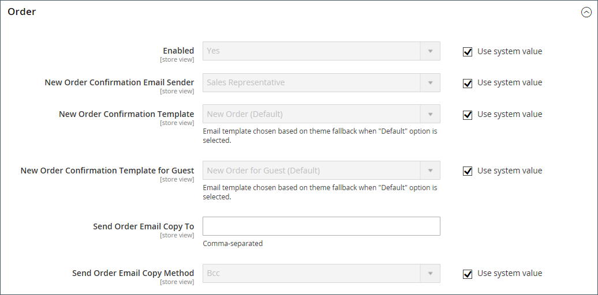

# Butiksinformation

Den grundläggande informationen för din butik omfattar butikens namn och adress, telefonnummer och e-postadress som visas i e-postmeddelanden, fakturor och annan kommunikation som skickas till dina kunder.

{width="900" zoomable="yes"}

## [!UICONTROL Store Information]

Avsnittet _[!UICONTROL Store Information]_&#x200B;innehåller grundläggande information som visas i försäljningsdokument och i annan kommunikation.

1. Gå till _>_ > **[!UICONTROL Stores]** på sidofältet _[!UICONTROL Settings]_&#x200B;Admin **[!UICONTROL Configuration]**.

1. Välj **[!UICONTROL General]** under **[!UICONTROL General]** i den vänstra navigeringspanelen.

1. Expandera  i avsnittet **[!UICONTROL Store Information]**.

   {width="700"}

1. Ange alternativen efter din butiksinformation:

   - Ange **[!UICONTROL Store Name]** som du vill använda i all kommunikation.

   - Ange **[!UICONTROL Store Phone Number]**, formaterad som du vill att den ska visas.

   - För **[!UICONTROL Store Hours of Operation]** anger du de timmar din butik är öppen för företag. Till exempel: `Mon - Fri, 9-5, Sat 9-noon PST`.

   - Välj **[!UICONTROL Country]** där ditt företag finns.

   - Välj **[!UICONTROL Region/State]** med landet.

   - Ange **[!UICONTROL Store Address]**. Om adressen är lång fortsätter du med adressen på **Butiksadressrad 2**.

   - Ange **[!UICONTROL VAT Number]** för din butik om tillämpligt.

     Verifiera numret genom att klicka på knappen **[!UICONTROL Validate VAT Number]**. Mer information finns i [Moms-ID-validering](../stores-purchase/vat.md#vat-id-validation).

1. Klicka på **[!UICONTROL Save Config]** när du är klar.

Mer information om konfigurationsalternativen för lagringsinformation finns i [_referenshandboken för konfiguration_](../configuration-reference/general/general.md#store-information).

## [!UICONTROL Locale Options]

Språkinställningen avgör antalet inställningar som används i hela butiken. Några av dem är:

- Språk
- Land
- Momssats
- Valuta
- Pris
- Nummerformat

Språkinställningen avgör vilken tidszon och vilket språk som används för varje butik och identifierar veckodagarna i området.

1. Gå till _>_ > **[!UICONTROL Stores]** på sidofältet _[!UICONTROL Settings]_&#x200B;Admin **[!UICONTROL Configuration]**.

1. Välj **[!UICONTROL General]** i den vänstra navigeringspanelen under **[!UICONTROL General]**.

1. Expandera  i avsnittet **[!UICONTROL Locale Options]**.

   {width="700"}

1. Välj **[!UICONTROL Timezone]** i listan.

1. Ange **[!UICONTROL Locale]** som butiksspråk.

1. Ange **[!UICONTROL Weight Unit]** till den måttenhet som vanligtvis används för leveranser från ditt språkområde.

1. Ange **[!UICONTROL First Day of the Week]** till den dag som anses vara den första dagen i veckan i ditt område.

1. I listan **[!UICONTROL Weekend Days]** väljer du de dagar som infaller på en helg i ditt område.

   Om du vill markera flera dagar håller du ned Ctrl (PC) eller Kommando (Mac) och klickar på varje objekt.

1. Klicka på **[!UICONTROL Save Config]** när du är klar.

Mer information om konfigurationsalternativen för nationella inställningar finns i [referenshandboken för konfiguration](../configuration-reference/general/general.md#locale-options).

## [!UICONTROL State Options]

I många länder är staten, provinsen eller regionen en obligatorisk del av en postadress. Informationen används för frakt- och faktureringsinformation, för att beräkna skattesatser och så vidare. För länder där delstat inte krävs kan fältet utelämnas helt från adressen eller inkluderas som ett valfritt fält.

Eftersom standardadressformaten varierar mellan olika länder kan du även redigera mallen som används för att formatera adressen för fakturor, följesedlar och leveransetiketter.

1. Gå till _>_ > **[!UICONTROL Stores]** på sidofältet _[!UICONTROL Settings]_&#x200B;Admin **[!UICONTROL Configuration]**.

1. Välj **[!UICONTROL General]** under **[!UICONTROL General]** i den vänstra navigeringspanelen.

1. Expandera  i avsnittet **[!UICONTROL State Options]**.

   {width="700"}

1. Använd listan **[!UICONTROL State is required for]** för att välja varje land där region/stat är en obligatorisk post.

1. Ange **[!UICONTROL Allow to Choose State if it is Optional for Country]** till något av följande:

   `Yes` - I länder där det inte finns något krav på tillståndsfältet inkluderas fältet State som en valfri post.

   `No` - I länder där det inte finns något krav på tillståndsfältet utelämnas fältet State (Delstat).

1. Klicka på **[!UICONTROL Save Config]** när du är klar.

Mer information om alternativen för lägeskonfiguration finns i [referenshandboken för konfiguration](../configuration-reference/general/general.md#state-options).

## [!UICONTROL Country Options]

Alternativen för land anger det land där företaget finns och de länder från vilka du godkänner betalningen.

### Ange landsalternativ för din butik

1. Gå till _>_ > **[!UICONTROL Stores]** på sidofältet _[!UICONTROL Settings]_&#x200B;Admin **[!UICONTROL Configuration]**.

1. Välj **[!UICONTROL General]** i den vänstra navigeringspanelen under **[!UICONTROL General]**.

1. Expandera  i avsnittet **[!UICONTROL Country Options]**.

   >[!NOTE]
   >
   >Om det behövs avmarkerar du kryssrutan **[!UICONTROL Use system value]** för varje inställning som du vill ändra.

   {width="700"}

1. Välj **[!UICONTROL Default Country]** där ditt företag finns.

1. I listan **[!UICONTROL Allow Countries]** väljer du varje land som du godkänner beställningar från.

   Som standard markeras alla länder i listan. Om du vill markera flera länder håller du ned Ctrl (PC) eller Kommando (Mac) och klickar på varje objekt.

1. Använd listan **[!UICONTROL Zip/Postal Code is Optional for]** för att välja varje land där du bedriver verksamhet som inte kräver att postnummer ska inkluderas som en del av gatuadressen.

1. I listan **[!UICONTROL European Union Countries]** väljer du varje land i EU där du bedriver verksamhet.

   Som standard väljs alla EU-länder. Om du vill välja länder håller du ned Ctrl (PC) eller Kommando (Mac) och klickar på respektive objekt.

1. I listan **[!UICONTROL Top Destinations]** väljer du de primära länder som du ska sälja.

1. Klicka på **[!UICONTROL Save Config]** när du är klar.

### Ange landsalternativ för en viss leveransmetod

Du kan också konfigurera leverans till specifika länder för varje tillgänglig [leveransmetod](../stores-purchase/delivery.md) (UPS, FedEx och så vidare).

1. Gå till _>_ > **[!UICONTROL Stores]** på sidofältet _[!UICONTROL Settings]_&#x200B;Admin **[!UICONTROL Configuration]**.

1. Expandera **[!UICONTROL Sales]** i den vänstra navigeringspanelen och välj **[!UICONTROL Delivery Methods]**.

1. Välj det transportföretag som du vill tillämpa specifika länder på.

1. För **[!UICONTROL Ship to Applicable Countries]** avmarkerar du kryssrutan **[!UICONTROL Use system value]** och väljer alternativet **[!UICONTROL Specific Countries]**.

1. I listan **[!UICONTROL Top Destinations]** väljer du de primära länder som du vill leverera till.

   {width="700"}

1. Klicka på **[!UICONTROL Save Config]** när du är klar.

### Felsökningsresurser

Hjälp med felsökning av problem med landskonfiguration finns i följande artiklar i [!DNL Commerce] kunskapsbasen med supportfrågor:

- [Lägga till ett land](https://experienceleague.adobe.com/docs/commerce-knowledge-base/kb/how-to/how-to-add-a-new-country-to-magento-2.html)

## [!UICONTROL Merchant Location]

[!BADGE Endast PaaS]{type=Informative url="https://experienceleague.adobe.com/en/docs/commerce/user-guides/product-solutions" tooltip="Gäller endast Adobe Commerce i molnprojekt (Adobe-hanterad PaaS-infrastruktur) och lokala projekt."}

Inställningen för handelsplats används för att konfigurera [betalningsmetoder](../stores-purchase/payments.md). Om det inte finns något värde för den här inställningen används inställningen [Standardland](#uicontrol-country-options).

1. Gå till _>_ > **[!UICONTROL Stores]** på sidofältet _[!UICONTROL Settings]_&#x200B;Admin **[!UICONTROL Configuration]**.

1. Expandera **[!UICONTROL Sales]** i den vänstra navigeringspanelen och välj **[!UICONTROL Payment Methods]**.

1. Expandera  i avsnittet **Markeringsplats** och välj **[!UICONTROL Merchant Country]**.

   {width="600"}

1. Klicka på **[!UICONTROL Save Config]** när du är klar.

Mer information om konfigurationsalternativen för betalningsmetoder finns i [referenshandboken för konfiguration](../configuration-reference/sales/payment-methods.md).

## Valuta

Valutainställning - Definierar basen [valuta](../stores-purchase/currency-configuration.md) och alla andra valutor som accepteras som betalning. Dessutom upprättas en importanslutning och ett schema som används för att automatiskt uppdatera valutakurser.

Valutasymboler - Definierar de [valutasymboler](../stores-purchase/currency-configuration.md#step-5-customize-currency-symbols-optional) som visas i produktpriser och försäljningsdokument som order och fakturor. [!DNL Commerce] har stöd för valutor från över 200 länder runt om i världen.

Uppdaterar valutakurser - Valutakurser kan [uppdateras](../stores-purchase/currency-update.md) manuellt eller importeras till din butik efter behov, eller enligt ett fördefinierat schema.

Valutaväljare - Om det finns flera tillgängliga valutor är [valutaväljaren](../stores-purchase/currency.md) tillgänglig i butikens huvud.

## [!UICONTROL Store Email Addresses]

Du kan ha upp till fem olika e-postadresser som representerar olika funktioner eller avdelningar för varje butik eller vy. Förutom följande fördefinierade e-postidentiteter finns det några anpassade identiteter som du kan konfigurera efter behov.

- Allmän kontakt
- Säljare
- Kundsupport

Varje identitet och tillhörande e-postadress kan kopplas till specifika automatiska e-postmeddelanden och visas som avsändare av e-postmeddelanden som skickas från din butik.

### Steg 1: Konfigurera e-postadresserna för din domän

Innan du kan konfigurera e-postadresser för butiken måste varje anges som en giltig e-postadress för din domän. Följ instruktionerna från serveradministratören eller e-postleverantören för att skapa de e-postadresser som behövs.

### Steg 2: Ange bas-URL för genererade länkar

[!BADGE Endast SaaS]{type=Positive url="https://experienceleague.adobe.com/en/docs/commerce/user-guides/product-solutions" tooltip="Gäller endast Adobe Commerce as a Cloud Service-projekt (SaaS-infrastruktur som hanteras av Adobe)."}

Vissa kundorienterade e-postmeddelanden innehåller länkar till butiken, t.ex. sådana som hjälper kunderna att återställa sina lösenord. För att länkarna till butiken ska fungera måste du definiera bas-URL:en till butiken.

1. Gå till _>_ > **[!UICONTROL Stores]** på sidofältet _[!UICONTROL Settings]_&#x200B;Admin **[!UICONTROL Configuration]**.

1. Välj **[!UICONTROL General]** under **[!UICONTROL Store Email Addresses]** i den vänstra navigeringspanelen.

1. I avsnittet **[!UICONTROL Storefront Base URL]** fält **[!UICONTROL General]** anger du arkivets rot-URL, till exempel `https://www.example.com/`. URL:en måste avslutas med ett snedstreck.

   {width="600"}

### Steg 3: Konfigurera e-postadresserna för din butik

[!BADGE Endast SaaS]{type=Positive url="https://experienceleague.adobe.com/en/docs/commerce/user-guides/product-solutions" tooltip="Gäller endast Adobe Commerce as a Cloud Service- och Adobe Commerce Optimizer-projekt (SaaS-infrastruktur som hanteras av Adobe)."} E-postadresser för avsändare konfigureras när din instans etableras. Om du behöver ändra adresserna skapar du en supportanmälan.

1. Gå till _>_ > **[!UICONTROL Stores]** på sidofältet _[!UICONTROL Settings]_&#x200B;Admin **[!UICONTROL Configuration]**.

1. Välj **[!UICONTROL General]** under **[!UICONTROL Store Email Addresses]** i den vänstra navigeringspanelen.

1. Expandera  i avsnittet **[!UICONTROL General Contact]** och gör följande:

   {width="600"}

   - I **[!UICONTROL Sender Name]** anger du namnet på den person som är associerad med den allmänna kontaktidentiteten som ska visas som avsändare av e-postmeddelanden.

   - Ange den associerade e-postadressen för **[!UICONTROL Sender Email]**.

1. Upprepa den här processen för varje e-postadress för butik som du tänker använda.

1. Klicka på **[!UICONTROL Save Config]** när du är klar.

### Steg 4: Uppdatera e-postkonfigurationen för försäljning

Om du använder anpassade e-postadresser måste du uppdatera konfigurationen för alla relaterade e-postmeddelanden så att rätt identitet visas som avsändare.

1. Expandera **[!UICONTROL Sales]** i den vänstra navigeringspanelen och välj **[!UICONTROL Sales Emails]**.

   Sidan har ett separat avsnitt för följande:

   - Order- och orderkommentarer
   - Faktura- och fakturakommentarer
   - Försändelse- och utleveranskommentarer
   - Kreditnota och kreditnota - kommentarer
   - RMA, RMA-auktorisering, RMA-administratörskommentarer och RMA-kundkommentarer  (endast Adobe Commerce)

1. Från och med **[!UICONTROL Order]** expanderar du avsnittet för varje meddelande och ser till att rätt avsändare är markerad.

   {width="600"}

1. Klicka på **[!UICONTROL Save Config]** när du är klar.

Mer information om konfigurationsalternativen för e-post för försäljning finns i [_Konfigurationsreferenshandbok_](../configuration-reference/sales/sales-emails.md).

## Kontakta oss

Länken _Kontakta oss_ i butikens sidfot är ett enkelt sätt för kunderna att hålla kontakten med dig. Kunden kan fylla i formuläret och skicka ett meddelande till din butik. Standardformuläret [!DNL Commerce]Kontakta oss _visas vid en_-standardinstallation. När du har skickat in formuläret visas ett tackmeddelande

Det är viktigt att förstå att standardformuläret Kontakta oss återges direkt från koden i stället för från en CMS-sida.

{width="700"}

Butikssidfoten innehåller en länk till sidan Kontakta oss som är tillgänglig i hela butiken.

{width="700"}

Exempeldata för luma innehåller ytterligare information på sidan Kontakta oss som visar hur du kan anpassa sidan för din butik.

{width="700"}

### Konfigurera kontaktformuläret

1. Gå till _>_ > **[!UICONTROL Stores]** på sidofältet _[!UICONTROL Settings]_&#x200B;Admin **[!UICONTROL Configuration]**.

1. Välj **[!UICONTROL General]** i den vänstra navigeringspanelen under **[!UICONTROL Contacts]**.

1. Expandera  i avsnittet **[!UICONTROL Contact Us]** och ange **[!UICONTROL Enable Contact Us]** till `Yes`.

   {width="600"}

1. Expandera  i avsnittet **[!UICONTROL Email Options]** och ange alternativ för e-postkontakt:

   {width="600"}

   - För **[!UICONTROL Send Emails to]** anger du den e-postadress dit meddelanden från formuläret Kontakta oss skickas.

   - Ange **[!UICONTROL Email Sender]** till den butiksidentitet som visas som avsändare av meddelandet från formuläret Kontakta oss. Exempel: Egen e-postadress 2.

   - Ange **[!UICONTROL Email Template]** till mallen som används för meddelanden som skickas från formuläret Kontakta oss.

1. Klicka på **[!UICONTROL Save Config]** när du är klar.

### Anpassa innehållet

Du kan anpassa innehållet i formuläret _Kontakta oss_ så att det passar butikens och kundtjänstens behov.

### Metod 1: Använda exempeldata

Luma-exempeldata innehåller ett _Kontakta oss_ -block som kan anpassas för din butik. `contact-us-info` [block](../content-design/blocks.md) kan enkelt ändras för att lägga till ditt eget innehåll på sidan Kontakta oss.

1. Gå till _>_ > **[!UICONTROL Content]** på sidofältet _[!UICONTROL Elements]_&#x200B;Admin **[!UICONTROL Blocks]**.

1. Hitta blocket **[!UICONTROL Contact Us Info]** i listan och öppna i läget **[!UICONTROL Edit]**.

   {width="700"}

1. Klicka på **[!UICONTROL Edit with Page Builder]** längst ned på blocksidan.

   {width="700"}

   >[!NOTE]
   >
   >Om du har [[!DNL Page Builder] inaktiverat](../page-builder/setup.md#disable-dnl-page-builder) kan du använda redigerarens [verktygsfält](../content-design/editor.md) för att formatera texten och lägga till [bilder](../content-design/editor-insert-image.md) och [länkar](../content-design/editor-insert-link.md).

1. Håll pekaren över HTML-behållaren för att visa verktygslådan och välj ikonen _Inställningar_ (  ).

1. Redigera HTML-koden enligt kontaktinformationen för din butik och klicka på **[!UICONTROL Save]**.

   {width="700"}

1. Avsluta scenen [!DNL Page Builder] och klicka på **[!UICONTROL Save Block]**.

### Metod 2: Utan exempeldata

>[!IMPORTANT]
>
>Från och med version 2.4.0 kan kontaktformuläret inte längre anropa inuti ett CMS-block eller en CMS-sida. All anpassning av kontaktformuläret ska göras med layout-xml eller egna temamallar.

Som standard kommer kunderna åt kontaktformuläret via länken _Kontakt_ i sidfoten på butikssidorna. Mer information om hur du anpassar kontaktsidan finns i [klientutvecklarhandboken](https://developer.adobe.com/commerce/frontend-core/guide/themes/).
