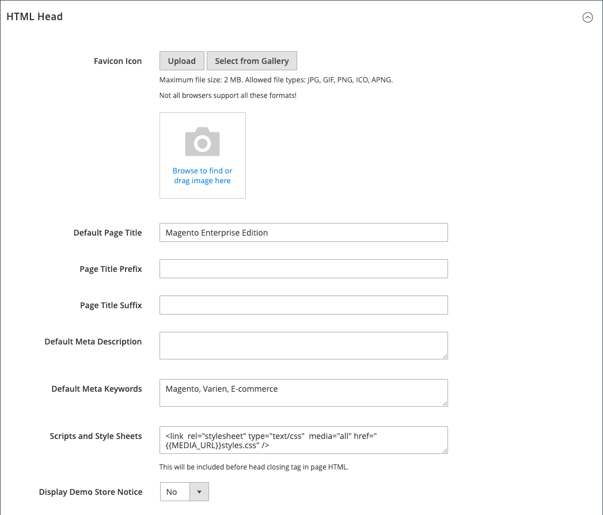
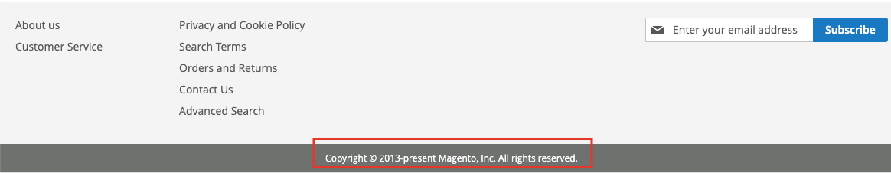

# Varumärkning för Storefront

En av de första saker du vill göra är att [ändra logotypen](#upload-your-logo) i sidhuvudet och [ladda upp en favorition](#add-a-favicon) för webbläsaren. Nu ska du [lägg till ditt välkomstmeddelande](#change-the-welcome-message) och [uppdatera copyrightmeddelandet](#change-the-copyright-notice) i sidfoten. Det här är några enkla designelement som du kan ta hand om direkt. Medan din butik är under utveckling kan du [aktivera demomeddelandet](#set-the-store-demo-notice)och sedan ta bort den när du är klar att starta.

{width="600" zoomable="yes"}

## Ladda upp din logotyp

Storleken och platsen för logotypen i rubriken bestäms av butikens tema. Din logotyp kan sparas som en GIF-, PNG- eller JPG-fil (JPEG) och överföras från administratören för din butik.

{width="600"}

Logotypbilden finns på följande plats på servern. Alla bildfiler med namnet `logo.svg` används som standardtemats logotyp.

Fullständig sökväg - `app/design/frontend/[vendor]/[theme]/web/images/logo.svg`

Relativ sökväg -  `images/logo.svg`

Om du inte känner till storleken på logotypen eller andra bilder som används i ditt tema, öppnar du sidan i en webbläsare, högerklickar på bilden och kontrollerar elementet.

>[!NOTE]
>
>Förutom logotypen i rubriken visas logotypen också på [e-postmallar](../systems/email-templates.md#prepare-your-email-logo) och [PDF fakturor](../stores-purchase/sales-documents.md) och andra försäljningsdokument. De logotyper som används för e-postmallar och fakturor har olika storlekskrav och måste laddas upp separat.

Filformat för logotyper som stöds:

| Filformat | Beskrivning |
|--- |--- |
| PNG | (Portable Network Graphics) Det här nyare alternativet till formatet GIF stöder upp till 16 miljoner färger (24 bitar). Det förlustfria komprimeringsformatet ger en bitmappsbild med hög kvalitet och skarp text, men större filstorlek än vissa format. PNG-formatet stöder genomskinliga lager och är utformat för visning online och direktuppspelning. |
| GIF | (Graphics Interchange Format) Ett vanligt och äldre bitmappsformat som är begränsat till 256 färger (8 bitar). Formatet GIF stöder enkel animering och genomskinliga lager. |
| JPG (JPEG) | (Joint Photographic Expert Group) Ett komprimerat bitmappsformat som används av de flesta digitalkameror. Förstörande komprimering orsakar en del dataförlust, som ibland märks som oskarpa fläckar i texten. |

{style="table-layout:auto"}

1. På _Administratör_ sidebar, gå till **[!UICONTROL Content]** > _[!UICONTROL Design]_>**[!UICONTROL Configuration]**.

   {width="700"}

1. Leta reda på butiksvyn som du vill konfigurera och klicka på **[!UICONTROL Edit]** i _[!UICONTROL Action]_kolumn.

1. Expandera  den **[!UICONTROL Header]** -avsnitt.

   {width="600"}

1. Om du vill ladda upp en ny logotyp klickar du på **[!UICONTROL Upload]** och välj filen i systemet.

1. Ange **[!UICONTROL Logo Image Width]** och **[!UICONTROL Logo Image Height]** i pixlar.

1. För **[!UICONTROL Logo Image Alt]** anger du den text som du vill ska visas när någon hovrar över bilden.

1. När du är klar klickar du på **[!UICONTROL Save Configuration]**.

## Lägg till en favoritikoner

_Favicon_ är kort för _favoritikon_ och hänvisar till den lilla ikonen på fliken för varje webbläsarsida. Beroende på webbläsaren visas favoritikonen även i adressfältet, precis före URL:en.

En favoritikonbild är vanligtvis 16 x 16 pixlar eller 32 x 32 pixlar stor. [!DNL Commerce] kan hantera filtyperna ICO, PNG, APNG, GIF och JPG (JPEG), men alla webbläsare stöder inte dessa format. Det mest använda filformatet för favoritikoner är ICO. Du kan använda andra bildfiltyper, men formatet kanske inte stöds av alla webbläsare. Det finns många kostnadsfria verktyg online som du kan använda för att generera en ICO-bild eller konvertera en bild till det formatet.

{width="600"}

[!DNL Commerce] har stöd för följande filformat som favicon:

| Filformat | Beskrivning |
|--- |--- |
| ICO | Det här bildfilsformatet är avsett för ikonbilder på små datorer. ICO-formatet används oftast i Microsoft® Windows OS och kan innehålla bilder på upp till 256 x 256 pixlar och 16 miljoner färger (24 bitar) med 8 bitar genomskinlighet. |
| PNG | (Portable Network Graphics) Det här nyare alternativet till formatet GIF stöder upp till 16 miljoner färger (24 bitar). Det förlustfria komprimeringsformatet ger en bitmappsbild med hög kvalitet och skarp text, men större filstorlek än vissa format. PNG-formatet stöder genomskinliga lager och är utformat för visning online och direktuppspelning. |
| APNG | (Animerad Portable Network Graphics) Ett filformat som liknar PNG och som stöder enkel animering. |
| GIF | (Graphics Interchange Format) Ett vanligt och äldre bitmappsformat som är begränsat till 256 färger (8 bitar). Formatet GIF stöder enkel animering och genomskinliga lager. |
| JPG (JPEG) | (Joint Photographic Expert Group) Ett komprimerat bitmappsformat som används av de flesta digitalkameror. Förstörande komprimering orsakar en del dataförlust, som ibland märks som oskarpa fläckar i texten. |

{style="table-layout:auto"}

### Steg 1: Skapa en favoritikonbild

1. Använd valfri bildredigerare och skapa en 16 × 16- eller 32 × 32-grafik av logotypen.

1. (Valfritt) Använd något av de tillgängliga onlineverktygen för att konvertera filen till .ico-format och spara filen på datorn.

### Steg 2: Överför favoritikonen till din butik

1. På _Administratör_ sidebar, gå till **[!UICONTROL Content]** > _[!UICONTROL Design]_>**[!UICONTROL Configuration]**.

1. Leta reda på butiksvyn som du vill konfigurera i rutnätet och klicka på **[!UICONTROL Edit]** i _[!UICONTROL Action]_kolumn.

1. Under _[!UICONTROL Other Settings]_, expandera  den **[!UICONTROL HTML Head]**-avsnitt.

   {width="600"}

1. Om du vill ta bort den aktuella favoritikonen klickar du på _Ta bort_ () i bildens nedre vänstra hörn.

1. Klicka **[!UICONTROL Upload]** och öppna favicon-filen som du har förberett.

   {width="400"}

1. När du är klar klickar du på **[!UICONTROL Save Configuration]**.

### Steg 3: Uppdatera cachen

1. När du uppmanas att uppdatera cachen klickar du på **[!UICONTROL Cache Management]** i meddelandet längst upp på arbetsytan.

1. I listan väljer du **[!UICONTROL Page Cache]** kryssruta som är markerad `Invalidated`.

1. Ange **[!UICONTROL Actions]** till `Refresh` och klicka **[!UICONTROL Submit]**.

1. Om du vill visa den nya favoritikonen går du tillbaka till butiken och uppdaterar webbläsaren.

## Ändra välkomstmeddelandet

Välkomstmeddelandet i rubriken utökas så att det innehåller namnet på den kund som är inloggad. Innan du startar din butik måste du ändra standardinställningen _Välkommen_ text för varje butiksvy.

{width="600"}

1. På _Administratör_ sidebar, gå till **[!UICONTROL Content]** > _[!UICONTROL Design]_>**[!UICONTROL Configuration]**.

1. Leta reda på butiksvyn som du vill konfigurera i rutnätet och klicka på **[!UICONTROL Edit]** i _[!UICONTROL Action]_kolumn.

1. Under _[!UICONTROL Other Settings]_, expandera  den **[!UICONTROL Header]**-avsnitt.

1. För **[!UICONTROL Welcome Text]** anger du den välkomstmeddelandetext som du vill ska visas i butikens sidhuvud.

   {width="600"}

1. När du är klar klickar du på **[!UICONTROL Save Configuration]**.

1. När du uppmanas att uppdatera sidcachen klickar du på **[!UICONTROL Cache Management]** överst på arbetsytan och följ instruktionerna för att uppdatera cachen.

## Ändra copyrightmeddelandet

I din butik visas ett copyrightmeddelande i sidfoten på varje sida. Som en god praxis bör copyrightmeddelandet innehålla det aktuella året och identifiera ditt företag som den lagliga ägaren av innehållet på webbplatsen.

{width="600"}

The `&copy;` används för att infoga copyrightsymbolen, vilket visas i följande exempel:

- Exempel på långt format

  `Copyright &copy; 2013-present Luma, Inc. All rights reserved.`

- Exempel på kort format

  `&copy; 2021 Luma, Inc. All rights reserved.`

**_Så här uppdaterar du copyrightmeddelandet:_**

1. På _Administratör_ sidebar, gå till **[!UICONTROL Content]** > _[!UICONTROL Design]_>**[!UICONTROL Configuration]**.

1. Leta reda på butiksvyn som du vill konfigurera i rutnätet och klicka på **[!UICONTROL Edit]** i _[!UICONTROL Action]_kolumn.

1. Under _Andra inställningar_, expandera den **[!UICONTROL Footer]** -avsnitt.

   {width="600"}

1. För **[!UICONTROL Copyright]** anger du det copyrightmeddelande som du vill ska visas i sidfoten på varje sida.

   Använd `&copy;` om du vill infoga en copyrightsymbol.

1. När du är klar klickar du på **[!UICONTROL Save Configuration]**.

## Ange butikens demomeddelande

Om din butik är online, men fortfarande är under uppbyggnad, kan du visa ett demonstrationsmeddelande längst upp på sidan så att andra kan se att butiken ännu inte är öppen för affärer. När du är redo att _publicera_ tar du bara bort meddelandet. Det liknar att vända tecknet som hänger i fönstret från _Stängd_ till _Öppna_. Formatet på demonstrationsmeddelandet bestäms av temat för din butik.

{width="600"}

1. På _Administratör_ sidebar, gå till **[!UICONTROL Content]** > _[!UICONTROL Design]_>**[!UICONTROL Configuration]**.

1. Leta reda på butiksvyn som du vill konfigurera i rutnätet och klicka på **[!UICONTROL Edit]** i _[!UICONTROL Action]_kolumn.

1. Under _[!UICONTROL Other Settings]_, expandera  den **[!UICONTROL HTML Head]**-avsnitt.

   {width="600"}

1. Rulla nedåt och ange **[!UICONTROL Display Demo Store Notice]** efter dina önskemål.

1. När du är klar klickar du på **[!UICONTROL Save Configuration]**.

1. Om du uppmanas att uppdatera cachen klickar du på **[!UICONTROL Cache Management]** i systemmeddelandet och följ instruktionerna för att uppdatera cachen.
