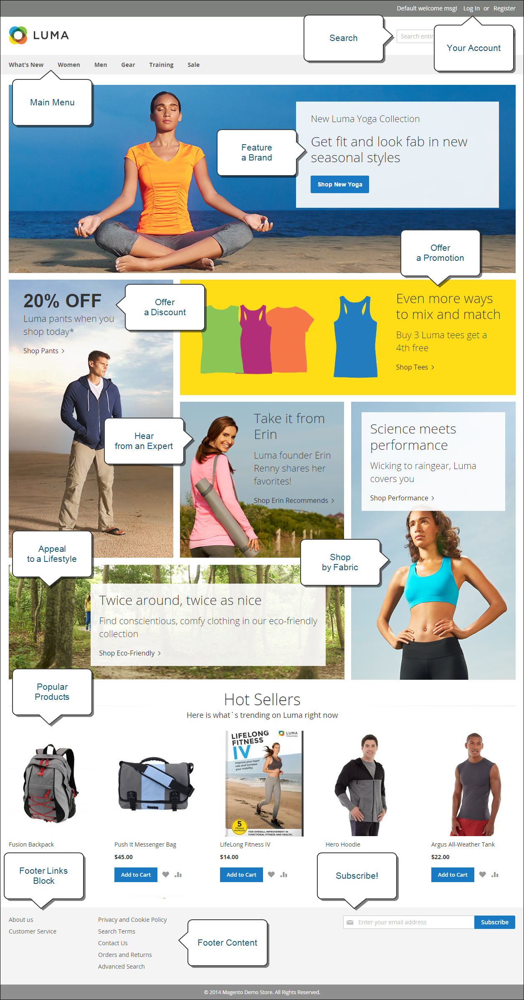
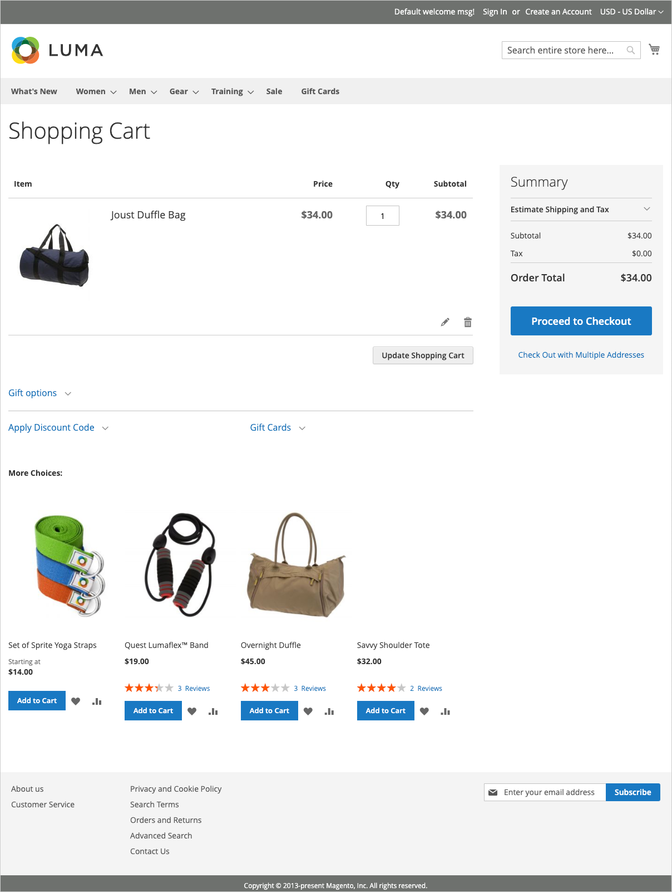

# Vad är butiken?

I er Adobe Commerce- eller Magento Open Source-implementering är butiken den externa, offentliga delen av er butik. Det innehåller innehåll och funktionskomponenter som kunderna använder för att handla och köpa.

Den väg kunderna går till en försäljning kallas ibland för _köpväg_, och din butik innehåller komponenter som kunderna kan använda för att slutföra den här vägen. I följande avsnitt finns en översikt över de grundläggande sidtyperna som ger ett strategiskt värde - de platser kunderna vanligtvis besöker när de handlar i din butik. När du tittar på dem bör du överväga olika butiksfunktioner som kan användas i varje skede av kundresan.

## Commerce Storefront

I och med introduktionen av [!DNL **Commerce Storefront från Edge Delivery Services**] erbjuder Adobe en högpresterande, skalbar och tillförlitlig butiksupplevelse som utnyttjar den senaste tekniken för att leverera överlägsen hastighet och användarupplevelse.

- **Förbättrade prestanda**: Lagringsplatser på Edge Delivery Services ger snabbare inläsningstider och bättre prestanda, vilket kan leda till högre konverteringsgrader och bättre SEO-rankning.

- **Skalbarhet**: Arkitekturen stöder sömlös skalning för att hantera ökad trafik och större produktkataloger utan att kompromissa med prestanda.

- **Flexibilitet**: Affärsplatsen är mycket anpassningsbar, vilket gör att företag kan skräddarsy shoppingupplevelsen efter sina unika behov.

- **Förbättrad användarupplevelse**: Funktioner som avancerad cachning, uppdateringar i realtid och skräddarsydd innehållsleverans bidrar till en smidigare och mer engagerande shoppingupplevelse.

### Viktiga funktioner

Commerce Storefront från Edge Delivery Services har flera funktioner som är till nytta både för handlare och utvecklare. Med dessa funktioner kan företag skapa engagerande shoppingupplevelser och samtidigt behålla flexibiliteten att anpassa och skala sina butiker efter sina behov.

Mer detaljerad information och vägledning om hur du konfigurerar och optimerar Commerce Storefront finns i [Adobe Commerce Storefront Documentation](https://experienceleague.adobe.com/sv/docs/commerce).

>[!BEGINTABS]

>[!TAB Handlare]

Commerce Storefront från Edge Delivery Services är en intuitiv dokumentbaserad redigeringsfunktion som gör det enkelt för handlare att skapa och hantera innehåll. Med välbekanta verktyg som Microsoft Word och Google Docs kan handlare skapa avancerat material samtidigt som versionskontrollen bibehålls och teammedlemmarna samarbetar.

- **Förenklad innehållsproduktion**: Skapa och redigera innehåll med välbekanta dokumentbaserade redigeringsverktyg som Microsoft Word och Google Docs.
- **Förhandsgranskning i realtid**: Se ändringarna direkt med förhandsgranskning i realtid innan publicering.
- **Versionskontroll**: Spåra innehållsändringar och backa enkelt till tidigare versioner.
- **Samarbetsflöde**: Flera teammedlemmar kan arbeta med innehåll samtidigt med inbyggda granskningsprocesser.
- **Återanvändning av innehåll**: Skapa innehållsblock som kan återanvändas på flera sidor för att bevara konsekvensen.

>[!TAB Utvecklare]

Med Headless-implementering kan utvecklare frikoppla lagret för frontend-presentationer från bakomliggande handelsfunktioner, vilket möjliggör flexibla, anpassade butiker som byggts med modern teknik och samtidigt utnyttja Commerce robusta backend-tjänster.

- **API-första arkitektur**: Bygg anpassade klientupplevelser med moderna ramverk och utnyttja Commerce backend-tjänster.
- **Sammansättningsbara komponenter**: Skapa och distribuera modulära, återanvändbara komponenter som kan monteras i olika sidlayouter.
- **Utbyggbar plattform**: Lägg till anpassade funktioner via API:er och webhooks utan att ändra kärnkoden.
- **Moderna utvecklingsverktyg**: Använd utvecklingsverktyg och arbetsflöden som är branschstandard för snabbare implementering och distribution.

>[!ENDTABS]

>[!NOTE]
>
>Commerce Storefront har många fördelar, men Adobe har fortfarande stöd för den ursprungliga Luma-baserade butiken. Företag som för närvarande använder Luma kan fortsätta sin verksamhet utan avbrott och ha möjlighet att gå över till den nya butiken i sin egen takt. De återstående avsnitten på den här sidan baseras på Luma-exempel.

## Startsida

Visste du att de flesta bara tillbringar några sekunder på en sida innan de bestämmer sig för att stanna eller åka någon annanstans? Det är inte länge sedan att göra ett intryck. Studier visar att man också älskar fotografier, särskilt av andra. Vilken design du än väljer bör allt på din hemsida flytta besökarna mot nästa steg i försäljningsprocessen. Tanken är att leda deras uppmärksamhet i ett sammanhängande flöde från en punkt till nästa.

{width="700"}

## Katalogsida

Katalogsidlistor har vanligtvis små produktbilder och korta beskrivningar och kan formateras som en lista eller ett rutnät. Du kan lägga till block, videoklipp och beskrivningar med nyckelord och även skapa specialdesigner för en kampanj eller säsong. Du kan skapa en särskild kategori för en livsstil eller ett varumärke som är en välstrukturerad samling produkter från olika kategorier.

Den första produktbeskrivningen ger oftast kunderna tillräckligt med information för att de ska kunna ta en närmare titt. Folk som vet vad de vill ha kan lägga produkten i sina varukorgar och gå. Kunder som är inloggade på sina konton får en personlig shoppingupplevelse.

{width="700"}

## Sökresultat

Visste du att det är nästan dubbelt så troligt att personer som använder sökningar köper något som de som bara använder navigering? Dessa kunder kan betraktas som _förkvalificerade_.

### [!DNL Live Search]

Med [[!DNL Live Search]](https://experienceleague.adobe.com/sv/docs/commerce/live-search/overview) för Adobe Commerce kan din butik erbjuda en snabb, superrelevant och intuitiv sökupplevelse och är tillgänglig för Adobe Commerce utan extra kostnad.

{width="700"}

### Standardkatalogsökning

Med [standardkatalogsökning](../catalog/search.md) innehåller din butik en sökruta i det övre högra hörnet och en länk till avancerad sökning i sidfoten. Alla söktermer som kunderna skickar sparas så att du kan se exakt vad de letar efter. Du kan ge förslag och ange synonymer och vanliga felstavningar. Visa sedan en viss sida när en sökterm anges.

{width="700"}

## Produktsida

Det är mycket som pågår på produktsidan! Det första som fångar ögat på produktsidan är huvudbilden med ett högupplöst zoom- och miniatyrgalleri. Förutom pris och tillgänglighet finns det ett flikområde med mer information och en lista över relaterade produkter.

{width="700"}

## Kundvagn

I kundvagnen visas ordersumman, inklusive eventuella rabattkuponger, beräknad frakt och moms. De här funktionerna gör det bra att visa märken och förseglingar för pålitlighet. Du kan även använda kundvagnssidan som en möjlighet till ett slutligt erbjudande. Du kan till exempel ställa in korsförsäljningsartiklar som visas som alternativ för impulsköp när specifika produkter finns i kundvagnen.

{width="700"}

## Utcheckningssida

Utcheckningsprocessen består av två steg:

1. Leveransinformation

   Det första steget i utcheckningsprocessen är att kunden fyller i leveransadressuppgifterna och väljer leveranssätt. Om kunden har ett konto anges leveransadressen automatiskt, men kan ändras vid behov.
Om en gästkund anger en e-postadress som känns igen som registrerad tidigare visas inloggningsmeddelandet om fältet [!UICONTROL Enable Guest Checkout Login] i butikskonfigurationen är inställt på `Yes` (se [[!UICONTROL Checkout Options]](../configuration-reference/sales/checkout.md#checkout-options) i _Konfigurationsreferenshandboken_). Den här inställningen kan dock visa kundinformation för oautentiserade användare.

   {width="700"}

1. Granska och betala

   Det andra steget i utcheckningsprocessen är att kunden väljer betalningsmetod och kan välja att använda en rabattkod.

   >[!NOTE]
   >
   >Även om [!DNL Commerce] tillåter konfigurering av flera kupongkoder, kan kunden bara använda en kupongkod i kundvagnen. (Mer information finns i [Kupongkoder](../merchandising-promotions/price-rules-cart-coupon.md#coupon-codes).)

   {width="700"}

Förloppsindikatorn överst på sidan följer varje steg i utcheckningsprocessen och i _ordersammanfattningen_ visas den information som har angetts fram till den här punkten.

>[!NOTE]
>
>Undantaget för en tvåstegs utcheckning gäller för virtuella och/eller hämtningsbara produkter. Om det bara finns sådana produkter i kundvagnen omvandlas utcheckningen automatiskt till en enstegsprocedur eftersom ingen leveransinformation behövs.
