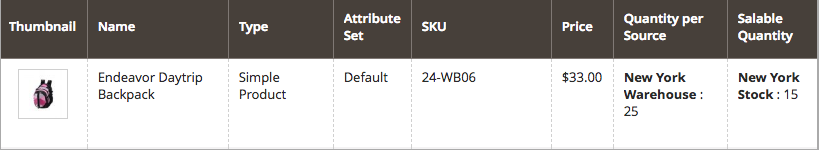

# Konfigurera [!DNL Inventory Management] bakordrar

Med restorder kan din butik fortsätta sälja produkter när kvantiteten är noll eller ligger utanför lagret. När en kundorder är en restorder godkänns och hämtas medlen omedelbart, orderns bearbetningsstatus ändras inte och leveransen är spärrad tills lagret är tillgängligt.

Beroende på butik och försäljning kan du aktivera eller inaktivera restorder på följande nivåer:

- **[!UICONTROL Global]** - Alla produkter i din katalog på webbplatsnivå

- **[!UICONTROL Product]** - Specifika produkter åsidosätter inställningar för plats, källa och lager

## Förstå inställningarna för restorder

Vi rekommenderar starkt att du konfigurerar specifika tröskelvärden och inställningar så att de fungerar bäst med bakgrunder.

### Tröskelvärde utanför lager

Använd ett negativt värde för det här tröskelvärdet för att ange den maximala kvantitet produkter som kan beställas innan produkten verkligen anses vara lagrad. Detta belopp adderar den försäljningsbara kvantiteten. Det värde som anges på produktnivå åsidosätter alla värden som anges på global nivå.

Formeln för den säljbara kvantiteten är `(Quantity - (Out-of-Stock Threshold))`.

Följande är ett exempel:

- Kvantitet: 25
- Meddela om kvantitet nedan: 10
- Endast X vänster tröskelvärde: 5
- Tröskelvärde utanför lager: -50

Försäljningsmängden för den här produkten är `75 (25 - (-50))`.

{width="600" zoomable="yes"}

{width="600" zoomable="yes"}

När kunderna köper de tillgängliga 25 produkterna läggs nya order in som restorder. När produktens säljbara kvantitet minskar till 5 (70 artiklar har sålts) visar sidan _Produkt_ ett meddelande `Only 5 left` i butiken. När den säljbara kvantiteten når `0` visas produkten som `Out of Stock` i butiken.

>[!NOTE]
>
>När en kund gör en beställning med hjälp av _[!UICONTROL backorder qty]_&#x200B;subtraherar [!DNL Inventory Management] automatiskt kvantiteten från den försäljningsbara kvantiteten. Om en order inte har levererats och annullerats returneras kvantiteten till den aggregerade virtuella försäljningsbara kvantiteten. Den **_annullerade orderkvantiteten har inte tilldelats någon av källorna_**, utan returneras till det totala antalet produkter som är tillgängliga för försäljning (_[!UICONTROL Salable Quantity]_ kolumn i produktrutnätet).

<!--### Notify for Quantity Below JIRA MDVA-8099 MDVA-33783

The _Notify for Quantity Below_ configuration option is configurable at the global, source, and product levels. When it is enabled, the system sends an email notification when the product quantity reaches a level at or below the configured value. For this example, a notification is triggered when the product has a quantity of 10 or less. When backorders are enabled, _Notify for Quantity Below_ is determined by the Salable Quantity (`Salable Quantity = Quantity - (Out-of-Stock Threshold)`). -->

### Lagerstatus

Produkterna måste anges till `In Stock`-status när backorder aktiveras. Du kan ange det här värdet från sidan _Produkt_. För handlare med flera källor måste du ha minst en källa markerad som `In Stock`. Få åtkomst till och ange status via sidan _Produkt_ och rutnätet _Källor_ .

## Konfigurera restorder globalt

Dessa steg möjliggör restorder för alla produkter på webbplatsnivå.

1. Gå till **[!UICONTROL Stores]** > _[!UICONTROL Settings]_>**[!UICONTROL Configuration]**&#x200B;på sidofältet_ Admin _.

1. Ange **[!UICONTROL Store View]** till `Default Config`.

1. Expandera **[!UICONTROL Catalog]** i den vänstra panelen och välj **[!UICONTROL Inventory]**.

1. Expandera  **[!UICONTROL Product Stock Options]**.

1. För **[!UICONTROL Backorders]** avmarkerar du kryssrutan **[!UICONTROL Use system value]** och väljer ett alternativ:

   | Alternativ | Beskrivning |
   | -- | -- |
   | `No Backorders` | Att inte acceptera restorder när produkten inte finns i lager. |
   | `Allow Qty Below 0` | Att acceptera restorder när kvantiteten är under noll. |
   | `Allow Qty Below 0 and Notify Customer` | Om du vill acceptera restorder när kvantiteten är under noll och meddela kunden att ordern fortfarande kan läggas. |

1. För **[!UICONTROL Out-of-Stock Threshold]** avmarkerar du kryssrutan **[!UICONTROL Use system value]** och anger ett annat värde.

   | Värde | Beskrivning |
   | -- | -- |
   | Positivt belopp | Om du har inaktiverat Restorder anger du ett positivt värde. |
   | Noll | Om du aktiverar Restorder kan du ange `0` för oändliga backorder. |
   | Negativt belopp | Om du aktiverar Restorder bör du ange ett negativt värde. Beloppet läggs till i den säljbara kvantiteten. Ange till exempel `-50` om du vill tillåta order upp till detta belopp. |

1. Klicka på **[!UICONTROL Save Config]**.

## Konfigurera restorder för en produkt

Produktnivåkonfigurationer åsidosätter globala konfigurationer. Du kanske vill konfigurera restorder på produktnivå för att åsidosätta inställningarna på den globala butiken eller källnivån. Butiken kan till exempel ha global support för restorder. Med produktinställningar kan du inaktivera efterbeställningar eller ändra värdet för Ej lagrad utan att påverka andra produkter och källor.

1. Gå till **[!UICONTROL Catalog]** > **[!UICONTROL Products]** på sidofältet _Admin_.

1. Öppna en produkt i **[!UICONTROL Edit]**-läge och rulla nedåt på sidan till _[!UICONTROL Sources]_-området.

   Fliken visas inte för produkter som konfigurerats utan [!DNL Inventory Management]. Knappen `Advanced Inventory` visas under fältet _[!UICONTROL Quantity]_.

1. Klicka på **[!UICONTROL Advanced Inventory]**.

   Den här åtgärden visar en sida med produktspecifika konfigurationer. Alla inställningar som anges som `global` visar den aktuella globala inställningen för butiken.

1. För **[!UICONTROL Backorders]** avmarkerar du kryssrutan **[!UICONTROL Use Config Setting]** och väljer ett alternativ:

   | Alternativ | Beskrivning |
   | -- | -- |
   | `No Backorders` | Att inte acceptera restorder när produkten inte finns i lager. |
   | `Allow Qty Below 0` | Att acceptera restorder när kvantiteten är under noll. |
   | `Allow Qty Below 0 and Notify Customer` | Om du vill acceptera restorder när kvantiteten är under noll och meddela kunden att ordern fortfarande kan läggas. |

1. För **[!UICONTROL Out-of-Stock Threshold]** avmarkerar du kryssrutan **[!UICONTROL Use Config Setting]** och anger ett belopp:

   | Värde | Beskrivning |
   | -- | -- |
   | Positivt belopp | Om du har inaktiverat Restorder anger du ett positivt värde. |
   | Noll | Om du aktiverar Restorder kan du ange `0` för oändliga backorder. |
   | Negativt belopp | Om du aktiverar Restorder bör du ange ett negativt värde. Beloppet läggs till i den säljbara kvantiteten. Ange till exempel `-50` om du vill tillåta order upp till det beloppet. |

   {width="600" zoomable="yes"}

1. Klicka på **[!UICONTROL Done]** och sedan på **[!UICONTROL Save]**.
