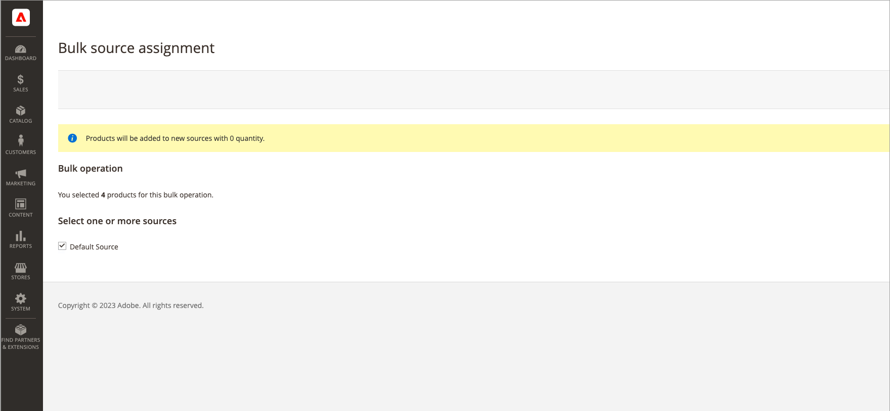

# Grupptilldelning och borttagning av tilldelning av källa

Använd verktyget _Tilldela källor_ för att lägga till en eller flera källor till dina produkter. Verktyget är till hjälp när du skapar och tilldelar anpassade källor till ditt standardlager eller anpassade lager och förbereder nya platser och lager.

När du har lagt till nya anpassade källor kan du lägga till [lagerkvantiteter per produkt](quantities-assign-per-product.md) eller för flera produkter via administratören eller med [importfunktionen](inventory-import-export.md).

## Tilldela källor och kvantiteter

1. Gå till _>_ på sidofältet **[!UICONTROL Catalog]** Admin **[!UICONTROL Products]**.

1. Välj de produkter som du vill ändra källorna för.

   Bläddra eller sök efter produkterna och markera kryssrutorna.

1. Klicka på menyn **[!UICONTROL Actions]** överst och välj **[!UICONTROL Assign Inventory Source]**.

1. Klicka på **[!UICONTROL OK]** i bekräftelsedialogrutan.

1. Markera kryssrutorna för alla källor som du vill lägga till i produkterna.

1. Klicka på **[!UICONTROL Assign Sources]**.

   {width="600" zoomable="yes"}

Källorna läggs till produkterna med lagerkvantiteten 0. Du kan lägga till [lagerkvantiteter](quantities-assign-per-product.md) per källa.

## Ta bort tilldelning av källor och kvantiteter

När du frigör en källa från en produkt anger du att produkten inte längre finns i lager på den platsen. Denna process rensar helt alla lagerdata för den källa som för närvarande är tilldelad produkten. Om du vill flytta det befintliga lagret till en ny plats bör du använda alternativet _Överför lager_.

{{$include /help/_includes/unassign-source.md}}

Vi rekommenderar att du slutför alla beställningar och leveranser för dessa produkter innan du tar bort källan.

1. Gå till _>_ på sidofältet **[!UICONTROL Catalog]** Admin **[!UICONTROL Products]**.

1. Välj de produkter som du vill ändra källor för.

   Bläddra eller sök efter produkterna och markera kryssrutorna.

1. Klicka på menyn **[!UICONTROL Actions]** överst och välj **[!UICONTROL Unassign Inventory Source]**.

1. Klicka på **[!UICONTROL OK]** i bekräftelsedialogrutan.

1. Välj den källa som du vill ta bort från produkterna.

   På sidan visas ett varningsmeddelande som tar bort tilldelning av alla specifika käll- och kvantitetsdata från produkten.

1. Klicka på **[!UICONTROL Unassign Sources]**.

   {width="600" zoomable="yes"}

<!-- Last updated from includes: 2022-08-30 15:36:09 -->
