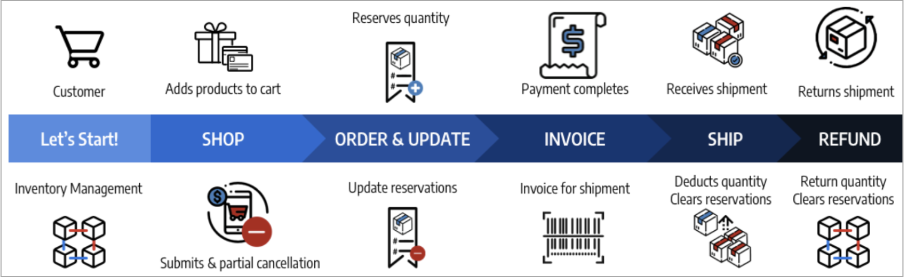

# Orderstatus och reservationer

[!DNL Inventory Management] har stöd för partiell och fullständig fakturering, betalningar, frakt och annulleringar per order. När du hanterar en order via bearbetning, fakturering, leverans och möjliga återbetalningar, anger eller ändrar [!DNL Commerce] automatiskt reservationer för att uppdatera den försäljningsbara kvantiteten för ett lager (eller en försäljningskanal) och lagerbehållningskvantiteten per källa. Du behöver inte aktivt komma åt eller ange reservationer. När du slutför åtgärder för att slutföra, avbryta eller återbetala en beställning utförs den åt dig.

Dessa reservationer justerar alltid den försäljningsbara kvantiteten, med positiva eller negativa belopp för att öka eller minska kvantiteter. Resultatet är en uppdatering av era lagerbehållningar och säljbara kvantiteter för aktuell produkttillgänglighet.

Mer information om beställningar och leveranser finns i [Hantera beställningar och leveranser](shipments.md).

## Alternativ för orderhantering

Beroende på lagerstatus och kundförfrågningar kan du uppdatera beställningar med partiella betalningar och annulleringar, partiella leveranser från flera källor eller för bakåtorder eller kreditnotor för att återbetala returnerade produkter.

### Leveranser

När du har fakturerat order skickar du delar av eller hela leveranser tills du slutför hela ordern. Varje leverans konverterar reservationen och drar av beloppet från produktkvantiteten per källa. Reservationskompensationer anges för att uppdatera den försäljningsbara kvantiteten för ditt lager. Om du skickar partiella leveranser dras beloppet av varje leverans från din produktkvantitet och reservationer. Alla produktreservationer som inte har levererats finns kvar tills de också har levererats, så att ditt försäljningsbelopp är aktuellt och ger dig kontroll över produktlagret och support för flera källleveranser och restorder.

### Annullerade order

Om en kund annullerar sin beställning före leverans (helt eller delvis), registreras en ny reservation för att returnera lagerbeloppet till den försäljningsbara kvantiteten. Reservationerna annullerar varandra i praktiken, utan att dra av kvantiteten från någon källa. Andra kunder kan aktivt köpa dessa produktkvantiteter via de tillhörande lagren och försäljningskanalerna.

### Återförda order

Om en kund begär en återbetalning ska kreditnotan skickas för de delar eller hela produktbeloppen. När du tar emot de returnerade produkterna anger du en kreditnota för att ange medel och uppdatera produktbelopp. När du väljer alternativet Återgå till lager lägger [!DNL Commerce] till kvantiteter tillbaka till de produkter och källor som levererade beställningarna och reservationskompensationerna för att uppdatera försäljningsbara kvantiteter för det associerade lagret.

## Ordertyper

Enkla beställningar börjar med en kundvagn, fortsätter att betala och avslutas med en tillfredsställande leverans. I de här beställningarna bearbetar [!DNL Inventory Management] enkelt reservationer mot tillgängligheten (eller säljbara kvantitet) i kundvagnen och kassan, och drar av från lagerbehållningen vid leveransen.

{width="600" zoomable="yes"}

En mer komplicerad order kan innehålla partiella annulleringar, partiella leveranser och återbetalningar. I sådana fall påverkar reservationer det tillgängliga lagret för att lägga till kvantiteter för annulleringar och återbetalningar och minska kvantiteter när de beställs och levereras.

{width="600" zoomable="yes"}

Tillgänglighetsreservationer och lagerändringar görs baserat på orderstatus.

## Status och reservationer

I följande register visas orderstatus och kreditnotsstatus med reservationsändringar som har angetts av [!DNL Commerce] för att hantera ditt lager.

| Orderstatus | Beskrivning | Reservation för säljbar kvantitet |
|--|--|--|
| [!UICONTROL Open] | Nytt och nyligen skickat, ingen bearbetning | Reservationen sparas när beställningen skickas för lagret. |
| [!UICONTROL Canceled] | Avbruten helt eller delvis före betalning | Reservationskompensation anges för att returnera en del av eller hela kvantitet till lagersaldokvantiteten. |
| [!UICONTROL On Hold] | Betalning och leverans har inte bearbetats eller fakturerats | Reservationen är kvar. |
| [!UICONTROL Suspected Fraud] | Har inte bearbetats på grund av bedrägeri | Om det godkänns eller ses över, stannar reservationen kvar på plats. Om det inte godkänns stannar reservationen kvar tills handlaren beslutar att godkänna eller avbryta. Om den avbryts anges reservationskompensationen för att returnera hela kvantiteten till lagerförsäljningskvantiteten. |
| [!UICONTROL Pending] | Väntar på betalning | Reservationen stannar kvar på plats. |
| [!UICONTROL Processing] | Betalningshantering, ej mottagen | Reservationen stannar kvar på plats. |
| [!UICONTROL Pending Payment] | Betalningen har inte tagits emot | Reservationen stannar kvar på plats. |
| [!UICONTROL Payment Review] | Betalning som granskas för bearbetning och slutförande | Reservationen stannar kvar på plats. |
| [!UICONTROL Complete] | Betalad och levererad i sin helhet | Reservationsbeloppet dras av från produktkvantiteten för den valda källan när det faktureras delvis eller helt. Reservationskompensationen anges för att uppdatera den totala försäljningsbara kvantiteten. |
| [!UICONTROL Closed] | Återgivet eller arkiverat | Om den arkiveras sker ingen ändring i kvantitet. Om det återbetalas helt eller delvis, bokförs och konverteras reservationskompensationen för att lägga tillbaka produktkvantiteter per källa och säljbar kvantitet per lager. |

| Kreditnotsstatus | Beskrivning | Reservation för säljbar kvantitet |
|--|--|--|
| [!UICONTROL Open] | Återbetalningen ska betalas, har inte slutförts | Inga reservationer ändras. |
| [!UICONTROL Refunded] | Slutförd, medel returnerades | Om det återbetalas helt eller delvis, anges och konverteras reservationskompensationen för att lägga tillbaka produktkvantiteter per källa och säljbar kvantitet per lager. |

## Exempel på komplex ordning

Blake Sanders beställer cyklar och kläder till familjesemestrar och kul. De ser en del bra försäljning i er butik med lager och källor som spänner över USA, Kanada och Europa.

De köper två stora parkcyklar till sina små barn, en BMX-cykel till sin tonåring, en trevlig bergscykel till sig själv och en modern tysk landsövergripande cykel till sin make. Butiken sålde på söta skjortor, så de köpte lite till hela familjen för att matcha. Se listan över semesterköp nedan, matchande SKU:er och bokningarna som gjorts i förhållande till lagerförsäljningsbara kvantiteter.

{width="600" zoomable="yes"}

De visar sin familj vad de hittade, men gör några ändringar. Innan betalningen har slutförts avbryts två av de 33-BikeFun-SKU:erna (som inte var underordnade). Detta är en partiell annullering på grund av väntande betalningar, så ingen kreditnota behövs. [!DNL Commerce] lägger tillbaka till det säljbara lagret för Kanada för att uppdatera. Ordern betalas och alla produkter skickas och anländer i tid till semester. [!DNL Commerce] uppdaterar säljbar kvantitet och källkvantiteter för leveranspapperren för de levererade produkterna.

Men skjortan passade inte riktigt sin make. Blake ber om pengarna och skickar tillbaka skjortan. När kreditnotan skapas läggs en 54-BikeLife-skjorta tillbaka till Kanadas lager och fraktlager.

- **Levererade produkter** - Med produkter som köpts och levererats uppdaterar [!DNL Commerce] lagret. Reservationskompensationer konverteras till lagerbehållningskvantitetsavdrag från den levererade källan. De tillgängliga uppdateringarna av försäljningsbar kvantitet för lagret.

- **Avbrutna produkter** - Genom att annullera lager tar [!DNL Commerce] bort reservationen för den produkten. Reservationskompensation anges på lagernivån för att lägga tillbaka säljbara kvantiteter för partiell annullering av två skjortor. Detta påverkar inte lagerkvantiteten på källnivå.

- **Kreditnota/återförd produkt** - Genom att returnera lager måste den läggas till i kvantiteterna igen. När du utfärdar kreditnotan kan du välja att returnera till aktien. [!DNL Commerce] lägger till tillbaka lagerkvantitet i den levererade källan för produkten. Reservationskompensationer anges för att rensa återstående reservationer. Den försäljningsbara kvantiteten beräknas om mot den uppdaterade kvantiteten.

{width="600" zoomable="yes"}
