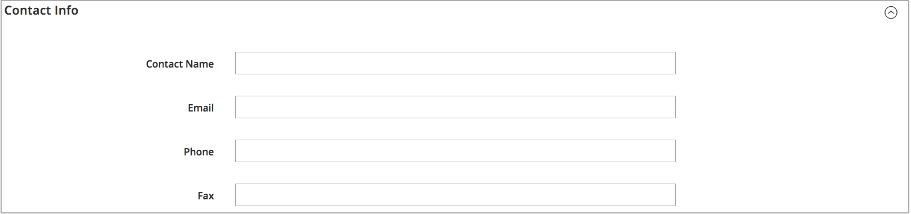

# Lägg till en källa

Hantera lagerhantering och orderhantering från flera platser med anpassade källor. Skapa en källa för varje plats, t.ex. lagerlokaler, butiker, distributionscenter och lossningsplatser. Tilldela källor och uppdateringskvantiteter per produkt

Om du redigerar Source Standard kan du redigera alla konfigurationer förutom namn och kod. Vi rekommenderar att handlare med en enda källa lägger till information som matchar deras plats.

## Lägg till en lagerkälla

1. Gå till _>_ > **[!UICONTROL Stores]** på sidofältet _[!UICONTROL Inventory]_Admin **[!UICONTROL Sources]**.

1. Klicka på **[!UICONTROL Add New Source]**.

   

1. Expandera  i avsnittet **[!UICONTROL General]** och gör följande:

   - Identifiera lagerkällan genom att ange en unik **[!UICONTROL Name]**.

   - Ange en unik **[!UICONTROL Code]**.

     Koden stöder versaler och gemener, siffror, bindestreck och understreck. Koden är ett unikt ID som används vid tilldelning till lager och export av importerade data.

   - Om den här lagerkällan är klar att användas anger du **[!UICONTROL Is Enabled]** till `Yes`.

   - Ange en kort **[!UICONTROL Description]** för den här platsen för snabb referens eller ytterligare information.

   - För **[!UICONTROL Latitude]** och **[!UICONTROL Longitude]** anger du GPS-koordinaterna (Global Positioning System) för platsen.

     Om du vill hitta GPS-koordinaterna med [Google Maps](https://www.google.com/maps) anger du adressen i sökrutan. Högerklicka på markören på kartan och välj **[!UICONTROL What's here?]**. GPS-koordinaterna visas i informationsrutan nedanför gatuadressen.

     

   - Om den här lagerkällan är en hämtningsplats anger du **[!UICONTROL Use as Pickup Location]** till `Yes`.

     Source-standardinställningen kan inte användas som hämtningsplats för hämtningsorder i butiken.

1. Expandera  i avsnittet **[!UICONTROL Contact Info]** och gör följande:

   - För **[!UICONTROL Contact Name]** anger du det fullständiga namnet på den primära kontakten på platsen.

   - Ange en **[!UICONTROL Email]**-adress för att kontakta platsen.

   - Ange riktnummer och telefonnummer för **[!UICONTROL Phone]**.

   - Ange riktnummer och telefonnummer för faxet för **[!UICONTROL Fax]**, om tillgängligt.

     

1. Expandera  i avsnittet **[!UICONTROL Address Data]** och gör följande:

   - Välj **[!UICONTROL Country]**.

   - För **[!UICONTROL State/Province]** anger du standardförkortningen för delstaten eller provinsen.

   - Ange **[!UICONTROL City]**.

   - Ange den fysiska **[!UICONTROL Street]**-adressen.

   - Ange postnummer för **[!UICONTROL Postcode]**.

     

1. Om du anger källan som en hämtningsplats i det tidigare steget expanderar du avsnittet  i **[!UICONTROL Pickup Location]** och anger beskrivande information om platsen:

   - Ange **[!UICONTROL Frontend Name]** för hämtningsplatsen.

   - Ange en **[!UICONTROL Frontend Description]** av hämtningsplatsen. Använd den här textrutan för att visa butikstimmar, platsen i förhållande till andra landmärken eller annan användbar information som hjälper kunden att välja rätt hämtningsplats.

     

   Mer information om hur du konfigurerar e-postmeddelanden när du använder en källa som hämtningsplats finns i [Försäljningsmeddelanden](../configuration-reference/sales/sales-emails.md) i _Konfigurationsreferenshandboken_.

1. Gör något av följande om du vill spara ditt arbete:

   - Om du vill spara ditt arbete och fortsätta redigera klickar du på **[!UICONTROL Save & Continue]**.

   - Om du vill spara ditt arbete och gå tillbaka till sidan Hantera källor klickar du på nedpilen () och väljer **[!UICONTROL Save & Close]**.

   - Välj **[!UICONTROL Save & New]** om du vill spara ditt arbete på den aktuella källposten och ange en ny källa.

## Knappfält

| Knapp | Beskrivning |
|--|--|
| [!UICONTROL Back] | Återgår till sidan Hantera källor. |
| [!UICONTROL Reset] | Återställer alla fält i formuläret till sina värden när de senast sparades. |
| [!UICONTROL Save & Continue] | Sparar alla ändringar och låter formuläret vara öppet för vidare redigering. Klicka på nedåtpilen för ytterligare alternativ:  **[!UICONTROL Save & Close]**- Sparar ändringar i den aktuella posten, stänger formuläret och återgår till sidan Hantera källor. **[!UICONTROL Save & New]** - Sparar ändringar, stänger den aktuella posten och öppnar ett nytt tomt formulär. |

## Fältbeskrivningar

| Fält | Beskrivning |
|--|--|
| **[!UICONTROL General]** | |
| [!UICONTROL Name] | (Obligatoriskt) Ett unikt namn som identifierar lagerkällan för administratörsanvändare. |
| [!UICONTROL Code] | (Obligatoriskt) En unik alfanumerisk kod som används av systemet för att identifiera lagerkällan. Ange koden med versaler eller gemener, utan mellanslag. Om det behövs kan du använda ett bindestreck eller ett understreck i stället för ett mellanslag. Koden kan inte redigeras efter att källan har skapats. Det är ett unikt ID som används när du tilldelar källor till lager och exporterar och/eller importerar produktdata. |
| [!UICONTROL Is Enabled] | Fastställer om lagerkällan är tillgänglig för användning. Alternativ: Ja/Nej |
| [!UICONTROL Description] | En kort beskrivning av lagerkällans plats. Inkludera information som är användbar för dina Admin-användare. |
| [!UICONTROL Latitude] | Anger latitudkoordinaten för lagerkällan för GPS. Ange värdet som ett tal, föregånget av ett plus- eller minustecken efter behov. Gradsymbolen och bokstäverna är inte tillåtna. Exempel: Latitude 32.7555 |
| [!UICONTROL Longitude] | Anger longitudkoordinaten för lagerkällan för GPS. Ange värdet som ett tal, föregånget av ett plus- eller minustecken efter behov. Gradsymbolen och bokstäverna är inte tillåtna. Till exempel: `-97.3308` |
| **[!UICONTROL Contact Info]** | |
| [!UICONTROL Contact Name] | Namnet på den primära kontakten på lagerkällans plats. |
| [!UICONTROL Email] | Den primära kontaktens e-postadress. |
| [!UICONTROL Phone] | Den primära kontaktens riktnummer och telefonnummer, i det format du föredrar. Till exempel: `(123) 456-7890` eller `123-456-7890` |
| [!UICONTROL Fax] | Den primära kontaktens riktnummer och faxnummer. |
| **[!UICONTROL Address Data]** | |
| [!UICONTROL Country] | (Obligatoriskt) Landet där lagerkällan finns. |
| [!UICONTROL State/Province] | Den delstat eller provins där lagerkällan finns. |
| [!UICONTROL City] | Ort där lagerkällan finns. |
| [!UICONTROL Street] | Lagerkällans gatuadress. |
| [!UICONTROL Postcode] | (Obligatoriskt) Lagerkällans postnummer. |
| **[!UICONTROL Pickup Location]** | |
| [!UICONTROL Frontend Name] | Namnet på hämtningsplatsen för källan som visas på butiken. |
| [!UICONTROL Frontend Description] | Beskrivningen av hämtningsplatsen för källan som visas på butiken. Den kan innehålla bifogade bilder. |
