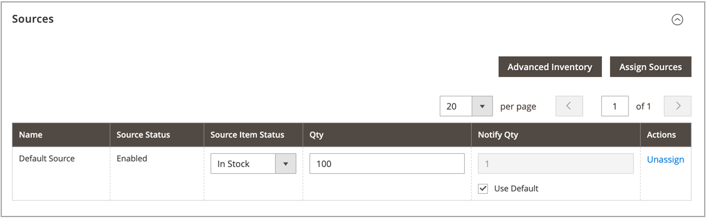

# Tilldela källor per produkt

Innan du ändrar kvantiteter och inställningar måste du tilldela [källor](sources-manage.md) till produkterna.

{{$include /help/_includes/unassign-source.md}}

## Tilldela källor till en produkt

1. Gå till _>_ på sidofältet **[!UICONTROL Catalog]** Admin **[!UICONTROL Products]**.

1. Öppna en produkt i _redigeringsläget_.

1. Expandera  i avsnittet **[!UICONTROL Sources]**.

   I det här avsnittet kan du ändra källan, uppdatera lagerkvantiteter och mycket mer.

   >[!NOTE]
   >
   >För närvarande stöder endast enkla, konfigurerbara, virtuella, nedladdningsbara och grupperade produkter flera källor. Paketprodukter kan skapas och hanteras med Source och Stock som standard.

   {width="600" zoomable="yes"}

1. Klicka på **[!UICONTROL Assign Sources]** om du vill lägga till en källa.

1. På sidan _[!UICONTROL Assign Sources]_&#x200B;markerar du kryssrutan bredvid varje källa som du vill tilldela produkten.

   {width="600" zoomable="yes"}

1. Klicka på **[!UICONTROL Done]** för att lägga till källorna.

1. Spara genom att göra något av följande:

   - Klicka på **[!UICONTROL Save]**.
   - Välj _[!UICONTROL Save]_&#x200B;på menyn menypil **[!UICONTROL Save & Close]**).

När du har tilldelat källor uppdaterar du [lagerkvantiteten](quantities-assign-per-product.md) för varje produktkälla.

<!-- Last updated from includes: 2022-08-30 15:36:09 -->
