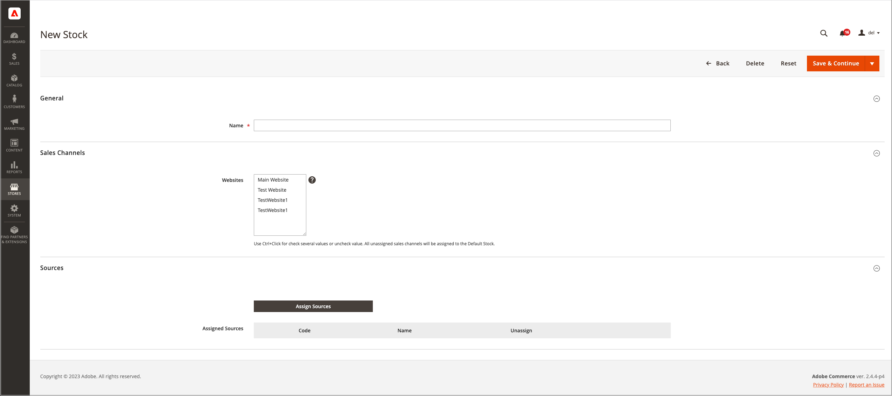
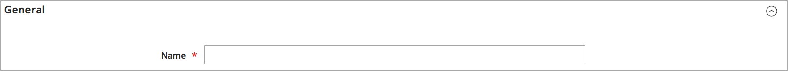

# Lägg till en aktie

Stock mappar dina källor till försäljningskanaler (eller webbplatser), vilket ger en direkt länk till säljbara kvantiteter och produktinventeringar.

När du skapar en anpassad resurs tilldelar du webbplatser och källor. Källor kan innehålla aktiverade och inaktiverade källor. Du kan till exempel lägga till ett lagerställe i ditt lager och förbereda att öppna platsen för hantering av lager och slutförande av leveranser.

När du har lagt till källor måste du prioritera ordningen för källorna uppifrån (första) och nedåt (sista). Ordern påverkar rekommendationer under orderleverans.

{width="600" zoomable="yes"}

## Lägg till lagret

1. Gå till **[!UICONTROL Stores]** > _[!UICONTROL Inventory]_>**[!UICONTROL Stock]**på sidofältet_ Admin _.

1. Klicka på **[!UICONTROL Add New Stock]**.

1. Expandera  i avsnittet **[!UICONTROL General]** och ange en unik **[!UICONTROL Name]** för att identifiera den nya stammen.

   {width="350" zoomable="yes"}

1. Expandera  i avsnittet **[!UICONTROL Sales Channels]** och markera **[!UICONTROL Websites]** där den här versionen är tillgänglig.

   Om du vill installera på flera webbplatser håller du ned Ctrl (PC) eller Kommando (Mac) och klickar på varje webbplats.

   >[!NOTE]
   >
   >Om du väljer en webbplats eller en försäljningskanal som har tilldelats en annan aktie, kopplas den inte från den aktien. Alla Sales Channeler som inte har tilldelats ett anpassat lager tilldelas standardlagret.

   {width="350" zoomable="yes"}

1. Expandera  i avsnittet **[!UICONTROL Sources]** och gör följande för alla andra typer av lager än standardinställningen:

   - Klicka på **[!UICONTROL Assign Sources]**.

   {width="350" zoomable="yes"}

   - Markera kryssrutor för alla källor som du vill tilldela till lagret.

   >[!IMPORTANT]
   >
   >Om du tilldelar samma källa till flera lager kan det leda till överförsäljning av de produkter som är tilldelade den källan.

   - Klicka på **[!UICONTROL Done]**.

     De tillagda källorna visas i Tilldelade källor.

     {width="600" zoomable="yes"}

1. Använd  om du vill dra och släppa källorna i en prioritet från överkanten (första) till nederkanten (sista).

   Källordningen är viktig vid leveransorder.

   {width="600" zoomable="yes"}

1. Välj **[!UICONTROL Save & Close]** på menyn _[!UICONTROL Save]_().

## Fältbeskrivningar

| Fält | Beskrivning |
|--|--|
| **[!UICONTROL General]** | |
| [!UICONTROL Name] | Namn på aktien. Till exempel: `UK Stock`, `US Stock` |
| **[!UICONTROL Sales Channels]** | |
| [!UICONTROL Websites] | Definierar [omfånget](../getting-started/websites-stores-views.md#scope-settings) för stocken genom att tilldela stocken till specifika webbplatser som _försäljningskanaler_. Välj en eller flera webbplatser per Stock. Varje webbplats kan bara tilldelas till ett lager. |
| **[!UICONTROL Sources]** | |
| [!UICONTROL Assign Sources] | Tilldelar lagerkällor till detta lager. Anpassade källor kan inte tilldelas standardlager. |
| [!UICONTROL Assigned Sources] | Lista över tilldelade källor. Dra och släpp källorna med hjälp av  i en prioriterad ordning för orderhantering och leverans.  **[!UICONTROL Code]**- Unikt kod-ID för källan. **[!UICONTROL Name]** - Källans namnbeskrivning. **[!UICONTROL Unassign]**- Ta bort den tilldelade källan från Stock med hjälp av . |
