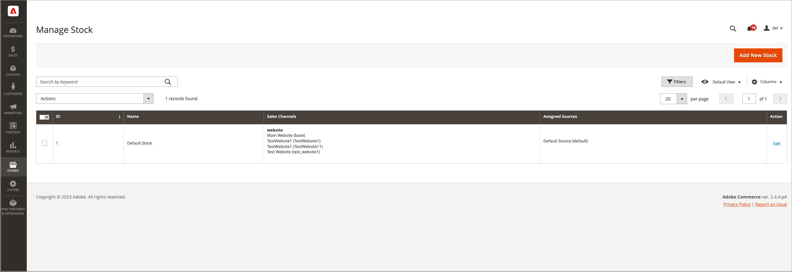

# Hantera lager

Stock representerar en virtuell, aggregerad produktförteckning för källor i dina försäljningskanaler (webbplatser). Beroende på din platskonfiguration kan aktien tilldelas en eller flera försäljningskanaler. Varje försäljningskanal kan bara ha en enda aktie tilldelad och en enda aktie kan tilldelas flera försäljningskanaler. Genom Adobe Stock kan du ändra prioriteringen av källor som används som beställningar via en försäljningskanal.

Du börjar med ett standardlager som inte kan tas bort eller inaktiveras. Du kan lägga till ytterligare försäljningskanaler enbart till aktien. Den enda tilldelade källan är standardkälla. Det här lagret används av säljare, tredjepartsintegreringar och importerade produkter med en enda källa.

Sales Channeler representerar enheter som säljer ert lager. Som standard [!DNL Commerce] tillhandahåller dina butikswebbplatser som säljkanaler. Försäljningskanalerna kan utökas med stöd för ytterligare kanaler som kundgrupper inom B2B och butiksvyer. Varje försäljningskanal kan bara kopplas till en Stock.

- **Sales Channel Support** - Säljkanalerna innehåller för närvarande färdiga webbplatser. Ni kan utöka säljkanalerna för att inkludera anpassade alternativ som kundgrupper inom B2B och butiksvyer. Varje försäljningskanal kan bara ha en enda aktie tilldelad. En enda aktie kan tilldelas flera försäljningskanaler.
- **Mappa till källor** - Varje lager kan ha en eller flera aktiverade eller inaktiverade källor tilldelade, vilket beräknar det virtuella aggregerade lagret per produkt.
- **Prioriterad orderhantering** - Algoritmen för färdig prioritet för källvalsalgoritmen använder stockens källlista uppifrån och ned när beställningarna är klara.

I följande diagram beskrivs hur en Stock fungerar i relation till källor och Sales Channeler för en Bicycle Shop-handlare.

{width="600" zoomable="yes"}

## Exempellager för en bergscykel och butik

Alla butiker börjar med ett standardlager. Det måste finnas kvar `Enabled` av följande skäl:

- Det används vid import av nya produkter och vid automatisk tilldelning av produkter till standardkällan och -arkivet för omedelbar åtkomst till [!DNL Inventory Management].
- Du kan inte lägga till ytterligare källor utöver standardkällan till den här resursen.
- Det krävs och används av handlare med en enda källa, produkter i ett paket och grupperade produkter.

För handlare med flera källor kan du skapa och konfigurera lager så att de passar era butiker och orderhantering. När du tilldelar en ny aktie till en försäljningskanal blir eventuell befintlig aktie i den försäljningskanalen otilldelad.

För en installation i flera butiker tilldelas standardlagret till [Huvudwebbplats](../stores-purchase/stores.md#add-websites){target="_blank"} och standardbutik. Korrekt lager och kvantiteter visas för aktiverade och inaktiverade produkter i **[!UICONTROL Products]** stödrastervyn.

{width="600" zoomable="yes"}

## Knappfält

| Knapp | Beskrivning |
|--|--|
| [!UICONTROL Add New Stock] | Öppnar _[!UICONTROL New Stock]_formulär som används för att ange ett nytt lager för att mappa lager till försäljningskanal. |

## Hantera Stock-kolumnbeskrivningar

| Kolumn | Beskrivning |
|--|--|
| [!UICONTROL ID] | Unikt, numeriskt ID genererat för lagerposten. |
| [!UICONTROL Name] | Unikt namn som identifierar lagret. |
| [!UICONTROL Sales Channels] | Definierar arkivets omfattning genom att tilldela Stock till specifika webbplatser som _försäljningskanaler_. |
| [!UICONTROL Assigned sources] | Källor som tilldelats det lager som levererar alla produktkvantiteter. |
| [!UICONTROL Action] | **[!UICONTROL Edit]** - Öppnar lagerlagerposten i redigeringsläge. |
