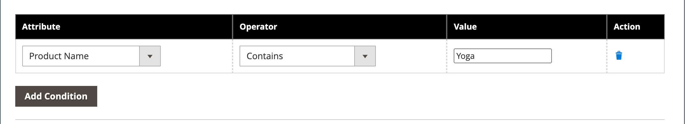

# Kategoriregler för försäljning

{{ee-feature}}

Kategorireglerna ändrar dynamiskt produkturvalet enligt en uppsättning villkor. Varje kategori kan bara ha en kategoriregel, även om den enskilda regeln kan ha flera villkor. Du kan till exempel skapa en kategoriregel för ett visst varumärke. Produkter av samma varumärke läggs automatiskt till i listan, även om de inte tillhör samma kategori. Du kan lägga till så många villkor i uttrycket som behövs för att beskriva de produkter som du vill inkludera.

>[!TIP]
>
>Vid inställning av kategoriregel är produkterna _sorterad_, _matchad_, _tilldelad_ och _ej tilldelad_ enligt den regeln **_endast_** när den här kategorin sparas. Om du till exempel lägger till en produkt i katalogen och vill tilldela den enligt regeln, **måste spara om varje kategori** som är inställt på att matcha produkter enligt regel. Om någon produktlagerstatus ändras till `In Stock` eller `Out of Stock` och produkterna i kategorin bör _sorterad_ enligt **[!UICONTROL Automatic Sorting]** regel måste du klicka **[!UICONTROL Save Category]**.

Varje villkor består av en attribut-, value- och logisk operator. Endast attribut med _[[!UICONTROL Use in Product Listing]](../catalog/attribute-product-create.md)_egenskap inställd på `Yes` kan användas i kategoriregler. Du måste ange den här egenskapen för attributet om du vill använda ett attribut som inte finns med i produktlistor. Även om datumattribut inte stöds kan du använda attributen Skapad den eller Ändrad den för att definiera ett datum eller datumintervall. Om du till exempel bara vill ta med produkter som har skapats under den senaste veckan ställer du in &quot;Skapad den&quot; till värdet `<7`.

>[!NOTE]
>
>Se till att konfigurera varje attribut som används i regeln som en [_smart_ attribute](smart-attributes-configure.md).

{width="600" zoomable="yes"}

Regler för kategoriprodukter kan snabba upp processen att tilldela specifika produkter till kategorier, baserat på villkor som bestämmer vilka produkter som visas i kategorin. De&quot;smarta&quot; attribut som kan användas med kategoriproduktregler anges i [Visual Merchandiser](visual-merchandiser.md) konfiguration.

>[!NOTE]
>
>Var försiktig när du tillämpar en kategoriproduktregel eftersom produkter som inte uppfyller villkoret tas bort från kategorin. Om du t.ex. skapar en regel som endast innehåller lila tanktoppar tas alla andra tanktoppar bort från kategorin.

## Steg 1: Konfigurera _smart_ attributes

1. För varje attribut som ska användas i regeln måste du se till att [[!UICONTROL Use in Product Listing]](../catalog/product-attributes.md) egenskapen storefront är inställd på `Yes`.

   >[!NOTE]
   >
   >Se till att attributet som du väljer INTE är en multimarkering _[!UICONTROL Input Type]_.

1. Slutför [konfiguration](smart-attributes-configure.md) för att identifiera _smart_ som ska användas med Visual Merchandiser.

## Steg 2: Skapa kategoriregeln

1. Öppna kategorin som ska redigeras i kategoriträdet.

1. I **[!UICONTROL Products in Category]** avsnitt, ange **[!UICONTROL Match products by rule]** till `Yes`.

   Alternativen för automatisk sortering och villkor visas.

1. Klicka på **[!UICONTROL Add Condition]**.

1. Välj **[!UICONTROL Attribute]** detta är grunden för villkoret.

1. Ange **[!UICONTROL Operator]** till något av följande:

   - `Equal`
   - `Not equal`
   - `Greater than`
   - `Greater than or equal to`
   - `Less than`
   - `Less than or equal to`
   - `Contains`

1. Ange **[!UICONTROL Value]** som ska matchas.

   {width="500"}

1. Upprepa den här processen för varje attribut som behövs för att beskriva de villkor som ska uppfyllas.

   Om du till exempel vill matcha produkter som skapades för mellan sju och 30 dagar sedan gör du följande:

   - Ange **[!UICONTROL Date Created]** till `Less than 30`.

   - Ange **[!UICONTROL Logic]** till `AND`.

     >[!NOTE]
     >
     >När du väljer `AND`gäller regeln för produkter där alla villkor är uppfyllda. När du väljer `OR`gäller den för produkter där minst ett villkor är uppfyllt.

   - Ange **[!UICONTROL Date Modified]** till `Greater than 7`.

1. Om du vill använda en sorteringsordning automatiskt på den dynamiskt genererade produktlistan anger du **[!UICONTROL Automatic Sorting]**.

   {width="600" zoomable="yes"}

   Sorteringen baseras på aktuella förhållanden:

   | Sorteringsalternativ | Beskrivning |
   |-----------| -----------|
   | [!UICONTROL Stock quantity] | Sortera baserat på lager, uppifrån eller ned: `Move low stock to top` eller `Move out of stock to bottom` |
   | [!UICONTROL Special price] | Sortera baserat på pris, uppifrån och ned: `Special price to top` eller `Special price to bottom` |
   | [!UICONTROL New Products] | Visa de senaste produkterna: `Newest products first` |
   | [!UICONTROL Color] | Sortera i bokstavsordning efter färg: `Sort by color` |
   | [!UICONTROL Product Names] | Sortera efter namn i stigande eller fallande ordning: `Name A - Z` eller `Name Z -A` |
   | [!UICONTROL SKU] | Sortera efter SKU i stigande eller fallande ordning: `SKU: Ascending` eller `SKU: Descending` |
   | [!UICONTROL Price] | Sortera efter pris i stigande eller fallande ordning: `Price: High to low` eller `Price: Low to high` |

   {style="table-layout:auto"}

1. När du är klar klickar du på **[!UICONTROL Save Category]**.

>[!NOTE]
>
>När du ställer in en kategoriregel matchas produkterna och tilldelas till regeln när kategorin sparas. Om du lägger till en produkt i katalogen och vill inkludera den i regeln, måste du spara om varje kategori som är inställd på att matcha produkter enligt regel. Detta säkerställer att den nya produkten ingår.

### Menyalternativ

- **[!UICONTROL Match products by rule]** - Anger om listan med produkter i kategorin genereras dynamiskt av en kategoriregel. Alternativ: `Yes` / `No`

- **[!UICONTROL Automatic Sorting]** - Använder automatiskt en sorteringsordning i listan över kategoriprodukter. Alternativ: `None`, `Move low stock to top`, `Move low stock to bottom`, `Special price to top`, `Special price to bottom`, `Newest products first`, `Sort by color`, `Name: A - Z`, `Name: Z - A`, `SKU: Ascending`, `SKU: Descending`, `Price: High to Low`och `Price: Low to High`

  >[!NOTE]
  >
  >Om du har en konfigurerbar produkt med underordnade produkter, beräknas den överordnade produkten baserat på den kombinerade summan av underordnade produktlager. Tänk dig ett exempel där du har en konfigurerbar produkt _Proteus Fitness Shirt_ med orange, rött och gula underordnade produkter med olika lagerkvantiteter. Det överordnade produktlagret beräknas baserat på den sammanlagda summan av lager av orangea, röda och gula underordnade produkter. Med `Move low stock to top` kan man beräkna beståndet av överordnade produkter genom att kombinera alla sina säljbara underordnade produkter och sortera dem därefter.

- **[!UICONTROL Add Condition]** - Lägger till ett annat villkor till regeln.

- **[!UICONTROL Attribute]** - Bestämmer vilket attribut som används som bas för villkoret. Alternativ:

  | Alternativ | Beskrivning |
  | ------ | ----------- |
  | `Clone Category ID(s)` | Klonar dynamiskt produkter, utan sortering och ordning, från flera kategorier baserade på kategori-ID. |
  | `Color` | Inkluderar produkter baserade på färg. |
  | `Date Created (days ago)` | Inkluderar produkter baserat på antalet dagar sedan produkterna lades till i katalogen. |
  | `Date Modified (days ago)` | Inkluderar produkter baserat på antalet dagar sedan produkterna senast ändrades. |
  | `Name` | Inkluderar produkter baserat på produktnamnet. |
  | `Price` | Inkluderar produkter baserade på pris. Det här attributet gäller inte för konfigurerbara produkter eftersom de inte har ett eget pris. |
  | `Quantity` | Inkluderar produkter baserat på lagerkvantiteten. |
  | `SKU` | Innehåller produkter baserade på SKU. |

  {style="table-layout:auto"}

  >[!NOTE]
  >
  >Kvantiteten för en konfigurerbar produkt med underordnade alternativ beräknas genom att kombinera alla säljbara underordnade produktkvantiteter. Tänk dig ett exempel där du har en konfigurerbar produkt _Grundläggande träningsbehållare_ med färgalternativen lila, rött och gult och olika mängder av varje färg. I det här fallet är kvantiteten för den överordnade produkten (Basic Fitness Tank) den sammanlagda säljbara kvantiteten för de lila, röda och gula underordnade färgprodukterna.

- **[!UICONTROL Operator]** - Anger den operator som används i attributvärdet för att uppfylla villkoret. Om inte en operator anges, `Equal` används som standard. Alternativ: `Equal`, `Not equal`, `Greater than`, `Greater than or equal to`, `Less than`, `Less than or equal to`och `Contains`

- **[!UICONTROL Value]** - Anger det värde som attributet måste ha för att uppfylla villkoret.

- **[!UICONTROL Logic]** - Logikkolumnen används för att definiera flera villkor och visas bara när ett annat villkor läggs till. Operatorerna följer reglerna för prioritet för MySQL [booleska operatorer](https://dev.mysql.com/doc/refman/8.0/en/operator-precedence.html). Alternativ: `AND` / `OR`
