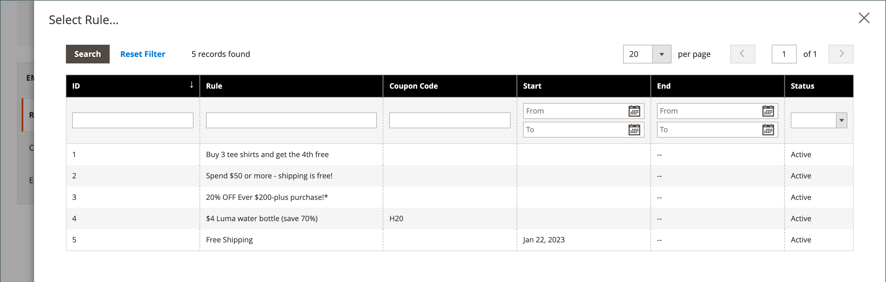
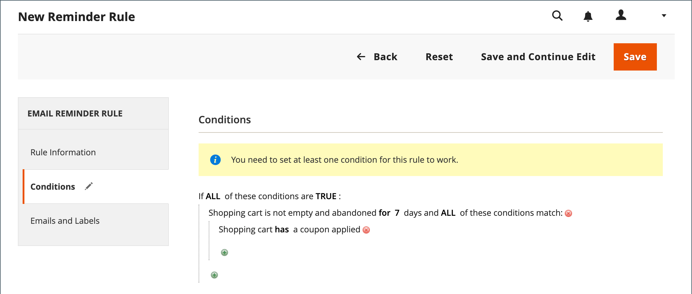
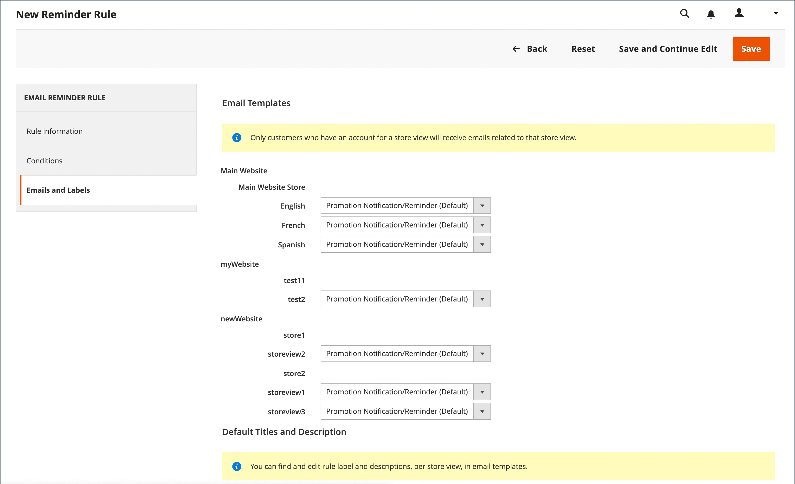
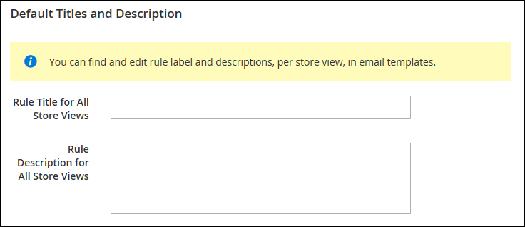
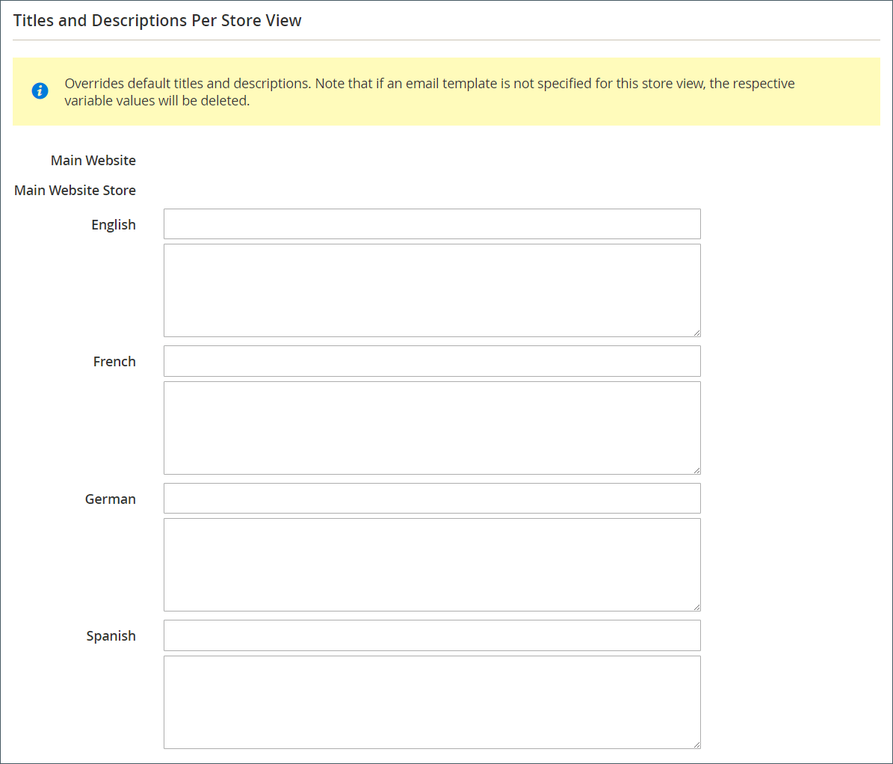
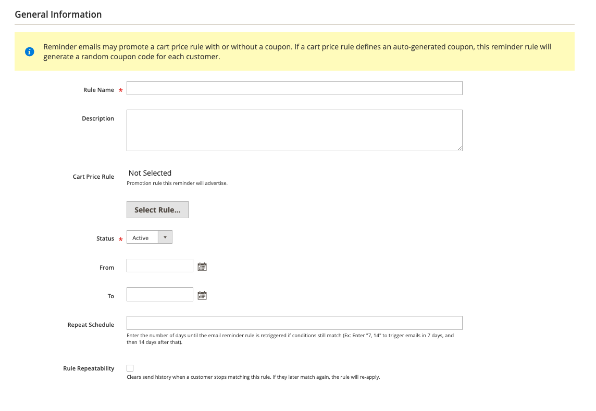

# Skapa e-postpåminnelser

Innan du konfigurerar en påminnelseregel för e-post måste du först [ställa in en kundprisregel](price-rules-cart-create.md) för att definiera den befordran som erbjuds. Regelvillkor som utlöser en e-postpåminnelse kan baseras på egenskaper för kundvagn, önskelisteegenskaper eller båda.

>[!NOTE]
>
>Påminnelser via e-post kan höja en kundvagnsregel med eller utan en kupong. En kundprisregel som definierar en autogenererad kupong genererar en slumpmässig kupongkod för varje kund.

1. Gå till _>_ > **[!UICONTROL Marketing]** på sidofältet _[!UICONTROL Communications]_Admin **[!UICONTROL Email Reminder Rules]**.

1. Klicka på **[!UICONTROL Add New Rule]** i det övre högra hörnet.

1. Slutför _[!UICONTROL Rule Information]_enligt följande:

   {width="700" zoomable="yes"}

   - Ange en **[!UICONTROL Rule Name]** för att identifiera regeln internt.

   - Ange en kort **[!UICONTROL Description]** av regeln.

   - Om du vill välja den **[!UICONTROL Cart Price Rule]**-kampanj som den här påminnelsen ska annonsera klickar du på **[!UICONTROL Select Rule…]** och väljer regeln.

     {width="600" zoomable="yes"}

   - Om du vill att regeln ska börja gälla omedelbart anger du **[!UICONTROL Status]** till `Active`.

   - Om du vill ange ett datumintervall för att regeln ska vara aktiv anger du datumen **[!UICONTROL From]** och **[!UICONTROL To]**.

     Du kan också välja datum från kalendern (  ).

   - Om du vill skicka påminnelsen mer än en gång anger du antalet dagar före nästa e-postmeddelande i fältet **[!UICONTROL Repeat Schedule]**.

1. Välj **[!UICONTROL Conditions]** i panelen till vänster.

   Minst ett villkor måste definieras för regeln. Processen liknar att skapa en [katalogprisregel.](price-rules-catalog.md)

   {width="600" zoomable="yes"}

   Klicka på _Lägg till_ ( ) för att visa listan med alternativ och välj sedan ett av följande villkor:

   - Önsklista
   - Kundvagn

   >[!NOTE]
   >
   >Om en kund har fler än en matchande övergiven kundvagn, önskelista eller kombination av båda aktiveras e-postpåminnelsen endast en gång för den kunden. Om du vill utlösa samma e-postpåminnelse igen använder du fältet _[!UICONTROL Repeat Schedule]_för att ange antalet dagar mellan e-postmeddelanden.  
   >
   >Samma e-postpåminnelse hämtas **_inte_** för samma kund för **_nya_** övergivna kundvagnar och önskelistor **_när_** _[!UICONTROL Repeat Schedule]_-perioden är slut.
   >
   >Adobe Commerce as a Cloud Service har en experimentell funktion som gör att en regel kan användas flera gånger. Mer information finns i [Regelrepeterbarhet](#rule-repeatability).

   Slutför villkoret för att beskriva scenariot som utlöser e-postpåminnelsen.

   {width="600" zoomable="yes"}

1. Välj **[!UICONTROL Emails and Labels]** i panelen till vänster.

   {width="600" zoomable="yes"}

1. I avsnittet **[!UICONTROL Email Templates]** väljer du den e-postmall som ska användas för varje webbplats och butiksvy i din [butikshierarki](../getting-started/websites-stores-views.md).

   Om du inte vill skicka påminnelsemeddelandet till kunder i en butiksvy lämnar du värdet `Not Selected`.

1. Gör följande i avsnittet _Standardtitlar och beskrivning_:

   - Ange **[!UICONTROL Rule Title for All Store Views]**.

     >[!NOTE]
     >
     >Det här värdet kan införlivas i e-postmallar med variabeln `promotion_name`.

   - Ange **[!UICONTROL Rule Description for All Store Views]**.

     {width="500" zoomable="yes"}

   - I avsnittet _[!UICONTROL Titles and Descriptions Per Store View]_anger du **[!UICONTROL Rule Title]**och **[!UICONTROL Description]**för_ standardbutiksvyn _. Om du har flera butiksvyer anger du lämplig rubrik och beskrivning för varje.

     >[!NOTE]
     >
     >Beskrivningen kan infogas i e-postmallar med variabeln promotion_description.

     {width="500" zoomable="yes"}

1. [!BADGE Endast SaaS]{type=Positive url="https://experienceleague.adobe.com/en/docs/commerce/user-guides/product-solutions" tooltip="Gäller endast Adobe Commerce as a Cloud Service- och Adobe Commerce Optimizer-projekt (SaaS-infrastruktur som hanteras av Adobe)."} Om du använder [!DNL Adobe Commerce as a Cloud Service] kan du aktivera [regelrepeterbarhet](#rule-repeatability) genom att markera kryssrutan [!UICONTROL Rule Repeatability].

   >[!IMPORTANT]
   >
   >Alternativet för regelrepeterbarhet är en experimentell funktion som är inaktiverad som standard.  Mer information om hur du aktiverar alternativet finns i [Regelrepeterbarhet](#rule-repeatabilty).

1. Klicka på **[!UICONTROL Save]** när du är klar.

## Regelupprepning

[!BADGE Endast SaaS]{type=Positive url="https://experienceleague.adobe.com/en/docs/commerce/user-guides/product-solutions" tooltip="Gäller endast Adobe Commerce as a Cloud Service- och Adobe Commerce Optimizer-projekt (SaaS-infrastruktur som hanteras av Adobe)."}

>[!IMPORTANT]
>
>Detta är en experimentell funktion och är inte aktiverat som standard. Om du vill aktivera det kontaktar du Adobe Commerce Customer Success Manager eller skapar ett supportärende. Den kommer att finnas tillgänglig för alla Adobe Commerce as a Cloud Service-kunder i en framtida version.

Regelrepeterbarhet gör att du kan återanvända en regel för flera e-postpåminnelser. Detta är användbart när du vill att regeln ska gälla för samma kund vid ett senare tillfälle. Utan regelrepeterbarhet gäller regeln inte längre när kunden har rensat sin kundvagn eller slutfört ett köp.

Om du markerar kryssrutan **[!UICONTROL Rule Repeatability]** på fliken **[!UICONTROL General Information]** kan regeln tillämpas på användare igen när den ursprungliga regelutlösaren inte längre gäller.

{width="600" zoomable="yes"}

>[!BEGINSHADEBOX]

Titta på följande exempel:

Du har en övergiven kundvagnsregel som aktiveras efter 1 dag och som hämtas 3 och 5 dagar senare. En användare överger en kundvagn och en dag senare får han/hon en påminnelse om övergiven kundvagn. Efter två dagar bestämmer sig användaren för att slutföra köpet. Kundvagnen är inte längre övergiven. 10 dagar senare överger användaren en ny kundvagn med olika artiklar.

- Om **[!UICONTROL Rule Repeatability]** är aktiverat får användaren en ny påminnelse om övergiven kundvagn.
- Om **[!UICONTROL Rule Repeatability]** är inaktiverat får användaren **inte** några fler påminnelser om övergivna kundvagn via e-post.

>[!ENDSHADEBOX]

## Utlösarvillkor

| Source | Utlösare |
|--- |--- |
| [!UICONTROL Wish List] | [!UICONTROL Conditions Combination] [!UICONTROL Sharing] [!UICONTROL Number of Items] [!UICONTROL Items Sub selection] |
| [!UICONTROL Shopping Cart] | [!UICONTROL Conditions Combination] [!UICONTROL Coupon Code] [!UICONTROL Cart Line Items] [!UICONTROL Items Quantity] [!UICONTROL Virtual Only] [!UICONTROL Total Amount] [!UICONTROL Items Subselection] |

{style="table-layout:auto"}

## Fältbeskrivningar

| Fält | Beskrivning |
|--- |--- |
| [!UICONTROL Rule Name] | Namnet på den automatiska påminnelseregeln identifierar regeln internt. |
| [!UICONTROL Description] | En beskrivning av regeln för intern referens. |
| [!UICONTROL Shopping Cart Price Rule] | Kundvagnsregeln som är associerad med den här e-postpåminnelsen. Påminnelsemeddelanden kan befordra en kundvagnsprisregel med eller utan kupong. Om en kundvagnsprisregel innehåller en autogenererad kupong, genererar påminnelseregeln en slumpmässig, unik kupongkod för varje kund. |
| [!UICONTROL Assigned to Website] | De webbplatser som får automatiska påminnelser via e-post baserade på den här regeln. |
| [!UICONTROL Status] | Aktiverar regeln. Om status är inaktiv ignoreras alla andra inställningar och regeln aktiveras inte. Alternativ: `Active` / `Inactive` |
| [!UICONTROL From Date] | Startdatum för den här automatiska påminnelseregeln. Om inget datum anges aktiveras regeln omedelbart. |
| [!UICONTROL To Date] | Slutdatumet för den här automatiska påminnelseregeln. Om inget datum anges blir regeln aktiv i oändlighet. |
| [!UICONTROL Repeat Schedule] | Antalet dagar innan regeln aktiveras och påminnelsemeddelandet skickas igen, förutsatt att villkoren uppfylls. Om du vill utlösa regeln mer än en gång anger du antalet dagar före nästa e-postsändning, avgränsade med kommatecken. Ange till exempel `7` om du vill att regeln ska aktiveras igen sju dagar senare. Ange `7,14` om du vill att regeln ska aktiveras om sju dagar och sedan 14 dagar senare. |
| [!UICONTROL Email Templates] | Bestämmer e-postmallen som ska användas för varje butiksvy. |
| [!UICONTROL Rule Title for All Store Views] | Anger regelns rubrik för varje butiksvy. |
| [!UICONTROL Rule Description for All Store Views] | Anger beskrivningen av regeln för varje butiksvy. |

{style="table-layout:auto"}
