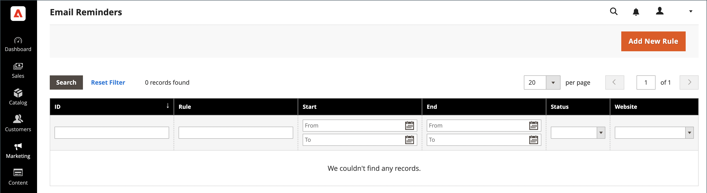

# Påminnelser via e-post

{{ee-feature}}

Syftet med en påminnelse via e-post är att uppmuntra personer som har besökt din butik att utnyttja en kampanj och göra ett köp. Påminnelser via e-post kan automatiskt skickas till kunder när en viss uppsättning villkor uppfylls. Du kan till exempel skicka en påminnelse till kunder som har lagt till något i kundvagnen eller önskelistan, men ännu inte har gjort ett köp. Du kan använda e-postpåminnelser för att uppmuntra kunderna att återvända till din butik och inkludera en [kupongkod](price-rules-cart-coupon.md) som ett incitament. Kupongkoder kan genereras automatiskt för varje grupp med e-postpåminnelser så att du får kontroll över de erbjudanden som är kopplade till varje grupp.

Påminnelser via e-post kan aktiveras efter ett visst antal dagar sedan en vagn övergavs eller för något annat villkor som du vill definiera. Vanliga villkor är t.ex. totalt kundvagnsvärde, kvantitet, artiklar i kundvagn.

>[!NOTE]
>
>Om en kund har fler än en matchande övergiven kundvagn, önskelista eller kombination av båda aktiveras e-postpåminnelsen endast en gång för den kunden. Om du vill utlösa samma e-postpåminnelse igen använder du fältet _[!UICONTROL Repeat Schedule]_&#x200B;för att ange antalet dagar mellan e-postmeddelanden.

{width="700" zoomable="yes"}

## Konfigurera e-postpåminnelser

Regler för e-postpåminnelser kan skickas med regelbundna intervall på minut, timme eller dag. Konfigurationen avgör hur många e-postmeddelanden som skickas i en batch och den butiksidentitet som visas som meddelandets avsändare.

1. Gå till **[!UICONTROL Stores]** > _[!UICONTROL Settings]_>**[!UICONTROL Configuration]**&#x200B;på sidofältet_ Admin _.

1. Expandera **[!UICONTROL Customers]** i den vänstra panelen och välj **[!UICONTROL Promotions]**.

1. Expandera  i avsnittet **[!UICONTROL Automated Email Reminder Rules]** och gör följande:

   {width="600" zoomable="yes"}

   - Ange **[!UICONTROL Enable Reminder Emails]** till `Yes`.

   - Om du vill ange hur ofta kontroller ska utföras för nya kunder som kvalificerar automatiska e-postpåminnelser anger du **[!UICONTROL Frequency]** till något av följande:

      - `Minute Intervals`
      - `Hourly`
      - `Daily`

   - Ange lämplig **[!UICONTROL Interval]** utifrån inställningen för _[!UICONTROL Frequency]_.

   - Ange **[!UICONTROL Start Time]** till timma, minut och sekund när e-postmeddelandet skickas, baserat på en 24-timmarsklocka.

   - Om du vill begränsa antalet e-postmeddelanden som kan skickas i en batch anger du numret i fältet **[!UICONTROL Maximum Emails per One Run]**.

   - Om du vill undvika upprepade försök att skicka misslyckade e-postmeddelanden anger du det maximala antalet försök i fältet **[!UICONTROL Email Send Failure Threshold]**.

   - Ange **[!UICONTROL Reminder Email Sender]** till den [butikskontakt](../getting-started/store-details.md#store-email-addresses) som visas som avsändare av påminnelsemeddelandet.

   En detaljerad lista över de här alternativen finns i [Automatiska regler för e-postpåminnelse](../configuration-reference/customers/promotions.md#automated-email-reminder-rules) i _Konfigurationsreferens_.

1. Klicka på **[!UICONTROL Save Config]** när du är klar.

## Mallar för e-postpåminnelser

Standardmallen för e-postpåminnelser kan anpassas och ytterligare mallar skapas för olika kampanjer. E-postpåminnelser har ett urval av specifika variabler som kan inkluderas i meddelandet. Informationen i dessa variabler bestäms av e-postpåminnelseregeln som du ställer in och av kundprisregeln som är associerad med kupongen. Knappen Infoga variabel kan användas för att infoga märkordet med variabeln i mallen. Mer information finns i [E-post](../systems/email-templates.md).

{width="600" zoomable="yes"}

### Anpassa en mall för e-postpåminnelser

1. Gå till **[!UICONTROL Marketing]** > _[!UICONTROL Communications]_>**[!UICONTROL Email Templates]**&#x200B;på sidofältet_ Admin _.

1. Klicka på **[!UICONTROL Add New Template]**.

1. Välj mallen **[!UICONTROL Promotion Notification/Reminder]** i listan **[!UICONTROL Template]** under `Magento_Reminder`.

1. Klicka på **[!UICONTROL Load Template]**.

Följ [standardinstruktionerna](../systems/email-template-custom.md) för att anpassa mallen.

### E-postpåminnelsevariabler

#### Kupongkod

```
{{var coupon.getCode()|escape}}
```

#### Kuponganvändningsgräns

```
{{var coupon.usage_limit|escape}}
```

#### Kuponganvändning per kund

```
{{var coupon.usage_per_customer|escape}}
```

#### Kundkonto-URL

```
{{var this.getUrl($store,'customer/account/',[_nosid:1])}}
```

#### Kundnamn

```
{{var customer_data.name|escape}}
```

#### Sidfotsmall för e-post

```
{{template config_path="design/email/footer_template"}}
```

#### E-postrubrikmall

```
{{template config_path="design/email/header_template"}}
```

#### E-postlogotypbild Alt

```
{{var logo_alt}}
```

#### URL för e-postlogotypbild

```
{{var logo_url}}
```

#### Beskrivning av erbjudande

```
{{var promotion_description|escape|nl2br}}
```

#### Erbjudandenamn

```
{{var promotion_name|escape}}
```

#### Butiksnamn

```
{{var store.frontend_name}}
```

#### Lagra URL

```
{{store url=""}}
```
