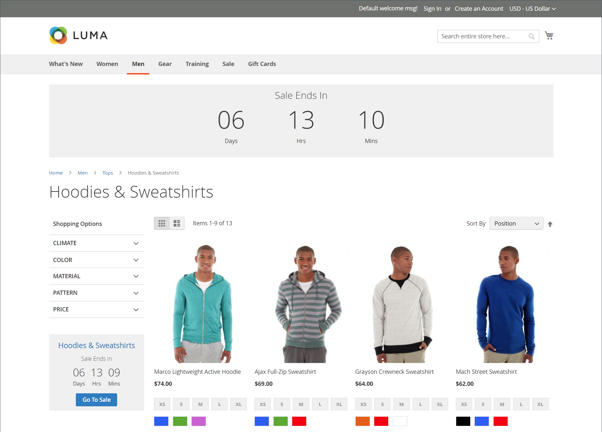

# Privat försäljning och evenemang

{{ee-feature}}

Privat försäljning och andra kataloghändelser är ett bra sätt att använda er befintliga kundbas för att generera spänningsproblem och nya leads eller för att avlasta överskottslager. Du kan skapa tidsbegränsad försäljning, begränsa försäljningen till specifika medlemmar eller skapa en fristående privat försäljningssida. Du kan också definiera inbjudningar och händelseinformation. Öka varumärkeslojaliteten och skapa ett krångel genom att ge era bästa kunder VIP behandling. Erbjud exklusiv åtkomst till medlemmar som bara säljer eller säljer privat för att öka varumärkeslojaliteten. Du kan också använda dessa försäljningar för att likvidera överskottsvaror. Kundgrupper är användbara när du ställer in den här typen av medlemmar och VIP försäljning.

{width="700" zoomable="yes"}

## Händelsehanteringskomponenter

- **Kategorier** - Varje händelse är associerad med en [kategori](../catalog/category-create.md) från katalogen.

- **Händelser** - Händelseförsäljningen baseras på ett start- och slutdatum. Du kan använda en [nedräkningsfilm](#event-ticker) för att visa den återstående tiden.

- **Kataloghändelse** - När [kataloghändelsewidgeten](../content-design/widget-event-carousel.md) är aktiverad i konfigurationen kan den placeras på butikssidor som en lista över öppna och kommande händelser, sorterade efter slutdatum. Om två eller flera händelser har samma slutdatum sorteras händelserna efter den ordning som anges i konfigurationen.

- **[!UICONTROL Websites]** - Kategoribehörigheter baseras främst på [kundgrupper](../customers/customer-groups.md).

- **Kategoribehörigheter** - [Kategoribehörigheter](../catalog/category-permissions.md) ger dig full kontroll över de specifika aktiviteter som kan äga rum i en viss kategori.

- **Åtkomstbegränsningar** - Förhindrar allmän [åtkomst](event-configure.md#restrict-access) till webbplatsen genom att dirigera om till en landningssida, inloggningssida eller registreringssida.

- **Inbjudningar** - E-postmeddelanden skickas med en länk för att skapa ett konto i butiken. Du kan begränsa möjligheten att skapa ett konto till endast dem som får en [inbjudan](invitations.md).

- **Privata försäljningsrapporter** - De [privata försäljningsrapporterna](../getting-started/private-sales-reports.md) innehåller information om skickade inbjudningar, inbjudna kunder och konverteringar.

## Händelseticker

Ticker-blocket visar en nedräkningsfilm för öppna händelser, med start- och slutdatum för kommande händelser. Om en händelse har stängts visas start- och slutdatumen i börsknappen.

{width="700" zoomable="yes"}

Om kategorisidans ticker är aktiverad för en händelse visas börsblocket högst upp i kategorilistan. Om produktsidans ticker är aktiverad visas även ticker-blocket högst upp på produktsidan för alla produkter som är kopplade till kategorin.

Händelseticker kan aktiveras när du [skapar händelser](event-create.md).

{width="700" zoomable="yes"}
