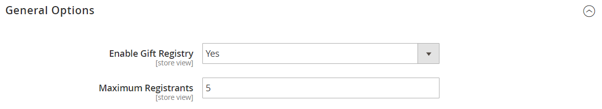

# Konfigurera presentregister

{{ee-feature}}

Innan du kan erbjuda dina kunder presentregister måste du aktivera presentregister och konfigurera relaterade e-postmeddelanden. Adobe Commerce skickar följande e-postmeddelanden som svar på händelser i presentregistrets arbetsflöde.

- När ett nytt presentregister skapas skickas ett e-postmeddelande till ägaren med en länk till registret som kan delas.
- Butiken kan också skicka ett meddelande med en länk till presentregistret till vänner och familj som äger presentregistret.
- Ägaren meddelas när artiklar köps in från presentregistret, men anger inte köparen.

Adobe Commerce har fördefinierade mallar för vart och ett av dessa e-postmeddelanden som kan anpassas för ert varumärke.

## Steg 1. Aktivera presentregister

1. På _Administratör_ sidebar, gå till **[!UICONTROL Stores]** > _[!UICONTROL Settings]_>**[!UICONTROL Configuration]**.

1. Expandera på den vänstra panelen **[!UICONTROL Customers]** och välja **[!UICONTROL Gift Registry]**

1. Expandera  den **[!UICONTROL General Options]** och gör följande:

   {width="600" zoomable="yes"}

   - Presentregistret är aktiverat som standard. Ange vid behov **[!UICONTROL Enable Gift Registry]** till `Yes`.

   - För **[!UICONTROL Maximum Registrants]** anger du det maximala antalet personer som kan bjudas in att delta i en presentregisterhändelse.

## Steg 2. Konfigurera e-postmeddelanden

1. Expandera  den **[!UICONTROL Owner Notification]** och gör följande:

   {width="600" zoomable="yes"}

   - Välj **[!UICONTROL Email Template]** som meddelar ägare av presentregister när deras register skapas.

   - Välj [butikskontakt](../getting-started/store-details.md#store-email-addresses) som visas som **[!UICONTROL Email Sender]** av meddelandet.

1. Expandera  den **[!UICONTROL Gift Registry Sharing]** och gör följande:

   {width="600" zoomable="yes"}

   - Välj **[!UICONTROL Email Template]** som meddelar mottagarna i presentregistret när ett register delas med dem.

   - Välj den butiksidentifiering som visas som **[!UICONTROL Email Sender]** av meddelandet.

   - För **[!UICONTROL Maximum Sent Emails Threshold]** anger du det maximala antalet e-postmeddelanden som kan skickas samtidigt.

1. Expandera  den **[!UICONTROL Gift Registry Update]** och gör följande:

   {width="600" zoomable="yes"}

   - Välj **[!UICONTROL Email Template]** som informerar presentatörens ägare om ändringar i registret.

   - Välj den butiksidentifiering som visas som **[!UICONTROL Email Sender]** av meddelandet.

1. När du är klar klickar du på **[!UICONTROL Save Config]**.

1. Uppdatera cacheminnet när du uppmanas att göra det.

   När cachen har uppdaterats visas presentregistret på menyn Lager under Andra inställningar och blir tillgängligt på kundkonton.
