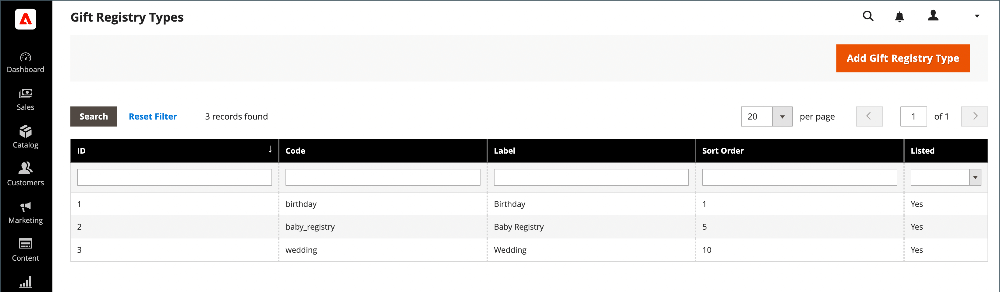

# Inställningar för presentregister

{{ee-feature}}

Du kan skapa ett presentregister för alla typer av evenemang, t.ex. ett bröllop, en födelsedag, en nyårsdag, ett nyfött barn eller andra speciella tillfällen. Som standard innehåller Adobe Commerce följande specialhändelser:

- Baby
- Födelsedag
- Bröllop

När du skapar ett register blir det ett alternativ i listan över presentregistertyper i kundens konto.

Du kan använda en av de tre förberedda presentregistren eller skapa ett eget anpassat register. Varje presentregistertyp innehåller flera attribut, vilka är de datainmatningsfält som kunden fyller i för att skapa ett presentregister. Attributen innehåller ytterligare information om händelsen, tiden och platsen, eller annan information som behövs. Beroende på indatatypen har vissa attribut flera alternativ. Presentregistertypen `Wedding` har till exempel attributet `Role` med alternativen `Bride`, `Groom` och `Partner`. Mer information om attribut och indatatyper finns i [Attribut](../customers/attribute-properties.md).

{width="700" zoomable="yes"}

## Använd ett förberett presentregister

1. Gå till **[!UICONTROL Stores]** > _[!UICONTROL Other Settings]_>**[!UICONTROL Gift Registry]**&#x200B;på sidofältet_ Admin _.

   Registren för födelsedag, bröllop och spädbarn är klara att användas av kunderna på deras konton.

1. Var noga med att slutföra konfigurationen av [e-postmallen](../systems/email-templates.md#configure-email-templates) så att den återspeglar ditt varumärke.

## Skapa ett anpassat presentregister

1. Gå till **[!UICONTROL Stores]** > _[!UICONTROL Other Settings]_>**[!UICONTROL Gift Registry]**&#x200B;på sidlisten Admin.

1. Klicka på **[!UICONTROL Add Gift Registry Type]** i det övre högra hörnet.

1. Fyll i följande under **[!UICONTROL General Information]**:

   - Ange en unik **[!UICONTROL Code]** för att identifiera presentregistret internt.

     Koden måste börja med en gemen bokstav. Resten av koden kan vara vilken kombination av gemener (a-z), siffror (0-9) och understreck (`_`) som helst.

   - För **[!UICONTROL Label]** anger du ett namn för presentregistret så som du vill att det ska visas i butiken.

     Den här etiketten är ett alternativ i listan med presentregistertyper som är tillgängliga för kunden.

   - För **[!UICONTROL Sort Order]** anger du ett nummer som avgör i vilken ordning presentregistret visas i listan med andra typer.

   - Aktivera presentregistret genom att ange **[!UICONTROL Is Listed]** till `Yes`.

     {width="600" zoomable="yes"}

1. Undersök varje avsnitt i presentregistret för att ta reda på vilken typ av information du vill inkludera.

1. Välj **[!UICONTROL Attributes]** i den vänstra panelen och klicka på **[!UICONTROL Add Attribute]**.

   {width="600" zoomable="yes"}

1. Gör följande för varje attribut:

   - Tilldela ett unikt **[!UICONTROL Code]** för att identifiera attributet internt. Koden kan innehålla upp till 15 tecken och måste börja med en gemen bokstav. Resten av koden kan innehålla gemena bokstäver (`a`-`z`), siffror (`0`-`9`) och understreck (`_`) för att skilja ord åt.

   - Välj **[!UICONTROL Input Type]** som ska användas för datainmatning. Du kan använda en av de anpassade eller statiska typerna.

   - Om indatatypen har flera alternativ klickar du på **[!UICONTROL Add New Option]** och fyller i informationen för varje alternativ.

     Vissa indatatyper har ytterligare egenskaper. Event Location har t.ex. ytterligare egenskaper som gör händelsen sökbar, och som finns med i butikens offentliga lista över presentregister.

      - Ange **[!UICONTROL Attribute Group]** till det avsnitt i presentregistret där du vill att attributet ska visas.

      - För **[!UICONTROL Label]** anger du ett namn som identifierar datainmatningsfältet i registret.

      - Om kunden måste göra ett val eller ange ett värde i fältet anger du **[!UICONTROL Is Required]** till `Yes`.

      - För **[!UICONTROL Sort Order]** anger du ett nummer som avgör i vilken ordning presentregistret visas när det visas tillsammans med andra presentregister som kan vara tillgängliga i butiken.

1. Om du vill lägga till ett till alternativ klickar du på **Lägg till nytt alternativ**.

   Varje nytt alternativ som läggs till visas i ett nytt avsnitt högst upp. Upprepa den här processen för det nya attributet.

1. Klicka på **[!UICONTROL Save]** när du är klar.

## Fältbeskrivningar

### [!UICONTROL General Information]

| Fält | Beskrivning |
|--- |--- |
| [!UICONTROL Code] | Ett unikt namn som identifierar presentregistertypen internt. Det första tecknet i koden måste vara en gemen bokstav. Resten av koden kan vara vilken kombination av gemener (a-z), siffror (0-9) och understreck (`_`) som helst. |
| [!UICONTROL Label] | Namnet på presentregistertypen som visas i butiken. |
| [!UICONTROL Sort Order] | Anger i vilken ordning den här presentregistertypen visas när den listas med andra typer. |
| [!UICONTROL Is Listed] | Avgör om presentregistertypen är tillgänglig för kunder i butiken. Alternativ: `Yes` / `No`. |

{style="table-layout:auto"}

### [!UICONTROL Attributes]

| Fält | Beskrivning |
|--- |--- |
| [!UICONTROL Code] | Ett unikt namn som identifierar attributet internt. Koden kan innehålla valfri kombination av gemener (a-z), siffror (0-9) och understreck (`_`). |
| [!UICONTROL Input Type] | Bestämmer vilken typ av data och indatakontroll som är associerad med attributet, beroende på typ. |
| [!UICONTROL Attribute Group] | Välj den grupp där attributet finns i presentregistret. |
| [!UICONTROL Label] | Namnet som identifierar attributet på kundens kontouppsättning. |
| [!UICONTROL Is Required] | Anger om attributet är en obligatorisk post. Presentregistret kan inte sparas förrän alla nödvändiga attribut har slutförts. Alternativ: `Yes` / `No`. |
| [!UICONTROL Sort Order] | Anger i vilken ordning attributet ska visas när det anges med andra attribut. |

{style="table-layout:auto"}

#### [!UICONTROL Input Type Options]

Välj den typ av data- och indatakontroll som är associerad med attributet.

**_[!UICONTROL Custom Types]_**

| Fält | Beskrivning |
|--- |--- |
| [!UICONTROL Text] | Visar attributet som ett textfält. |
| [!UICONTROL Select] | Visar attributet som en nedrullningsbar lista. Klicka på **[!UICONTROL Add New Option]** om du vill lägga till fler villkor i listrutan: **[!UICONTROL Code]**- Ett unikt namn som identifierar attributet internt. **[!UICONTROL Label]** - Det namn som identifierar attributet på kundens kontonamall. **[!UICONTROL Is Default]**- Ange den här växeln för att välja standardvillkoret. **[!UICONTROL Delete Option]** - Klicka för att ta bort alternativet. |
| [!UICONTROL Date] | Visar attributet som ett datumfält. Alternativ: `Short (3/23/2014)` / `Medium (Mar 23, 1914)` / `Long (March 23, 1914)` / `Full (Sunday, March 23, 2014)` |
| [!UICONTROL Country] | Visar attributet som en nedrullningsbar lista över länder. Ange **[!UICONTROL Show Region]** till: `Yes` / `No`. |

{style="table-layout:auto"}

**_[!UICONTROL Static Types]_**

| Fält | Beskrivning |
|--- |--- |
| [!UICONTROL Event Date] | Avgör hur datumattributet används i butiken. Alternativ:  **[!UICONTROL Searchable]**- Anger om attributet är tillgängligt för avancerad sökning. Alternativ: `Yes` / `No`. **[!UICONTROL Is Listed]** - Avgör om händelsen finns med i listan över händelser som är tillgängliga i butiken. Alternativ: `Yes` / `No`.  **[!UICONTROL Date Format]**- Bestämmer formatet för händelsedatumet. Alternativ: `Short (3/23/2014)` / `Medium (Mar 23, 1914)` / `Long (March 23, 1914)` / `Full (Sunday, March 23, 2014)` |
| [!UICONTROL Event Country] | Visar attributet som en lista över länder. Alternativ:  **[!UICONTROL Searchable]**- Anger om attributet är tillgängligt för avancerad sökning. Alternativ: `Yes` / `No`. **[!UICONTROL Is Listed]** - Avgör om händelsen finns med i listan över händelser som är tillgängliga i butiken. Alternativ: `Yes` / `No`.  **[!UICONTROL Show Region]**- Anger regionen för händelsen. |
| [!UICONTROL Event Location] | Platsen för händelsen som är relaterad till presentregistret.  Ange **[!UICONTROL Is Searcheable]** till: `Yes` / `No`  Ange **[!UICONTROL Is Listed]** till: `Yes` / `No` |
| [!UICONTROL Role] | Den roll som identifierar presentmottagaren. Till exempel `Bride`, `Groom` eller `Partner`. **[!UICONTROL Is Searcheable]**- Ange som `Yes`/ `No` **&#x200B; Listar &#x200B;**- Ange som `Yes` / `No` **[!UICONTROL Add New Option]** - Klicka för att lägga till fler villkor i listrutan: **Kod** - Ett unikt namn som identifierar attributet internt. **[!UICONTROL Label]**- Det namn som identifierar attributet på kundens kontonamall. **[!UICONTROL Is Default]** - Ange den här växeln för att välja standardvillkoret. **[!UICONTROL Delete Option]**- Klicka för att ta bort alternativet. |

{style="table-layout:auto"}

#### [!UICONTROL Attribute Group Options]

Välj den grupp där attributet finns i presentregistret.

| Fält | Beskrivning |
|--- |--- |
| [!UICONTROL Event Information] | Grupperar alla presentregisterattribut som lägger till information om presentationshändelsen, dess tid, plats och så vidare. |
| [!UICONTROL Gift Registry Properties] | Kombinerar alla attribut som lägger till information direkt om presentregistret. |
| [!UICONTROL Privacy Settings] | Visar attribut som lägger till information om presentationshändelsens sekretess. |
| [!UICONTROL Recipients Information] | Grupperar de attribut som ger information om den person som skapar ett presentregister. |
| [!UICONTROL Shipping Address] | Kombinerar de attribut som lägger till information om presentationshändelsens leveransadress. |

{style="table-layout:auto"}
