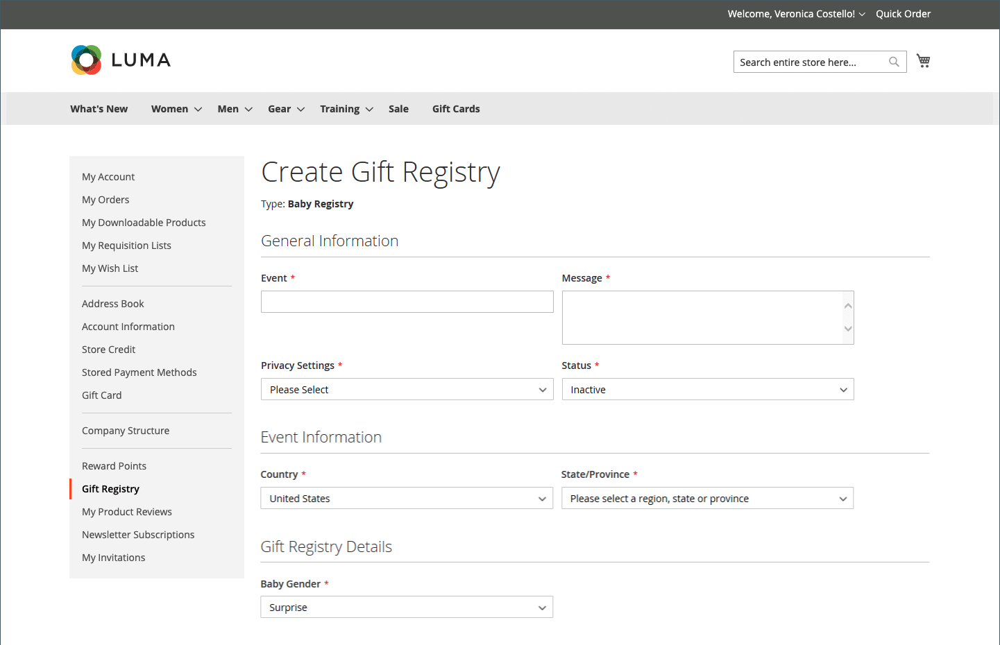

# Affärsupplevelsen i presentregistret

{{ee-feature}}

Avsnittet [Presentregister](gift-registries.md) i kundkontot innehåller en lista över kundens aktuella presentregister och den associerade händelsen. Kunderna kan hantera de aktuella registren och lägga till nya.

{width="700" zoomable="yes"}

## Presentregisterinformation

Kunder kan skapa och hantera presentregister från sina konton. All information som är associerad med varje typ av register är tillgänglig från kundens konto.

{width="700" zoomable="yes"}

| Avsnitt | Beskrivning |
|--- |--- |
| [!UICONTROL General Information] | Det här avsnittet innehåller vanligtvis namnet på händelsen, ett meddelande eller en beskrivning av händelsen, sekretessinställningar och händelsestatus. |
| [!UICONTROL Event Information] | Det här avsnittet innehåller platsen och datumet för händelsen. För ett bröllop kan det även omfatta det antal gäster som varje person kan ta med sig. |
| [!UICONTROL Gift Registry Details] | Detta kan inkludera ytterligare information som är specifik för händelsen. |
| [!UICONTROL Registrant Information] | Detta avsnitt innehåller namn och kontaktinformation för varje person som ska få ett meddelande om registret. För ett bröllopsregister kan rollfältet inkluderas för att associera registranten som vän till bruden eller brudgummen. |
| [!UICONTROL Shipping Address] | I det här avsnittet visas var presenter ska skickas och den information som en transportör behöver för att leverera paketet. |

{style="table-layout:auto"}

>[!NOTE]
>
>När ett presentregister är inaktivt fungerar inte sökning och länkar för registret. Om registret aktiveras igen senare, bryts länkarna.

## Skapa ett presentregister

1. Kunden väljer **[!UICONTROL Gift Registry]** på sin kontokontrollpanel.

1. Klicka på **[!UICONTROL Add New]** på sidan _Presentregister_.

1. Väljer en **[!UICONTROL Gift Registry Type]**, till exempel:

   - Födelsedag

   - Bebisregister

   - Bröllop

1. Klicka på **[!UICONTROL Next]**.

1. Anger nödvändig information och klickar på **[!UICONTROL Save]**.

## Lägg till en produkt i ett register

1. Kunden öppnar den produkt som han/hon vill lägga till i presentregisterhändelsen.

1. Klicka på **[!UICONTROL Add to Cart]**.

1. Klicka på **[!UICONTROL View and Edit Cart]** i minivagnen.

1. På sidan Kundvagn väljer den händelse de vill ha och klickar/trycker på **[!UICONTROL Add All To Gift Registry]**.

   Objekt läggs till i presentregistret för den valda händelsen.

## Dela ett presentregister

1. Från kontouppsättningen går kunden till **[!UICONTROL Gift Registry]**.

1. Söker efter registerhändelsen som de vill hantera och klickar på **[!UICONTROL Share]**.

1. Anger nödvändig information och klickar på **[!UICONTROL Share Gift Registry]**.

## Redigera ett presentregister

1. Från kontouppsättningen går kunden till **[!UICONTROL Gift Registry]**.

1. Söker efter registerhändelsen som de vill hantera och klickar på **[!UICONTROL Edit]**.

1. Ändrar eventuella alternativ efter behov.

1. Redigerar nödvändiga alternativ och klickar på **[!UICONTROL Save]**.

## Hantera presentregisterobjekt

1. Från kontouppsättningen går kunden till **[!UICONTROL Gift Registry]**.

   {width="700" zoomable="yes"}

1. Söker efter registerhändelsen, markerar de objekt som ska hanteras och klickar på **[!DNL Manage Items]**.

1. Ändrar de nödvändiga alternativen, till exempel **[!UICONTROL Note]** och **[!UICONTROL Qty]**.

1. Om det behövs tar bort ett objekt från presentregistret genom att markera kryssrutan och klicka på **[!UICONTROL Delete]**.

1. Klicka på **[!UICONTROL Update Gift Registry]** för att spara ändringarna.

## Ta bort ett presentregister

1. Från kontouppsättningen går kunden till **[!UICONTROL Gift Registry]**.

1. Söker efter registerhändelsen som de vill hantera och klickar på **[!UICONTROL Delete]**.

1. Bekräfta genom att klicka på **[!UICONTROL OK]**.
